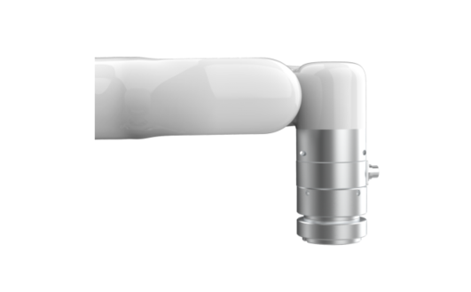

# 1.General Presentation

## 1.1  6 Axis Force Torque Sensor Introduction

The UFACTORY 6 Axis Force Torque Sensor is designed for force and torque data acquisition on Arm, it can simultaneously measure the force and torque in three-dimensional space. It is installed on the Arm tool flange, a flexible cable is used for power and communications.

## 1.2 Safety
The operator must read and understand all the instructions below before running the 6 Axis Force Torque Sensor.

### 1.2.1 **Warning**

1. The 6 Axis Force Torque Sensor needs to be properly installed before operating.

2. Do not install or operate the 6 Axis Force Torque Sensor that is damaged or lacking parts.

3. Never supply the 6 Axis Force Torque Sensor with an alternative current (AC) source.

4. Make sure all cord sets are always secured at both ends, the 6 Axis Force Torque Sensor end & Robot end.

5. Always satisfy the 6 Axis Force Torque Sensor’s load specifications.

6. Be sure nothing is in the robot and the 6 Axis Force Torque Sensor path before using.
 
**Caution**

The term "operator" refers to anyone responsible for any of the following operations on the 6 Axis Force Torque Sensor:

   **● Installation**

   **● Control**

   **● Maintenance**

   **● Inspection**

   **● Decommissioning**

   **● Calibration**

"Overload" refers to exceeding the measurement range specified by the torque sensor, that is, if the positive and negative directions of Fx and Fy exceed 225N, the positive and negative directions of Tx, Ty, and Tz exceed 6Nm, the positive direction of Fz exceeds 300N, and the negative direction of Fz exceeds 600N, it is considered an overload. . Please note that overloading, collision, and falling from a high place may cause damage to the torque sensor.

This documentation explains the various components of the 6 Axis Force Torque Sensor and general operations regarding the whole life-cycle of the product from installation to operation and decommissioning.

The drawings and photos in this documentation are representative examples and differences may exist between them and the delivered product.

### 1.2.2 **Risk Assessment and Final Application**
The 6 Axis Force Torque Sensor is meant to be used on an industrial robot. The robot, force torque sensor and any other equipment used in the final application must be evaluated with a risk assessment. The robot integrator must ensure that all local safety measures and regulations are respected. Depending on the application, there may be risks that need additional protection/safety measures, for example, the work-piece 6 Axis Force Torque Sensor is manipulating may be inherently dangerous to the operator.

### 1.2.3 **Validity and Responsibility**
Always comply with local and/or national laws, regulations and directives on automation safety and general machine safety.

The unit may be used only within the range of its technical data. Any other use of the product is deemed improper and unintended use.

UFACTORY will not be liable for any damages resulting from any improper or unintended use.
