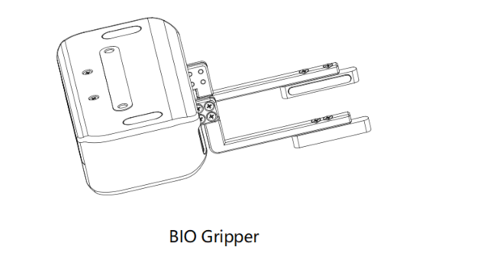
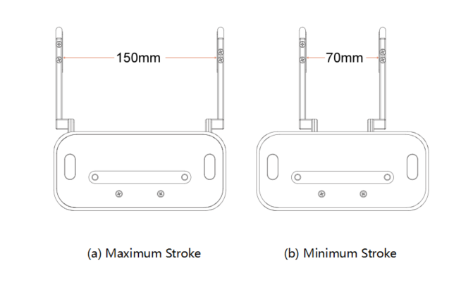

# BIO Gripper User Manual

## 1. General Presentation

### 1.1 Gripper Introduction

The xArm BIO Gripper is a gripper designed for liquid handling. It provides fast deployment paired with simple customization and easy programming. The gripper is a multifunctional tool, boasting customized fingertips to provide gripping flexibility.

**Main Features of BIO Gripper:**

1. Designed for liquid handling
2. Customizable fingertips
3. Highly integrated with xArm

### 1.2 Object Picking

The fingers of the BIO Gripper adopt a parallel grasp. The width of the object that the gripper can grasp is: 70-150mm.

### 1.3 Setup and Control

The gripper is powered and controlled directly via a single gripper connection cable that carries a 24V DC supply and Modbus RTU communication over RS-485.

### 1.4 Safety

#### 1.4.1 Warning

The operator must have read and understood all of the instructions in the following manual before handling the BIO Gripper.

#### 1.4.2 Risk Assessment and Final Application

The BIO Gripper is meant to be used on an industrial robot. The robot, gripper, and any other equipment used in the final application must be evaluated with a risk assessment.

#### 1.4.3 Intended Use

The gripper is designed for grasping and temporarily securing or holding objects.

