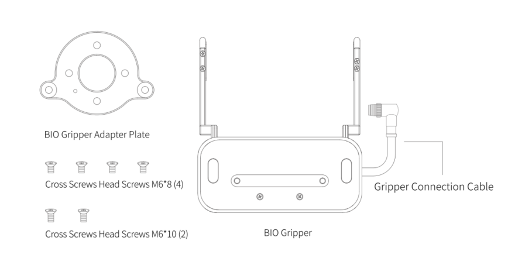
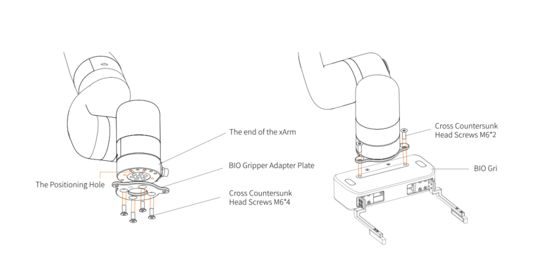
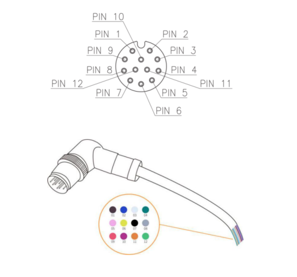

# 2. Installation

The following subsections will guide you through the installation and general setup 
of BIO Gripper.

(1) The Scope of Delivery section

(2) The Mechanical Installation section

(3) The Electrical Setup section

**Warning**

Before installing:

Read and understand the safety instructions related to the BIO Gripper.

Verify your package according to the Scope of delivery and your order info.

Have the required parts, equipment and tools listed in the requirements readily

available.

Installing:

Satisfy the environmental conditions.

Do not operate the Gripper, or even turn on the power supply, before it is firmly

anchored and the danger zone is cleared.

Caution the fingers of the gripper which may move and cause injury or damag

### 2.1 Scope of Delivery

#### 2.1.1 General Kit

A Gripper Kit generally includes these items:

- BIO Gripper
- BIO Gripper adapter plate
- Cross countersunk head screws M6*8 (4)
- Cross countersunk head screws M6*10 (2)

### 2.2 Mechanical Installation

BIO Gripper installation steps:

1. Fix the BIO Gripper adapter plate to the tool flange of the robotic arm with screws.
2. Fix the BIO Gripper to the BIO Gripper adapter plate with screws.
3. Connect the robotic arm and the Gripper with the gripper connection cable.

**Note:**

1. When wiring the gripper connection cable, be sure to power off the robotic arm, 
the emergency stop button is in the pressed state and the power indicator of the 
robotic arm is off, so as to avoid robotic arm failure caused by hot plugging;

2. When connecting the gripper and the robotic arm, be sure to align the 
positioning holes at the ends of the gripper and the robotic arm. Since the male 
pins of the gripper connection cable are relatively thin, avoid bending the male 
pins during plugging.

### 2.3 Electrical Setup

Power and communication are established with the BIO Gripper via a single gripper connection cable. The gripper connection cable provides a 24V power supply to the Gripper and enables serial RS485 communication to the robot control box.

**Warning**

Power must be off before connecting the Gripper and the robotic arm via the 
gripper connection cable

#### 2.3.1 Pinout Interface

The BIO Gripper is connected to the tool end of the robotic arm via a 12-pin connector.

| Pin sequence | Function         |
|--------------|------------------|
| 1            | 24V              |
| 2            | 24V              |
| 3            | GND              |
| 4            | GND              |
| 5            | 485-A            |
| 6            | 485-B            |
| 7            | Digital Input 0  |
| 8            | Digital Input 1  |
| 9            | Digital Output 0 |
| 10           | Digital Output 1 |
| 11           | No Connect       |
| 12           | No Connect       |

