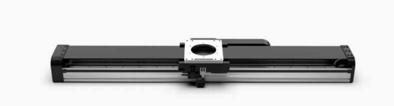
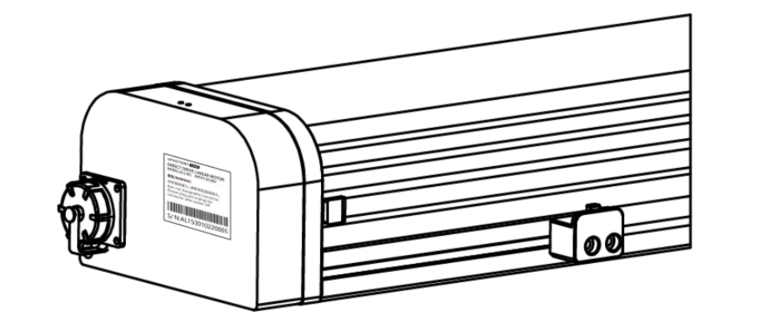
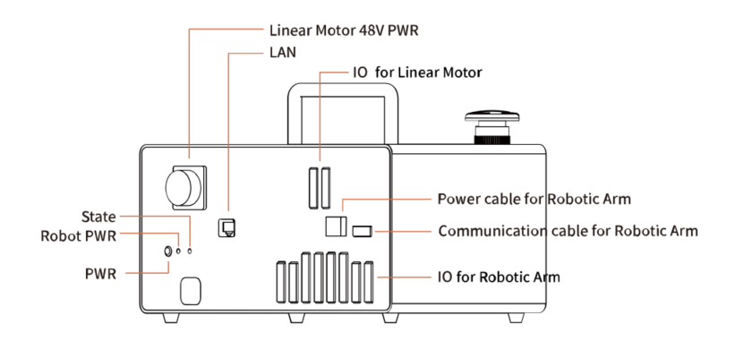
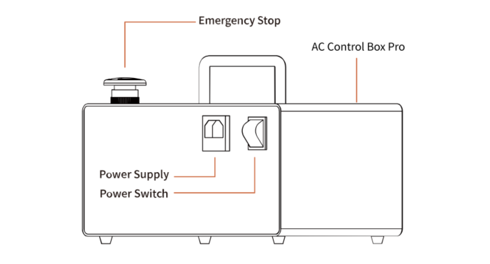
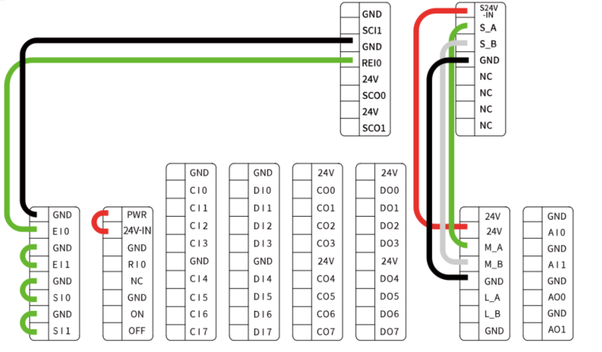

# 1.General Presentation

## 1.1 UFactory Linear Motor Introduction
UFactory Linear Motor needs to be used with AC Control Box Pro, it mainly supports and guides the moving parts(Robotic Arm) to move smoothly according to the given direction, which significantly increases the working range of xArm.

## 1.2 Linear Motor Model

There are two models of UFactory Linear Motor, which can be divided according to Serial Number(SN). SN can be found at the end plate of Linear Motor, see the figure below.

Zero Position: position - 0.

Speed Range: 1 to 1000(mm/s).

Position Range: depend on the model(SN) of Linear Motor. 

SN - AL0700: 0 to 700(mm)

SN - AL1000: 0 to 1000(mm)

SN - AL1500: 0 to 1500(mm)

## 1.3 AC Control Box Pro

UFactory Linear Motor comes with AC Control Box Pro.

Control IO connection is as shown in the figure below, and it has been connected before shipping.

## 1.4 Safety

The operator must read and understand all the instructions below before running the Linear Motor.

### 1.4.1 Warning

1. The Linear Motor needs to be properly installed before operating.

2. Do not install or operate a Linear Motor that is damaged or lacking parts.

3. Never supply Linear Motor with an alternative current (AC) source.

4. Make sure all cord sets are always secured at both ends, Linear Motor end & Robot end.

5. Always satisfy the recommended Mechanical Installation.

6. Be sure nothing is in the robot and Linear Motor path before initializing the Linear Motor.

7. Set the Linear Motor speed and position accordingly, based on your application.

8. Keep magnetic scales away from strong magnets

**Caution**

The term "operator" refers to anyone responsible for any of the following operations on the Linear Motor:

   **● Installation**

   **● Control**

   **● Maintenance**

   **● Inspection**

   **● Programming**

   **● Decommissioning**

   This documentation explains the various components of the Linear Motor and general operations regarding the whole life-cycle of the product from installation to operation and decommissioning.

   The drawings and photos in this documentation are representative examples and differences may exist between them and the delivered product.
### 1.4.2 Risk Assessment and Final Application

The Linear Motor is meant to be used on an industrial robot. The robot, Linear Motor and any other equipment used in the final application must be evaluated with a risk assessment. The robot integrator must ensure that all local safety measures and regulations are respected. Depending on the application, there may be risks that need additional protection/safety measures, for example, the work-piece the Linear Motor is manipulating may be inherently dangerous to the operator.

### 1.4.3 Validity and Responsibility

The Linear Motor is designed for supporting and guiding the moving parts(Robotic Arm), according to the given direction of smooth reciprocating linear motion.

**Caution**

The product can be installed horizontally only.

No debris should be placed on the surface of the product.

The photoelectric sensor on the Linear Motor can not be disassembled.

The product is intended for installation on a robot or other automated machinery and equipment.

**Info**

Always comply with local and/or national laws, regulations and directives on automation safety and general machine safety.

The unit may be used only within the range of its technical data. Any other use of the product is deemed improper and unintended use.

UFACTORY will not be liable for any damages resulting from any improper or unintended use.

