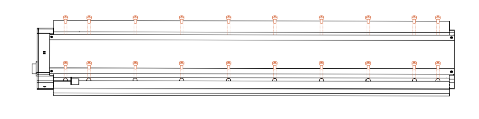
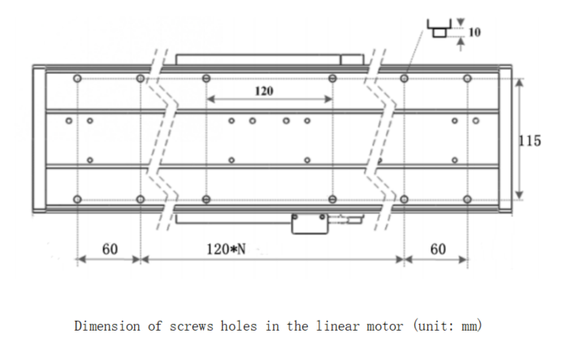
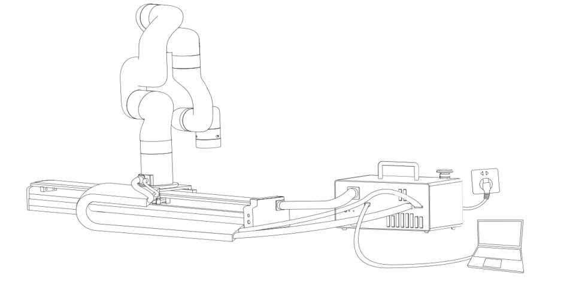

# 2. Installation

The following subsections will guide you through the installation and general setup of Linear Motor.

(1)The Scope of Delivery section

(2)The Mechanical Installation section

**Warning**

Before installing:

Read and understand the safety instructions related to the Linear Motor.

Verify your package according to the Scope of delivery and your order info.

Have the required parts, equipment and tools listed in the requirements readily available.

Installing:

Satisfy the environmental conditions.

Please do not disassemble the photoelectric sensor on the Linear Motor.

Do not operate the Linear Motor, or even turn on the power supply, before it is firmly anchored and the danger zone is cleared.

## 2.1. Scope of Delivery

A Linear Motor Kit generally includes these items:

UFactory Linear Motor \*1 (including Power cable for the Linear Motor\*1, Power cable for the Robotic Arm\*1)

Power cable for the AC Control Box Pro\*1

Communication cable for the Robotic Arm\*1

AC Control Box Pro\*1

Ethernet Cable\*1

Head hexagon socket screws M6\*20 (28)

Head hexagon socket screws M5\*12 (5)

5MM L type wrench\*1

4MM L type wrench\*1

Debugging tool\*1(USB to 485 cable)

## 2.2 Mechanical Installation
The Linear Motor is directly connected to the AC Control Box Pro via a cable, which is used for 48V DC power supply and Modbus RTU communication over RS-485.

Linear Motor installation steps (as shown below):

1-Move the Linear Motor and robotic arm to a safe position. Avoid touching other equipment or obstacles; Please install the Linear Motor horizontally only, not vertically.

There are 20 φ6.2 screw holes on the linear motor which is designed for fixing the linear motor on the table or base. There are also 28 M6\*20 screws in the package.

Dimension of screws holes in the linear motor (unit: mm)

2-Fix the base plate on the Linear Motor with 8 M6\*20 screws.

3-Fix the robotic arm on the base plate with 5 M5\*12 screws.
4-Cable connection:

(1)Plug the Linear Motor Power Supply Cable, LAN cable into control box.

(2)Plug the connector of the Robotic Arm Power Supply Cable and the Robotic Arm Signal Cable into the interface of the Robotic Arm. The connector is a foolproof design. Please do not unplug and plug it violently.

(3)Plug the Robotic Arm Power Supply Cable and the Robotic Arm Signal Cable into the interface of control box. The connector is a foolproof design.

5-Turn on the power switch of the control box and release the emergency stop button.
6-Enter into 'xArmStudio-Settings-Tools-Linear Motor', click 'Initialize' button to return to zero position and finish initialization. 

**Note:**

1. When wiring the Linear Motor connection cable, be sure to power off the Robotic Arm, the emergency stop button is pressed down and the power indicator of the robotic arm is off, so as to avoid robotic arm failure caused by hot plugging;

2. The Linear Motor has no brake design, please installed horizontally only.