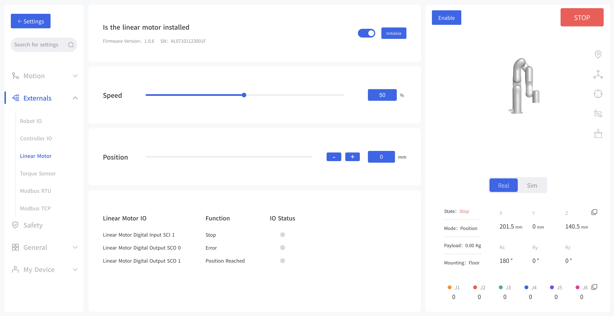

# 3.Control
 
## 3.1 Control Linear Motor through xArm Studio

**1. Set up Linear Motor**

Enter [Settings]-[Tools]-[Linear Motor]

- Turn on [Is Linear Motor installed].
- Click [Initialize] button.

1. [Is Linear Motor installed] button should be turn on.

2. Click [Initialize] button to enable the Linear Motor and return to zero position. After the initialization is completed, the Linear Motor will be ready to move.

**2.Control Linear Motor**

(1) In Linear Motor interface, the speed and position of the Linear Motor can be adjusted through the progress bar, +/- keys, and input box\.

(2) Control the Linear Motor through Blockly

The role of this program: execute this program to control the Linear Motor to reciprocate 10 times at the highest speed(1000mm/s) from the zero position to the farthest position.

**Note:**

(1)Before moving the linear motor for the first time after power on, it is a must to go back to zero position and do initialization first.

(2) Click 'Edit' button, can quickly modify the position of Linear Motor.

## 3.2 Control Linear Motor through Python-SDK

For details on controlling Linear Motor with python-SDK, please refer to the link below:

https://github.com/xArm-Developer/xArm-Python-SDK/blob/master/example/wrapper/common/9000-set_linear_track.py

## 3.3 Indicator
Linear Motor has two indicators, which are at the end plate of Linear Motor.

1-Power indicator: it will show red light when power on.

2-Status indicator: a steady green light indicates normal status; a flashing green light indicates there is an error.

## 3.4 IO Control

Linear Motor has three IOs, one Input and two Outputs.

SCI1: Emergency stop of Linear Motor, low level effective.

SCO0: Output high level, indicating there is an error of Linear Motor.

SCO1: Output high level, indicating the position has been reached.

