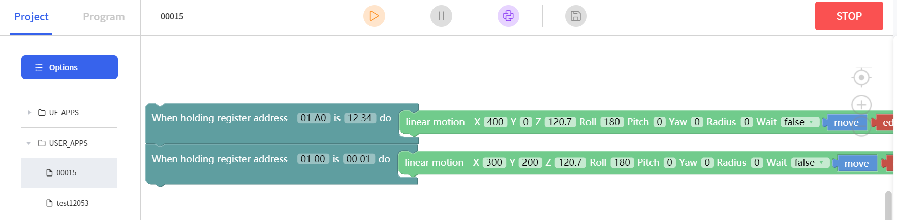

# How to use 'Modbus TCP' block under Blockly module?
Firmware version: V2.4.0+

UFactory Studio version: V2.4.100+

Block: 'Externals - When holding register address [] is [] do'


Holding register:  

Address: 256 ~ 511(0x0100 ~ 0x01FF)

Value: 0 ~ 255(0x00 ~ 0xFF)

**Example:**

Create a Blockly project named 00015.

Drag 2 blocks and enter the corresponding address and its value.





Trigger the Blockly via Modbus TCP:

```

1.Send '00 01 00 00 00 09 01 10 00 30 00 01 02 00 0F' to trigger 00015 Blockly project.

2.Send '00 01 00 00 00 06 01 06 01 A0 12 34' to write '12 34'  to the address '01 A0', it will let the arm go to [400, 0, 120.7, 180, 0, 0].

3.Send '00 01 00 00 00 06 01 06 01 00 00 01' to write '00 01' to the address '01 00', it will let the arm go to [300, 200, 120.7, 180, 0, 0].
```
