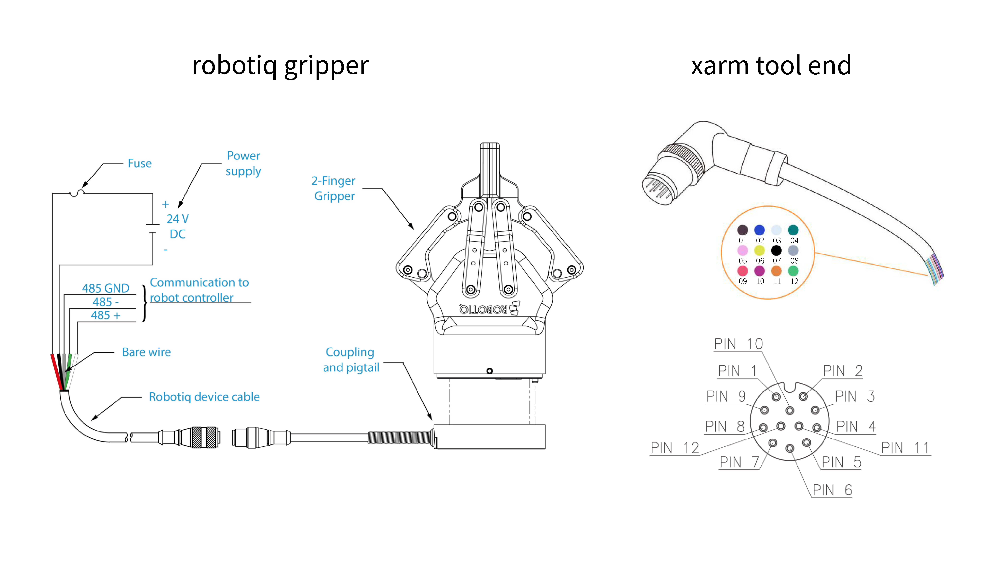

# How to use Robotiq Gripper on xArm tool end?

This article mainly explains the connection method of the Robotiq Gripper and xArm, and the usage example of the robotiq gripper.


## 1.Hardware

* Gripper: Robotiq 2F-85/ Robotiq 2F-140
* Robotic Arm: xArm5/ xarm6/ xArm7

## 2.Cable connection

### 1)Pin Definition



### 2) Connection

| Robotiq connector | Robotiq connector | xArm tool end | xArm tool end |
|-------------------|-------------------|---------------|---------------|
| **Color**         | **Signal**        | **Color**     | **Signal**    |
| red               | +24V DC           | brown或者blue   | +24V DC       |
| black             | -24V DC           | white         | GND           |
| white             | 485-A             | pink          | User 485-A    |
| green             | 485-B             | yellow        | User 485-B    |
| grey              | 485 GND           | green         | GND           |


## 3. Parameter Config

The main parameter is the Baud rate, TCP offset, TCP payload, and self-collision prevention model.

### 1)Config the parameter via UFactory Studio

TCP Payload and offset: 'Settings-Motion-TCP'.

.png)

Self-collision prevention model: 'Settings-Live Control-End Effector', choose Robotiq Gripper.

Please choose 'yes', It will set the baud rate to 115200, the default baud rate is 2000000.

.png)

### 2)Config the parameter via Python SDK

Baud rate:

```python
# Modify the baud rate to 115200, the default is 2000000.
arm.set_tgpio_modbus_baudrate(115200)  

```


TCP Payload and offset:


```python
# Robotiq 2F/85 Gripper
arm.set_tcp_load(0.925, [0, 0, 58])
arm.set_tcp_offset([0, 0, 174, 0, 0, 0])
arm.save_conf()

# Robotiq 2F/140 Gripper
arm.set_tcp_load(1.025, [0, 0, 73])
arm.set_tcp_offset([0, 0, 244, 0, 0, 0])
arm.save_conf()
```


Self-Collision Prevention Model:


```python
# Robotiq 2F/85 Gripper
arm.set_collision_tool_model(4)

# Robotiq 2F/140 Gripper
arm.set_collision_tool_model(5)
```


## 4. Control Method

### 1) Control it via UFactory Studio.

UFactory Studio - Live Control:


(1)(1)(1).png)


UFactory Studio - Blockly:

(1)(1).png)

### 2) Control it via Python SDK

Code Example
```python

arm.set_tgpio_modbus_baudrate(115200)  
arm.robotiq_reset()
arm.robotiq_set_activate()    #enable the robotiq gripper
arm.robotiq_close()
arm.robotiq_open()
```


**Note:**

1\. When using the SDK to control the gripper, there is no need to send the CRC, we will add it automatically.

2\. Please note that we consider the slaver ID of the Robotiq gripper as **ID=9** by default. If you modify the ID of the gripper, UFactory Studio or SDK above should not work, you can only use getset\_tgpio\_modbus\_data to control it.

