# How to replace the end flange of Lite6?

You will receive:

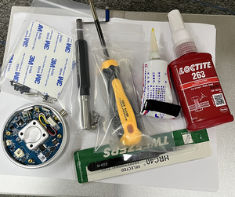

### 1. Remove the end flange

1\) Power off the Lite6 and put it on the table horizontally.

Mark the position of the end, at the last step we need to align this line to reinstall the end flange.

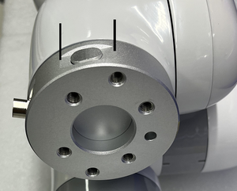

2\)  Remove the round sticker with tweezers.

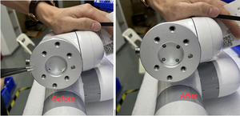

3\) Remove 4 screws using M3 L type wrench.

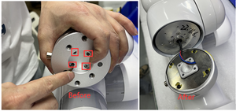

4\) Remove 4 screws using cross screwdriver.

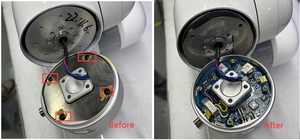 

5\) Remove the yellow liquid glue in the below pin using tweezers.

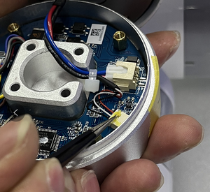

6\) Use tweezers to pull out the pin module.

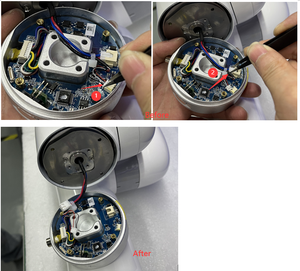

### 2. Install the end flange

1\) Use tweezers to insert 2 pin module.

Costed with yellow liquid glue in one pin module.

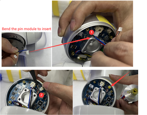

2\) Put on the metal cover, tighten 4 screws and costed with yellow liquid glue in 4 screws.

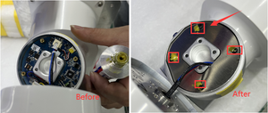

3\) Insert the cable into the circular hole, align it with the previous marked line.

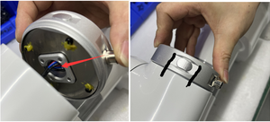

4\) Costed with red liquid glue in 4 screws and then tighten 4 screws.

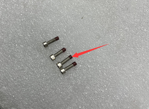

5\) Put on round stickers.

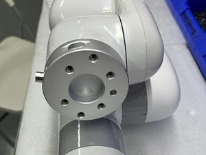

