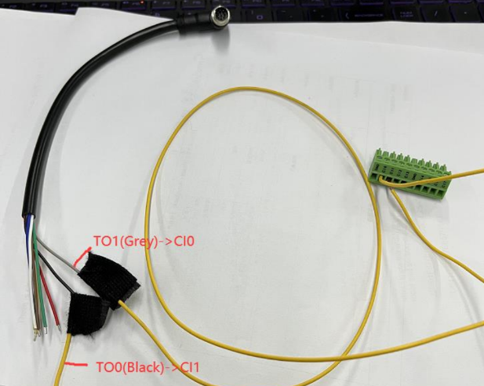
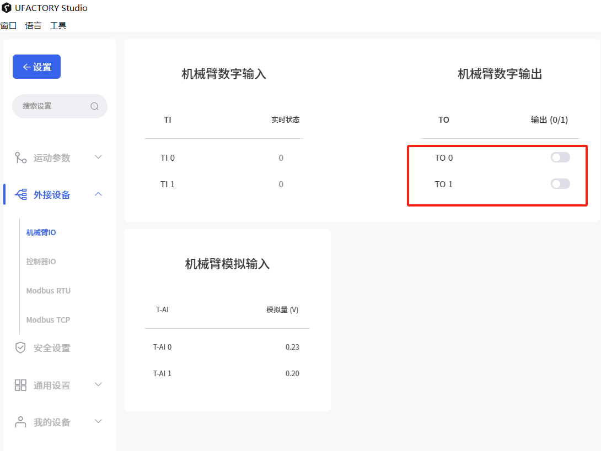
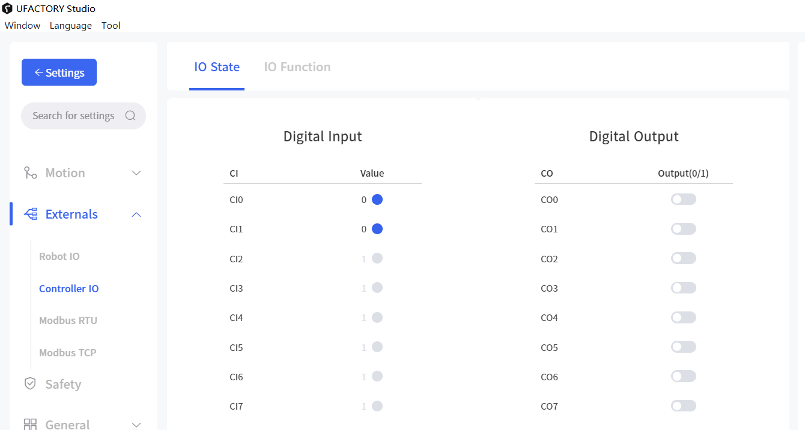

# How to verify the digital input and output are normal?

Take TO and CI as an example.

### 1. Hardware Connection

Connect TO0 to CI0, Connect TO1 to CI1

Connect the End-Effector cable to the end side of the arm.

Connect the pin module back to controller's IO.

### 2. Software Operation

1\) Enter 'Settings-Externals-Controller IO', CI0 & CI1 should in 1(high level).

.png)

2\) Switch to 'Robot IO', set TO0 & TO1 to 1(high level).

3\) Go back to 'Controller IO',  CI0 & CI1 should be changed to 0(low level).

