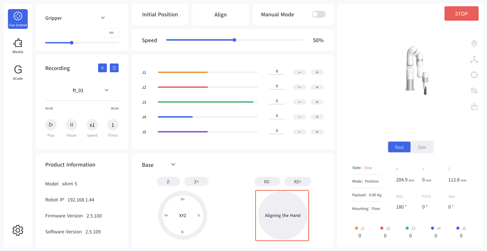

# How to align the tool end flange of xArm5 Lite?

## 1. UFACTORY Studio
'Live Control - Aligning the Hand'.

## 2. Python SDK
Calculated J4 Joint angel via: J4 = - (J2+J3) and set it, this way the end was aligned.

~~~python
// align the end flange of xArm 5 Lite
code, angles = arm.get_servo_angle()
if code == 0:
    angles[3] = -(angles[1] + angles[2])
    arm.set_servo_angle(angle=angles, wait=True)
~~~