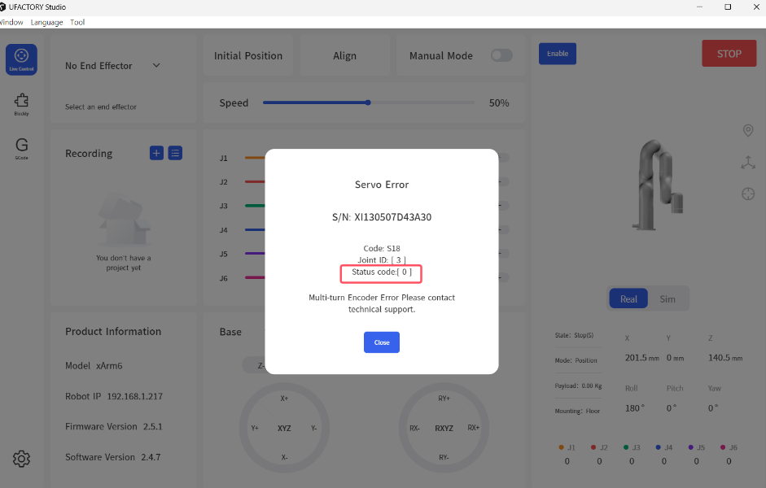

# How to solve S18 error?

S18: Multi-turn Encoder Error'

Product: xArm series, UF 850, Lite6

UFactory version: V2.4.0+

Please note that if the arm is not used for a long time(**≥3 months**), you need to power on the arm for 6 hours every 3 months to charge the built-in battery of the arm, otherwise the encoder data may be lost and report S18 error.

### Status code=0:

There is a status code of S18 error. If the status code is 0, please enter 'Settings-General-Debugging Tools-Joint', enter '**H101D0813V256I\***', and send. **Press down the E stop button and release.**

* stands for joint ID, can be 1-7.

For example, H101D0813V256I3.

.png)

### Status code≠0:

Please provide the SN of the robot, and take a screenshot of the error page to <[support@ufactory.cc](mailto:support@ufactory.cc)>.

###
