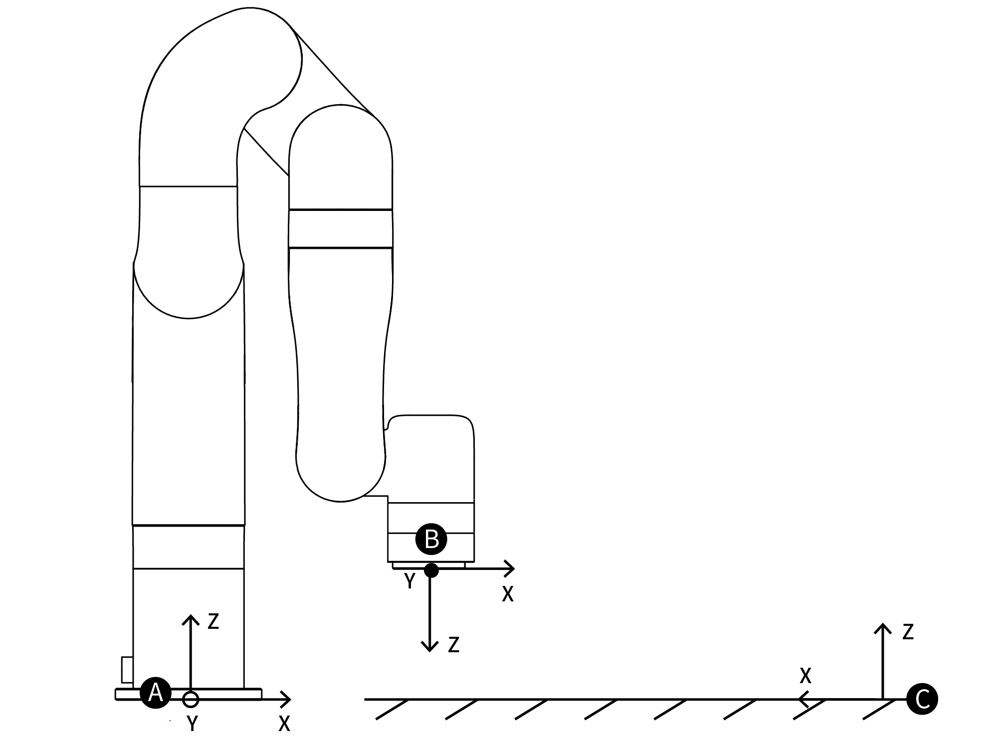

# 11. Glossary
***
**Control Box:** The control box, core part of the robotic arm, is the integration of the robotic arm control system.
***
**End Effector:** The end effector, installed on the front end of the wrist of the robotic arm, is used to install special tools(such as grippers, vacuum gripper, etc.), which can directly perform work tasks.
***
**Enable Robotic Arm:** Power on the robotic arm and turn on the motor of the robotic arm. After the robotic arm is enabled, it can start to move normally.
***
**TCP:** Tool Center Point.
***
**TCP Motion:** TCP motion is the Cartesian space motion, with target position in Cartesian space coordinate and the end follows the specified trajectory(arc, line, etc.)
***
**TCP Payload:** The payload weight refers to the actual(end tool &other object) weight in kg; the X/Y/Z-axis indicates the position of the center of mass of the TCP relative to the default tool coordinate system, with unit of mm.
***
**TCP Offset:** Set the relative offset between the default tool coordinate system at flange center and the actual tool coordinate system, with distance unit of mm.
***
**Roll/Pitch/Yaw(RPY):** Roll/Pitch/Yaw sequentially rotates around the X / Y / Z of the selected coordinate system (base coordinate system).  
The following describes the roll/pitch/yaw orientation representation of {B} relative to {A}:  
For example, the coordinate system {B} and a known reference coordinate system {A} are first superposed. First rotate {B} around **X-axis** by γ, then around **Y-axis** by β, and finally around  **Z-axis** by α.  
Each rotation is around a fixed axis of the reference coordinate system {A}. This method is called the XYZ fixed angle coordinate system, and sometimes they are defined as the roll angle, pitch angle, and yaw angle.  

The above description is shown in the following figure:

The equivalent rotation matrix is:   
$$ 
{{}^B_A \mathbf{R}_{XYZ}(\gamma, \beta, \alpha) = \mathbf{R}_Z(\alpha)\mathbf{R}_Y(\beta)\mathbf{R}_X(\gamma)}
$$
Note: γ corresponds to roll; β corresponds to pitch; α corresponds to yaw.
***
**Axis-angle:** Rx / Ry / Rz representation also, using 3 values to represent the pose (but not three rotation angles), which is the product of a three-dimensional rotation vector [x, y, z] and a rotation angle [phi (scalar)].
The characteristics of the axis angle:
Assume the rotation axis is [x, y, z], and the rotation angle is phi.
Then the representation of the axial angle:
[Rx, Ry, Rz] = [x * phi, y * phi, z * phi]
* [x, y, z] is a unit vector, and phi is a non-negative value.
* The vector length (modulus) of [Rx, Ry, Rz] can be used to estimate the rotation angle, and the vector direction is the rotation direction.
* If you want to express reverse rotation, invert the rotation axis vector [x, y, z], and the value of phi remains unchanged.
* Using phi and [x, y, z] can also derive the attitude representation as unit quaternion q = [cos (phi / 2), sin (phi / 2) * x, sin (phi / 2) * y, sin (phi / 2) * z].
For example:
The vector of the rotation axis represented by the base coordinate system is [1, 0, 0], and the rotation angle is 180 degrees (π), then the axis angle representation of this pose is [π, 0, 0]. 
The rotation axis is [0.707, 0.707, 0] and the rotation angle is 90 degrees (π / 2), then the axis angle posture is [0.707 * (π / 2), 0.707 * (π / 2), 0].
***
**Base Coordinate System:** The base coordinate system is a Cartesian coordinate system based on the mounting base of the robotic arm and used to describe the motion of the robotic arm(Front and back: X axis, left and right: Y axis, up and down: Z axis).  
**Tool Coordinate System: ** Consists of tool center point and coordinate orientation. If the TCP offset is not set, the default tool coordinate system is located at flange center. 
For tool coordinate System based motion: The tool center point is taken as the zero point, and the trajectory of the robotic arm refers to the tool coordinate system.  
**User System: ** The user coordinate system can be defined as any other reference coordinate system rather than the robot base.

***