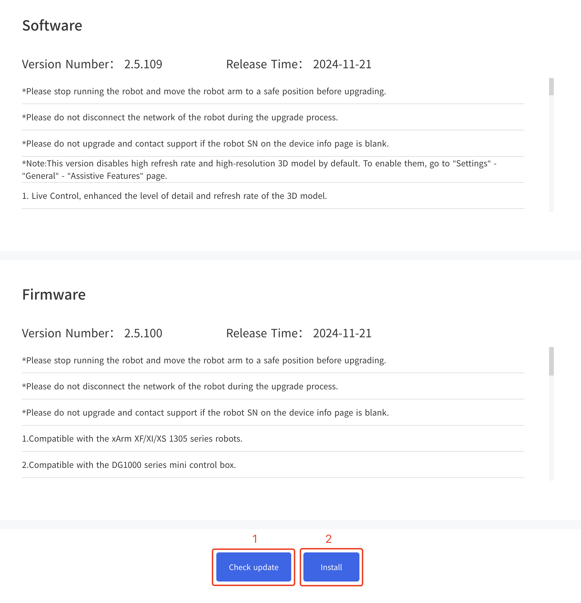
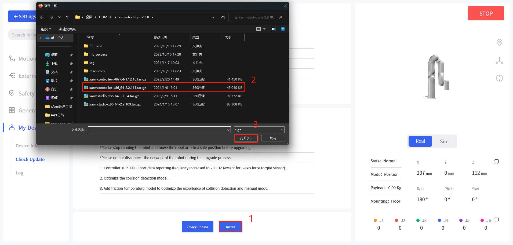
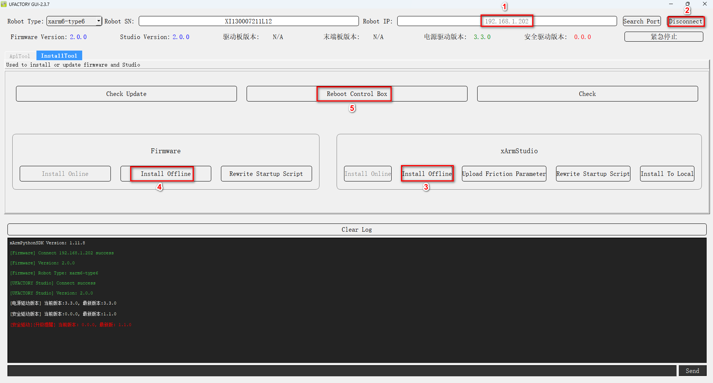

# 13. Software and Firmware Update Method

## 13.1 online update
When PC has network connection.

**Method 1:** UFACTORY Studio.    
Enter Settings - My Device - Check Update, click "Check for Update", if there is a new version, click "Download", click "Install" to load the downloaded installation package and wait for the system to reboot. The reboot will take about 2-3 minutes.

## 13.2 offline update
When PC has no network connection.  

**Method 1:** UFACTORY Studio.    
Enter Settings - My Device - Check Update, click "Install" to load the offline package downloaded in advance, reboot the system, it will take 2-3 minutes.
    
  
**Method 2:** xArm-Tool-GUI.  
Download the [xarm-tool-gui](https://drive.google.com/drive/folders/1zhWkVTCdJYv2eMCrhY6wNc82jYXnXOMB?usp=drive_link) tool, unzip and run it. Enter the IP address of the controller and click 'Connect' button.
* Click Firmware - Offline Installation, select the offline firmware package you downloaded in advance, click 'Install', the interface pop-up prompt "Install firmware successfully".
* Click xArmStudio - Offline Installation, select the offline package downloaded in advance, click 'Install', the interface will pop up a prompt "Install Studio successfully".
* Click Reboot Control Box, wait for 2-3 minutes for the controller to finish rebooting and reconnect.

**Note:** If the online upgrade fails, you can try the offline upgrade. When the offline upgrade is still unsuccessful, please contact technical support (support@ufactory.cc).