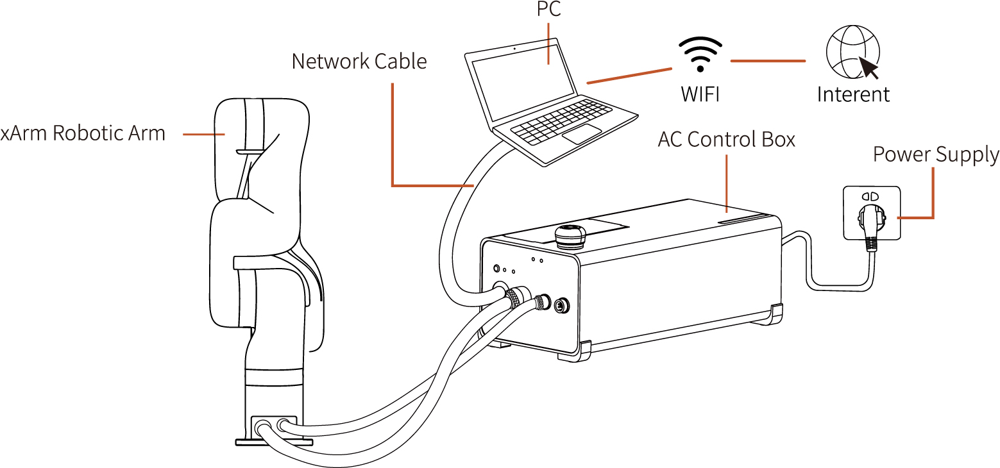
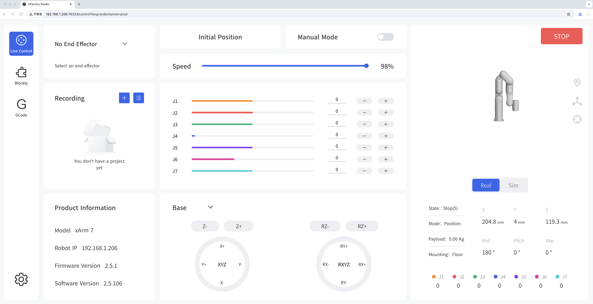

# 2. Connection

## 2.1 Hardware Preparation
Recommended connection method: the control box is directly connected to the PC.
  
For more connection methods, please check Hardware Connection.

## 2.2 Software connection
The default IP of robotic arm is 192.168.1.xxx, please make sure that the IP address of the PC and control box are on the same network segment.  

Please refer to [Quick Start Guide](https://www.ufactory.cc/wp-content/uploads/2023/04/Quick-Start-Guide-of-Lite-61.pdf) to learn how to set the IP of PC.    

Enter 'IP+:18333' on the browser to access UFACTORY Studio.  
For example:   
The IP of control box is 192.168.1.201  
Access link: 192.168.1.201:18333
