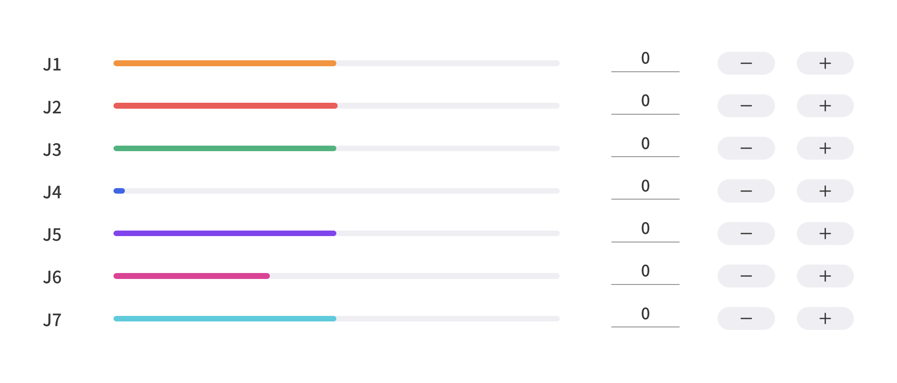

# 3. Live Control


## 3.1 End Effector
The end effectors currently supported are: 
* xArm Gripper
* xArm vacuum Gripper
* xArm BIO Gripper
* Robotiq-2F-85 Gripper
* Robotiq-2F-140 Gripper
* Gripper Lite
* Vacuum Gripper Lite.
  
No End Effector by default.
Take xArm Gripper as an example:


It will set the robotic arm as default baud rate when switching the end effector. For example: the default baud rate of xArm Gripper is 2000000, the default baud rate of Robotiq gripper is 115200.


When installing other end effectors (not officially provided) at the end of the robotic arm, please choose other.  

You can choose a 3D model (cylinder/cuboid) that can wrap the end effector and use it as the self-collision prevention model of the end effector.


## 3.2 Recording
The position of the joint is obtained and recorded by 250HZ to record the motion trajectory of the robotic arm in free driving, and the maximum recording time is 5 minutes. The playback will completely repeat the motion trajectory during recording, and the playback speed of the trajectory can be set (x1, x2, x4). A recorded trajectory can be imported into Blockly projects.

1. Play: play the trajectory.
2. Pause: pause the trajectory.
3. Speed: set playback speed.
4. Times: set playback times.
5. Create new file: 
6. import/delete file: file operation.

Create new file:  
Manual Mode will be turned on accordingly by clicking on the button, and the robotic arm can be dragged directly for trajectory recording. When starting recording, be sure to pay attention to the load state of the robotic arm, so as to avoid the big difference between the actual load and the set load of the robotic arm, resulting in its self-motion.


import/delete file:  


## 3.3 Product Information
This page display the product information, such as: Model, IP, Firmware Version, Software Version, State, Mode, Payload, Mounting, etc.

* IP:The IP of the controller.
* Mode:Robotic arm mode, default: position mode.
* Payload:Robotic arm payload, default: 0kg.
* Mounting:Robotic arm mounting way, default: Floor.
* TCP Coordinate:Current TCP coordinates.
* Joint Angle:Current joint angle.

## 3.4 Position & Joint Control

**Initial Position:** Long press for continuous motion, the robotic arm will back to the initial position.   
Default initial position:  
* xArm/850: ``` [0,0,0,0,0,0,0]```   
* Lite6：```[0,9.9,31.8,0,21.9,0]```  
  
**Align:** Align the head. (xArm7 don't provide such a function)  

**Manual Mode:** By turning on the Manual Mode, the joint can be driven freely by hand. 
Turn on the joint manual mode, you can manually drag the robot links to reach the target position, making it easier to record the robot's motion trajectory, thereby reducing the development workload. When danger occurs, you can also use the manual mode to manually drag the robot away from the danger zone.
* Before opening the manual mode, you must ensure that the installation method of the robotic arm and the payload setting of the robotic arm are consistent with the actual situation, otherwise it will be dangerous.
* The serial number of robotic arm and the control box need to be matched before Manual Mode can be turned on. The SN of the control box can be checked in Settings-My Device-Device Info. 
* The SN address of the robotic arm can be checked next to the power signal interface of the base.

**Speed:** It is used to adjust the motion speed of the live control interface of xArm.  
* 50%=115mm/s, default
* 1% = 2.3mm/s
* 100% = 230mm/s  

Note: The maximum speed of the live control interface is not the actual maximum motion speed of the robotic arm. If you want the program to run at high speed, you can add a speed command in the Blockly motion program.


**Linear Motion:** Users can control the motion of the robotic arm based on the base coordinate system and TCP coordinate system. The trajectory of tool center point in the Cartesian space is a straight line. Each joint performs a more complex movement to keep the tool in a straight path. The TCP path is unique once the target point is confirmed, and the corresponding posture in the execution process is random. 
* X, Y, and Z control the position of TCP in base or tool coordinate system, in the unit of mm. While Roll/Pitch/Yaw controls the TCP orientation in the unit of degree.
* Linear motion and arc linear motion belong to the Cartesian space trajectory planning, which needs to be solved by inverse kinematics. Therefore, there may be no solution, multiple solutions, and approximated solutions; and due to the nonlinear relationship between the joint space and Cartesian space, the joint motion may exceed its maximum speed and acceleration limits. 

***
<font color=Orange size=4>TCP Coordinate：</font>
  
&nbsp;&nbsp;&nbsp;&nbsp;A: Base Coordinates&nbsp;&nbsp;&nbsp;B: TCP Coordinates

The default TCP coordinate system is defined at the centre point of the end flange of the robotic arm, and it is the result of rotating (180°, 0°, 0°) around the X/Y/Z-axis of the base coordinate system in order. The spatial orientation of the TCP coordinate system changes according to the changes of the joint angles.
* Roll/Pitch/Yaw respectively rotates around X/Y/Z of the base coordinate system, and the final TCP orientation is the result of the three rotations in exact order. The robotic arm will always choose the shortest way to reach target orientation. In particular, it is important to strictly control the magnitude of the deflection angle between the two points to control the direction of rotation, and if necessary, insert a third point between the two points. As shown in figure 6.4, if a deflection is needed from position point A to point B, the robotic arm moves in the direction of α angle.  If the robotic arm needs to be moved in the direction of the β angle, a new position between the angles of β should be inserted, and the angle that formed by the inserted point and A should be smaller than α. 

* The +180° and -180° points of the Roll/Pitch/Yaw are coinciding in the space, and the valid range is ±180°, so it is possible to have both ±180° when the robotic arm is reporting the position.
* Roll angle, pitch angle, and yaw angle (RPY). The RPY rotation matrix (X, Y', Z" rotation) is determined by the following formula:
$$
Rrpy ( r, p,y) = R Z (y ) · R Y (p ) · R X ( r )
$$ 
    
&nbsp;&nbsp;&nbsp;&nbsp;A: Base Coordinates&nbsp;&nbsp;&nbsp;B: TCP Coordinates(no offset)

**DANGER: You must check the TCP offset before recording the Cartesian position.**
***

**Joint Motion:** The robotic arm consists of joint modules. The position of the end-effector is controlled by coordinating the rotation angle of each joint.   
The joint motion reaches the target point with the fastest path, the end trajectory is not a straight line, and the speed unit is °/s. After the target point is set, the corresponding poses are unique for TCP and the joints along the trajectory.


To confirm the direction of joint rotation, please refer the figure below：   


## 3.5 Enable & STOP button


**Enable:** Enable Robotic Arm. This button will disappears after the robotic arm is enabled.  

**STOP:** The robotic arm will stop immediately and clear all cache commands. It's a **software stop**, the power is still on.

## 3.6 Real & Simulation robotic arm
Switch to real or simulation robotic arm, both mode needs to connect to a real robotic arm.  

When switch to simulation robotic arm, the robot will not move but the settings will apply to real robotic arm.
For example, set tcp payload as 0.6kg in sim mode, the tcp payload will be 0.6kg when switching back to real mode.


1. Reset Perspective: Reset to default Perspective.
2. Base: Current base coordinate system.
3. TCP: Current TCP coordinate system.
4. Plot Path: Plot trajectory path.
5. Clean Path: clean trajectory path.

The picture below showing the Base and TCP coordinates, and plot path.


