# 4. Blockly
Blockly is a graphical programming tool that can be programmed to control the robotic arm by dragging and dropping code blocks without the need to write the code manually.

## 4.1 Interface Overview

1. Run: Run the Blockly program.
2. Pause: Pause the Blockly program.
3. Convert to Python：Convert to Python code.
4. Save：Save change to Blockly code.
5. Zoom log：Zoom in/out the log page.
6. Zoom 3D models：Zoom in/out the 3D models page.
7. File Operation：new, import, download, copy, paste, rename, delete.

## 4.2 Blockly Workspace
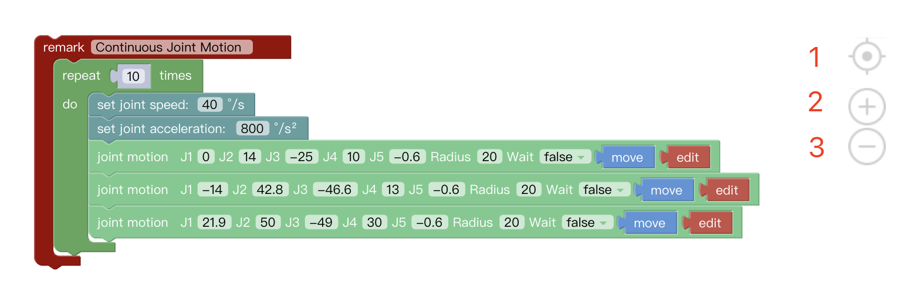
1. Reset Workspace: Reset to default workspace.
2. Zoom in: Zoom in the code block.
3. Zoom out: Zoom out the code block.

**Right Click Mouse Event in the Workspace**
Right-click on the blank workspace of the non-code block, the function is mainly for all code blocks:
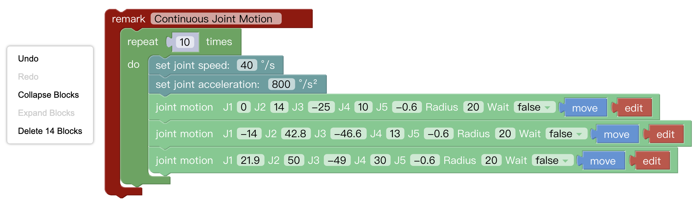
1. Undo: Undo the previous operation.
2. Redo: Restore the last undo operation.
3. Collapse Blocks: Collapse all code blocks.
4. Expand Blocks: Display all collapsed commands.
5. Delete 14 Blocks: Delete all code blocks.

**Move/Wait/Edit**
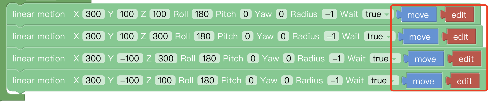
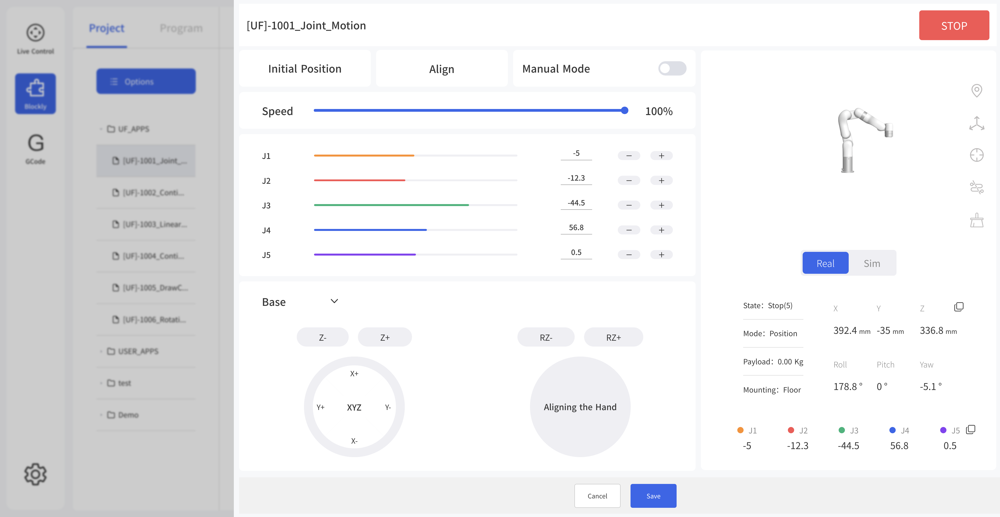
For some common functions of the motion commands:
1. Move: The robotic arm will move to the current position
2. Edit: The robotic arm will move to the current position and jump to the live control page.
3. Wait (true/false): indicating whether to wait for the execution of a command before sending the next one.

## 4.3 Blockly Code Block
### 4.3.1 Settings
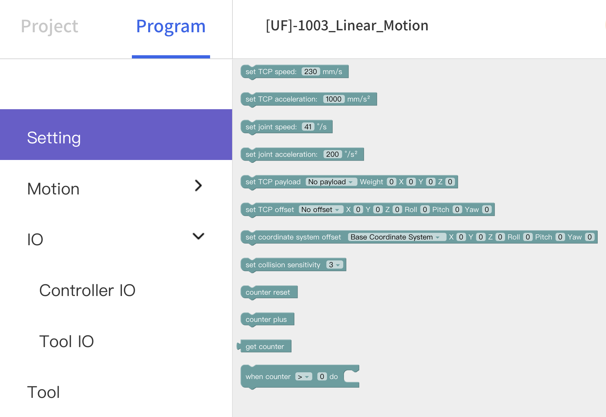
**Set TCP speed:** Set the speed of the linear motion in mm/s.  
**Set TCP acceleration:** Set the acceleration of the linear motion in mm/s².  
**Set joint speed:** Set the speed of joint movement in °/s.  
**Set joint acceleration:** Set the acceleration of joint motion in °/s2. The default speed and acceleration values in the code block are the speed and acceleration values set currently, which can be modified manually.  
**Set tcp load() weigh() XYZ:** Set the load of the current project, refer Settings-TCP Payload from the drop-down list.  
**Set tcp offset() XYZRPY:** Set the end offset of the current project, reference Settings-TCP Offset from the drop-down list.  
**Set coordinate system offset() XYZRPY：** Set the base coordinate offset of the current project. The drop-down list refers to the data of the Setting-Base Coordinate Offset.
**Set collision sensitivity:** Set collision detection sensitivity level.  
**Counter reset:** This command resets the counter in the control box to 0.  
**Counter plus:** Each time the command is run, the counter of the control box will be incremented by 1. It can be used to calculate the number of times the program actually cycles.
**Get counter:** Get the value of counter.
**When counter (>)0 do:** Execute when event.

### 4.3.2 Motion
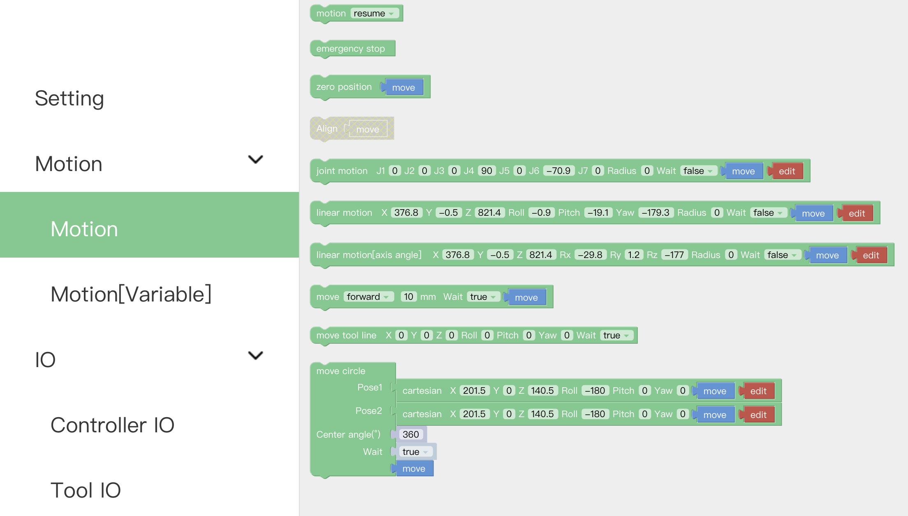  
**Motion:** With this command, operators can set the state of the robotic arm (movement, pause, stop). It is used to control the state of the robotic arm. It is mainly used in condition-triggered programs.  
**Emergency stop:** The robotic arm immediately stops moving and clears the command cache.  
**Zero position:** The robotic arm returns to a posture where the joint value are 0.
**Align:** Align the head.   
**Joint motion:** Set each joint value for the joint movement, with the unit of degree.  
**Linear motion:** Set the Cartesian coordinate target value of the linear motion and the TCP rotation angle in mm and °. 
**Move (forward)()mm wait():** Indicates that the robotic arm makes relative linear motion forward/backward/left/right based on the current position, in mm.  
**Move tool line XYZRPY:** This command is a relative motion relative to TCP coordinates.
**Move circle:** From current position, the whole circle is determined by current position and position1 and positon2, “center angle” specifies how much of the circle to execute.   
center angle:Indicates the degree of the circle. When it is set to 360, a whole circle can be completed, and it can be greater than or less than 360; (Note: To achieve smooth track motion, you need to set Wait = false).

**Motion with Variable:** 
The command passes through the Cartesian motion and supports      variable values.
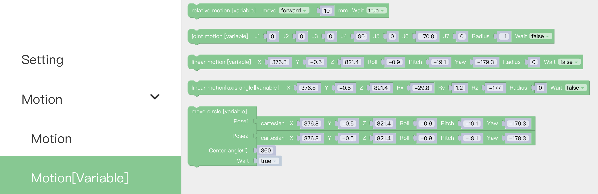

### 4.3.3 IO

#### 4.3.3.1 Controller IO
The IO interface is made up of a control box interface and an end tool interface, which can be used to acquire, set, and monitor IO interface operations.   
The control box has 16 digital input, 16 digital output, 2 analog input and 2 analog output.   
The end tool has 2 digital input, 2 digital output, 2 analog input and 2 analog output.  
The control box digital IO is **low-level-triggered**.   
The end tool digital IO is **high-level-triggered**.
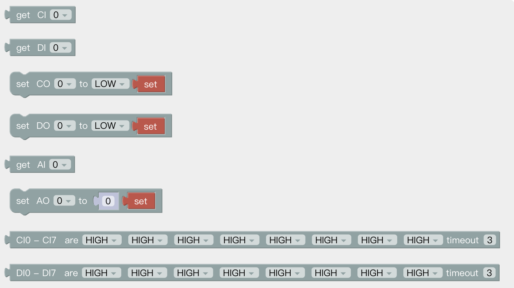
get IO:Acquire the I/O interface data of the code block.

set IO:Set the I/O interface of the code block, click 【Set】 to run the command.  

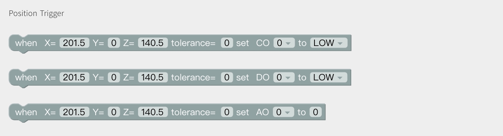
set I/O when（X, Y, Z, tolerance）:When the robotic arm reaches the specified position (the area of the sphere specified with the trigger position point (X, Y, Z) as the center (the radius of the sphere is the tolerance radius)), IO is triggered. This command can be used to trigger IO at a specific location.
X, Y, Z represent the coordinate value of the specified position to be reached by the robot arm, with the unit of mm.
The digital IO is triggered as soon as the system detects that the TCP position enters a spherical area centered at (X, Y, Z) with the specified radius. If the tolerance radius is not set, when the robotic arm passes the specified point at a speed other than 0, it may miss the trigger because it cannot be accurately detected.  
when digital I/O is (High/Low) do:Executes the commands contained in this code block when the condition is met.   

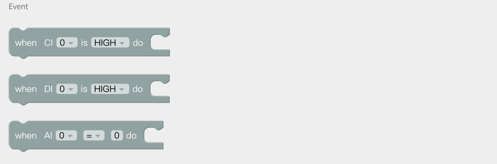
when the analog IO value satisfies the set condition do: When the monitored analog IO value meets the condition, the commands contained in the code block will be executed, and the condition are =, ≠, >, ≥, <, ≤.

#### 4.3.3.2 Tool IO
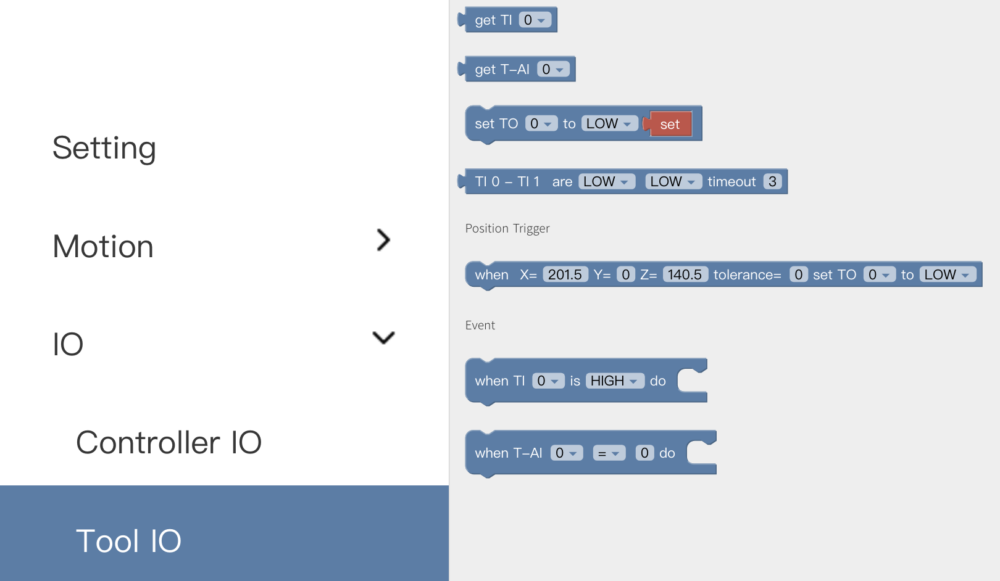
Similar to Controller IO.

### 4.3.4 Tool
  

### 4.3.5 Externals

### 4.3.6 Import

### 4.3.7 Logic

### 4.3.8 Loop

### 4.3.9 Math

### 4.3.10 Advance

## 4.4 Python IDE
Python IDE is a Python development integration environment that can directly use xArm-Python-SDK API and check the Blockly projects converted into Python code.
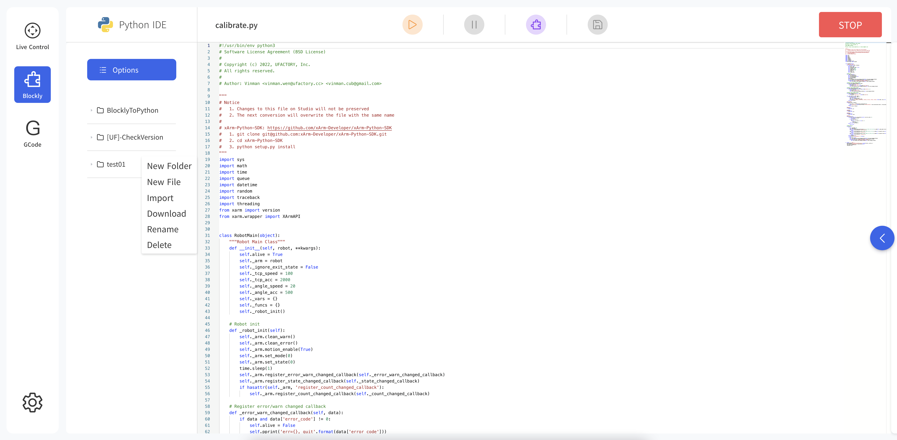