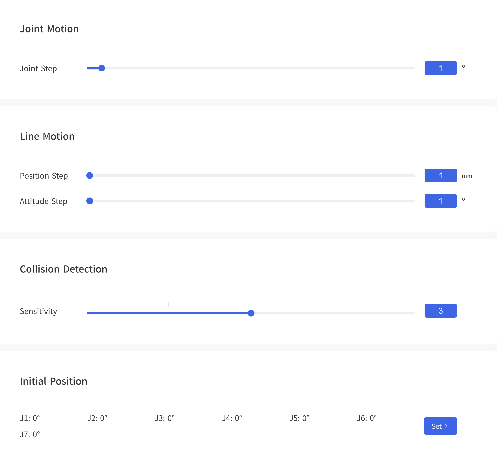
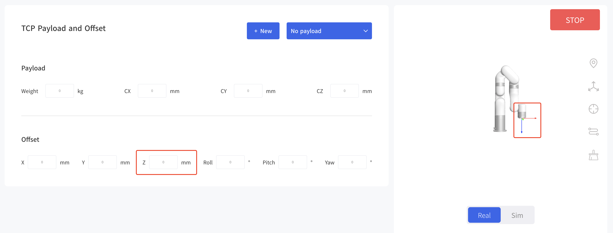

# 6. Settings

## 6.1 Motion 

### 6.1.1 Parameters

**Joint Step:** Set the step length for fine adjustment of single joint rotation in Live-control.  

**Position Step:** Set the step length for fine cartesian position (X/Y/Z) adjustment in Live-control.  

**Attitude Step:** Set the step length for fine adjustment of TCP orientation in Live-control.  

**Collision Detection Sensitivity:** When the deviation of the torque detected by the joint exceeds a certain normal range during the movement of the robotic arm, the robotic arm will automatically stop to prevent the robotic arm or the operator from being injured. The collision sensitivity range is 1 to 5 levels. The larger the value is set, the higher the collision sensitivity level is, and the smaller the additional torque required for the robotic arm to trigger collision protection. If the load or installation direction is not set accurately, it may cause false alarms.   
During certain high loads or high speed movements, if you confirm that the load or installation direction is set accurately, you can try to lower the collision sensitivity, but it is not recommended to lower it to less than 3. 

**Initial Position:** Setting the Initial Position of the robotic arm can help the user to return the robotic arm to a relatively safe position when planning the motion trajectory.

### 6.1.2 TCP
Set TCP Payload and TCP Offset according to the actual situation.

**TCP Payload:** The load weight refers to the actual mass (end-effector + object) in Kg; X/Y/Z-axis represents the position of the centre of gravity of payload in mm, this position is expressed in default TCP coordinate located at flange center (Frame B in the above figure). If there is virtually no load at the end, both TCP payload and centre of gravity must be set to 0.  

**TCP Offset:** Setting the Tool Coordinate Offset with respect to the initial tool frame located at the center of the flange (Frame B in the above figure). The position coordinates X, Y, and Z determine the position of TCP, while Roll, Pitch, and Yaw determine the orientation. When the specified value is zero, TCP coincides with the centre point of the tool output flange.

The current payload of the robotic arm can be set and the additional TCP payload data can be recorded. The additional TCP payload data can be referenced during Blockly programming.

**Default TCP payload：[kg,Cx,Cy,Cz][x,y,z,roll,pitch,yaw]**  
* No Payload: [0,0,0,0]，[0,0,0,0,0,0]
* xArm Vacuum Gripper: [0.61,0,0,53]，[0,0,126,0,0,0]
* xArm Gripper: [0.82,0,0,48]，[0,0,172,0,0,0]
* xArm BIO Gripper: [0.72,22.39,3.22,23.55]，[159.5,0,59.5,0,0,0]
* Robotiq-2F-85 Gripper: [0.925,0,0,58]，[0,0,174,0,0,0]
* Robotiq-27-140 Gripper: [1.025,0,0,73]，[0,0,244,0,0,0]

**Create New TCP Payload and Offset**
* Method 1: Manual Input
  When the TCP offset parameter of the end effector is known, you can choose to manually input its TCP offset parameter. 

  Note: Once the name of the new payload has been determined, it cannot be changed.  
  

* Method 2: Automatic identification.
  The current robotic arm must be mounted on a steady floor if automatic identification is selected. The robotic arm needs to run a series of action commands to calculate the parameters of TCP payload. In addition, it is important to ensure the safety of equipment and personnel near the robotic arm. 
  Teaching 5 points to get the TCP offset.
  

### 6.1.3 Coordinates

Base Coordinates:

## 6.2 Externals 

### 6.2.1 End Effector IO
### 6.2.2 Controller IO
### 6.2.3 Torque Sensor
### 6.2.4 Modbus RTU
### 6.2.5 Modbus TCP

## 6.3 Safety

## 6.4 General
### 6.4.1 Assistive Features
### 6.4.2 Debugging Tools
### 6.4.3 Advanced Settings

## 6.5 My Device

### 6.5.1 Device Info
### 6.5.2 Check Update
### 6.5.3 Log