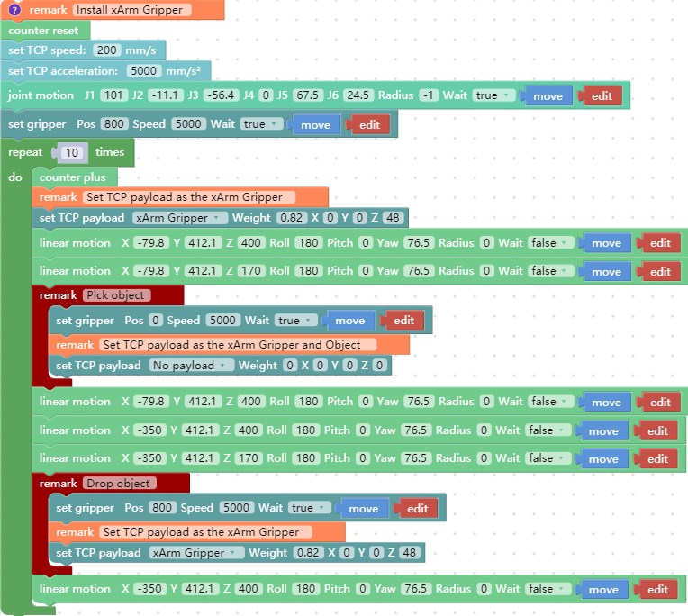
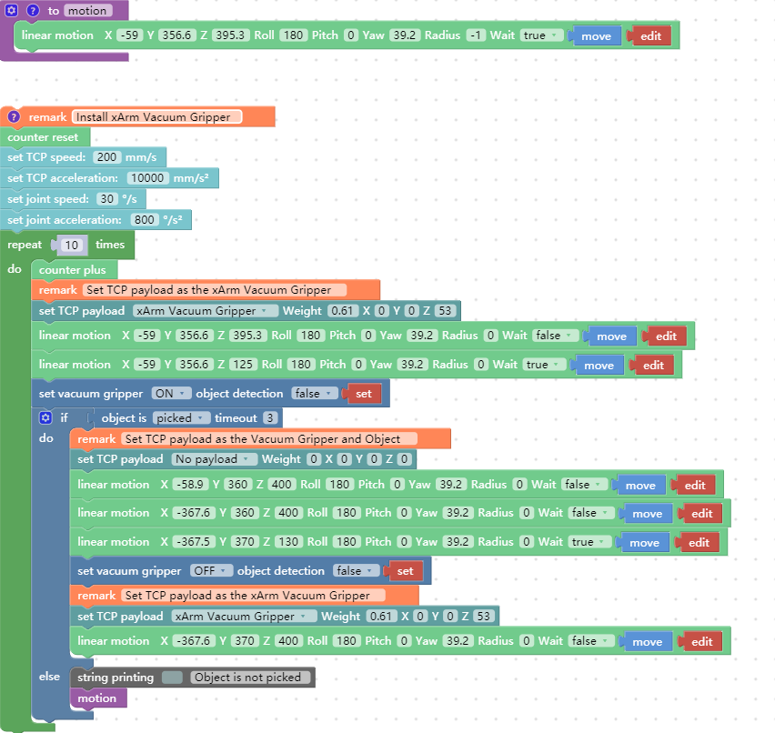
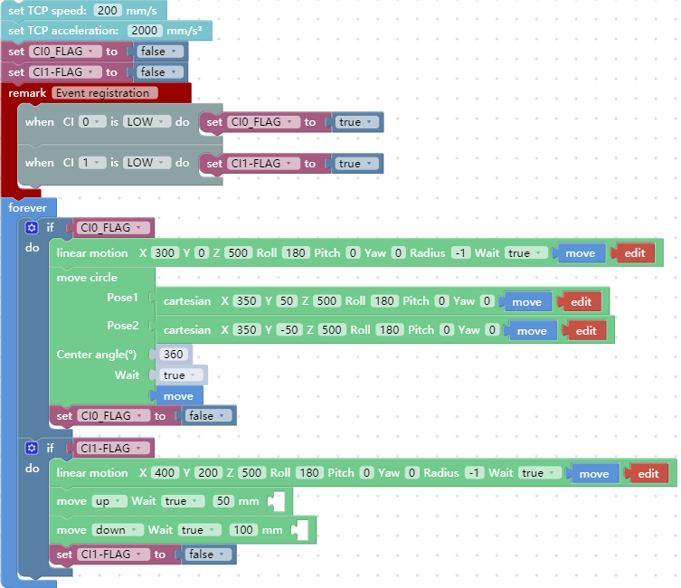

# 7. Blockly Typical Examples
There are multiple examples built into Blockly in UFactory Studio, which you can refer to for programming. Here are some of the more representative examples.

## 7.1 xArm Gripper
[UF] - 1007_xArm_Gripper.

The role of this program: execute this program to control the gripper to grab the target object at the specified position, and then place the target object at the target position.  

Set TCP payload: Dynamic change tcp payload according to the real application.

## 7.2 xArm Vacuum Gripper
[UF] - 1008_xArm_Vacuum_Gripper.

The role of this program: execute this program to control the vacuum gripper to suck the target object at the specified position, and then place the target object at the target position.

Block:
* object is (picked/release): Detect whether the vacuum gripper has picked (released) the object, if it is detected that the vacuum gripper has picked (released) the object, then jump out of this command and execute the next command. If the timeout period is exceeded, the vacuum gripper has not yet picked (released) the object, it will also jump out of the command and execute the next command.
* set xarm vacuum gripper (ON/OFF) object detection (true/false) [set]: Set the vacuum gripper to be on and off.   
  object detection = true: detect whether the object is sucked, if not, it will jump out of the entire program.
  
  object detection = false: do not detect whether the object is sucked.

**Cyclic motion count:** By adding 'Counter plus', each time the command is run, the counter of the Control Box will be incremented by 1. It can be used to calculate the number of times the program cycles.  

**Counter reset:** This command resets the counter in the Control Box to 0.

## 7.3 Digital_IO
[UF] - 1010_Digital_IO.

The role of this program: If you need to use digital IO to control the motion of the robotic arm, you can trigger the digital IO(**signal change**) to perform the corresponding motion.