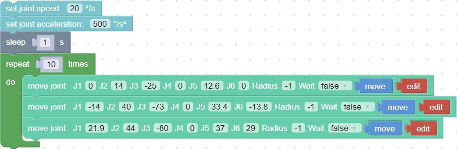

# 8. Motion Characteristics

## 8.1 Motion of Robotic Arm

### 8.1.1 Joint Motion  
To achieve point-to-point motion in joint space (unit: degree), the speed is not continuous between each command.  

* Wait (true / false): indicates whether to wait for the execution of this command before sending the next command.
* Move: The robotic arm will move to the current position.
* Edit: Open the live control interface and adjust the coordinates of the current point.
The motion trajectory of the robotic arm in the above example is as follows:   

Python Example:
~~~python
arm.set_servo_angle(angle=[0.0, 7.0, -71.2, 0.0, 0.0, 0.0], speed=8, mvacc=1145, wait=True)
arm.set_servo_angle(angle=[0.0, 7.0, -51.2, 0.0, 0.0, 0.0], speed=8, mvacc=1145, wait=True)
arm.set_servo_angle(angle=[0.0, 7.0, -91.2, 0.0, 0.0, 0.0], speed=8, mvacc=1145, wait=True)
~~~
set_servo_angle:
* `servo_id`: joint ID, 1-7, None or 8 means all joints.
* `angle`: Joint angle or list of joint angles (the unit of the default joint angle is is_radian = False, degrees (°)).
* `speed`: joint speed (the default unit is °/s).
* `mvacc`: joint acceleration (default unit is °/s²).
* `is_radian`: roll/pitch/yaw Whether it is measured in radian (default is_radian = False).
* `wait`: If wait = True, wait for the current commands to finish before sending the next commands; If wait = False, send the next commands directly.
* `mvtime`: 0, reserved.
***
How to plan continuous Joint motion?    
Inserting an arc transition between two joint motion commands is a way to plan the continuous joint motion of the robotic arm.  

&ensp;&ensp; The motion trajectory of the robotic arm in the above example is as follows:
  

**Key Parameter**
 **Radius=60**
 `Radius =60` in the `move joint` command refers to setting the radius of the transition arc R = 60mm, which is used to achieve a smooth transition of the arc in a joint motion.
The parameters of Radius can be set as Radius> 0, Radius = 0, Radius = -1, different parameters correspond to different trajectories.
* ** `Radius > 0`:** For example, setting Radius = 60, the turning trajectory is as shown in the arc in the figure below, which can achieve a smooth turning effect.
&ensp;&ensp; Note: The radius of the arc is smaller than DAB and DBC.    

* (2) ** `Radius = 0`:** There is no arc transition at the turn, it will be a sharp turn with no deceleration, as shown in the figure below.   

* ** `Radius < 0`:** There is no arc transition at the turn, this speed will not be continuous between this and next motion, as shown in the figure below, speed will decelerate to 0 at point B before moving to C.   

**Conclusion:**
If you need to plan for speed continuous joint motion, make sure **wait = false, radius≥0** to buffer the commands to be blended.
***

### 8.1.2 Linear Motion  
Linear motion between Cartesian coordinates (unit: mm), the speed is not continuous between each command.    

Users can control the motion of the robotic arm based on the base coordinate system and TCP coordinate system. The trajectory of tool center point in the Cartesian space is a straight line. Each joint performs a more complex movement to keep the tool in a straight path. The TCP path is unique once the target point is confirmed, and the corresponding posture in the execution process is random. X, Y, and Z control the position of TCP in base or tool coordinate system, in the unit of mm. While Roll/Pitch/Yaw controls the TCP orientation in the unit of degree.    

Linear motion and circular linear motion belong to the Cartesian space trajectory planning, which needs to be solved by inverse kinematics. Therefore, there may be no solution, multiple solutions, and approximated solutions; and due to the nonlinear relationship between the joint space and Cartesian space, the joint motion may exceed its maximum speed and acceleration limits.   
  

Python Example:
~~~python
arm.set_tcp_jerk(2000)

arm.set_position(x=205.0, y=100.0, z=110.4, roll=180.0, pitch=0.5, yaw=0.0, speed=100,  radius=-1.0, wait=True)
arm.set_position(x=205.0, y=120.0, z=110.4, roll=180.0, pitch=0.5, yaw=0.0, speed=100,  radius=-1.0, wait=True)
arm.set_position(x=205.0, y=140.0, z=110.4, roll=180.0, pitch=0.5, yaw=0.0, speed=100,  radius=-1.0, wait=True)
~~~

If you want to plan speed continuous linear motion, make sure **wait=false, radius≥0.**  

**Note:** If it is xArm5, roll and pitch must be set to roll = ± 180 ° and pitch = 0 °.

### 8.1.3 Circular and Arc Motion  
The circular motion calculates the trajectory of the spatial circle according to the coordinates of three points, which are (starting point, pose 1, pose 2).  

The calculation method of three-point drawing circle:
Use the current point as the starting point, and then set two position points. Three points define a circle. Make sure these three points are not in a common line.
Set the center angle:  
* If 0< center angle (°) <360 ° or center angle (°) > 360 °, the motion path of the robotic arm is a   circular arc of the corresponding degree; center angle = 60°, the motion trajectory of the robotic arm is:  

* The center angle (°) = 360 °, the movement track of the robotic arm is a complete circle;
* If you want to draw multiple circles continuously (for example, draw 10 circles continuously), set center angles equal to 3600°;

* The starting point, pose 1 and pose 2 determine the three reference points of a complete circle. If the motion path of the robotic arm is a circular arc, then pose 1 and pose 2 are not necessarily end points or passing points;
* If you want the robot arm to change its posture during the movement, set the roll, pitch, and yaw of pose 2 to the desired posture when completing the trajectory;
* center angle (°): Indicates the degree of the circle. When it is set to 360, a whole circle can be completed, and it can be greater than or less than 360; 

**Example explanation:**  
In this example, the central angle is set to 3600°, which means that the robotic arm can draw ten circles at a time, and the robotic arm still stays at the starting point after drawing a circle.   

Judgment of the direction of the robotic arm motion:   
In the above example, the starting point, pose 1 and pose 2 are:   
A (300,0,400,180,0,0)   B (350,50,400,180,0,0)   C (350, -50,400,180,0,0)
* The robotic arm draws a circle in a clockwise direction, and t he trajectory of the robotic arm is as follows:  

* If the positions of point B and C are swapped, point B is (350, -50,400,180,0,0), point C is (350,50,400,180,0,0), the robotic arm will draw a circle in a counterclockwise direction. The trajectory of the robotic arm is as follows:  
  

Python Example:
~~~python
arm.set_servo_angle(angle=[0.0, -45.0, 0.0, 0.0, -45.0, 0.0], speed=20, mvacc=500, wait=True)        
arm.set_position(*[300.0, 0.0, 400.0, 0.0, -90.0, 180.0], speed=300, mvacc=2000, radius=-1.0, wait=True)  
move_circle([350.0, 50.0, 400.0, 180.0, -90.0, 0.0], [350.0, -50.0, 400.0, 180.0, -90.0, 0.0], 1000.0, speed=300, mvacc=2000, wait=True)

~~~

## 8.2 xArm5 Motion Characteristics
**Cartesian space**
&ensp;&ensp; The movement of xArm5 is relatively special. Due to the structural limitation, the actual flexible degrees of freedom of linear and circular motions in Cartesian space is 4, which is [x, y, z, yaw], similar to a SCARA manipulator with four degrees of freedom. Before starting Cartesian control, it is necessary to ensure that the end flange surface of xArm5 and the base are completely parallel. If mounted on horizontal plane, the roll and pitch should be [± 180 degrees, 0 degrees], otherwise the trajectory is likely to have no solution.
When firmware version ＞v2.5.0, we provided **Use approximate solutions** option to remove this restriction.

**Cartesian space**
In joint space, the robotic arm has 5 degrees of freedom to control and can switch to joint commands when different orientations are required at the end. Then use the joint command again to return the flange and the base to a horizontal attitude, and you can switch back to Cartesian control. A quick way to set a cartesian controllable attitude is: Just set the angle of J4 equal to-(J2 angle + J3 angle).

## 8.3 Singularity
***
What is singularity?  
Singularities occur when the axes of any two joints of a robotic arm are on the same straight line. At the singularity point, the robot's degrees of freedom will be degraded, which will cause the angular velocity of some joints to be too fast, leading to loss of control. A common situation is that when the wrist joint (the penultimate one) is at or near the axis of the first joint, singularity point will also appear (see Figure 2.1), so the robotic arm should try to avoid passing directly the central area near the base, which is likely to cause 1st Joint speed too high.  

***

**Characteristics**  
The characteristic of the singularity is that the planning movement cannot be performed correctly. Coordinate-based planned movements cannot be explicitly translated into joint motions of each axis. When the robot performs motion planning (linear, circular, etc., excluding joint movements) near the singularity point, it will stop to avoid high instantaneous speed of the joint when it passes the singularity point. Therefore, try to avoid the singularity point or pass the singularity point through joint motion.

**Processing method for singularity point**  
Case 1: Singularity encountered during robot teaching
* Switch the robot coordinate system to a joint coordinate system, and pass the singularity point through joint motion.
Case 2: Singularities encountered while the program is running
* Enable **bypassing singularity** option
* When encountering a singularity point while running the program, you can modify the position and attitude of the robot and re-plan the path to the target point.

Note：  
It is important to consider the cylindrical volume directly above and directly below the base of the robotic arm when a mounting place for the robotic arm is chosen. Moving the wrist joint(second last joint) close to the cylindrical volume should be avoided if possible, because it causes the joints to move fast even though the robotic arm is moving slowly, causing the robot to work ineffificiently and making it diffificult to conduct a risk assessment.
