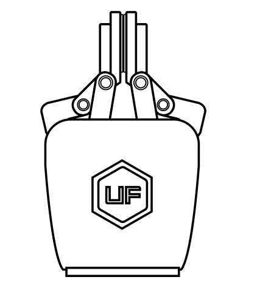

# 1.General_Presentation
## 1.1.Gripper Introduction

The gripper is the end-effector of the robotic arm, which can grasp objects dynamically.

The value range of the gripper opening and closing is: -10 to 850. The larger the value, the greater the stroke of the gripper, meaning the smaller the value, the smaller the stroke of the gripper. If the clamping is not tight, a negative value can be set until it is tightened.

## 1.2.Setup and Control
The gripper is powered and controlled directly via a single gripper connection cable that carries a 24V DC supply and Modbus RTU communication over RS-485.

## 1.3.Safety

****Warning****

The operator must have read and understood all of the instructions in the following manual before handling the xArm Gripper.

**Caution**

The term "operator" refers to anyone responsible for any of the following operations on the xArm Gripper:

*  Installation
*  Control
*  Maintenance
*  Inspection
*  Calibration
*  Programming
*  Decommissioning

This documentation explains the various components of the xArm Gripper and general operations regarding the whole life-cycle of the product from installation to operation and decommissioning.

The drawings and photos in this documentation are representative examples and differences may exist between them and the delivered product.
### 1.3.1.**Warning**

**Caution**

Any use of the Gripper in noncompliance of these **Warning**s is inappropriate and may cause injury or damage.

****Warning****

*  The Gripper needs to be properly secured before operating the robot.
*  Do not install or operate a Gripper that is damaged or lacking parts.
*  Never supply the Gripper with an alternative current (AC) source.
*  Make sure all cord sets are always secured at both ends,Gripper end & Robot end
*  Always satisfy the recommended keying for electrical connections.
*  Be sure no one is in the robot and/or gripper path before initializing the robot's routine.
*  Always satisfy the gripper payload.
*  Set the gripper speed accordingly, based on your application.
*  Keep fingers and clothes away from the gripper while the power is on.
*  Do not use the gripper on people or animals.
### 1.3.2.Risk Assessment and Final Application

The xArm Gripper is meant to be used on an industrial robot.

The robot, gripper and any other equipment used in the final application must be evaluated with a risk assessment. The robot integrator must ensure that all local safety measures and regulations are respected. Depending on the application, there may be risks that need additional protection/safety measures, for example, the work-piece the gripper is manipulating may be inherently dangerous to the operator.

### 1.3.3.Intended Use

The gripper is designed for grasping and temporarily securing or holding objects.
**Caution**

The Gripper is NOT intended for applying force against objects or surfaces.

The product is intended for installation on a robot or other automated machinery and equipment.

**Info**

* Always comply with local and/or national laws, regulations and directives on automation safety and general machine safety.
* The unit may be used only within the range of its technical data. Any other use of the product is deemed improper and unintended use.
* UFACTORY will not be liable for any damages resulting from any improper or unintended use.
