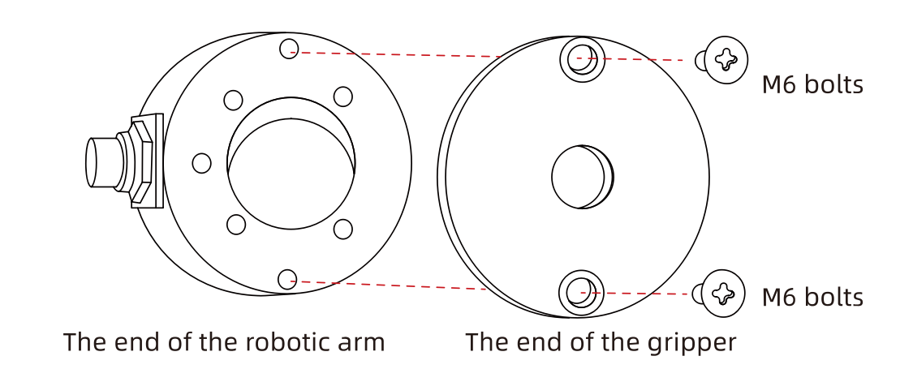
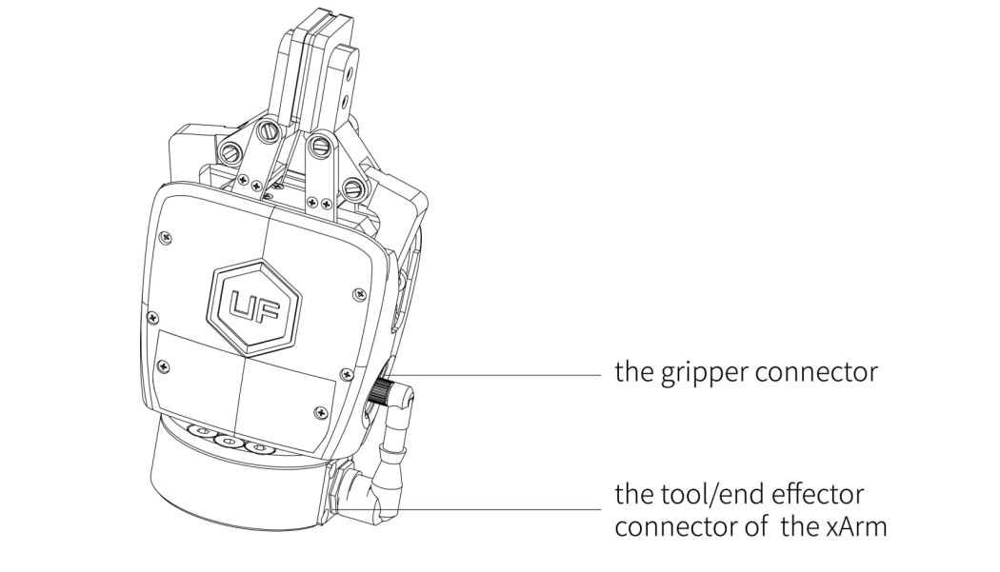
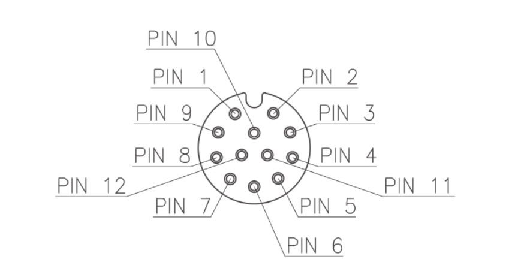
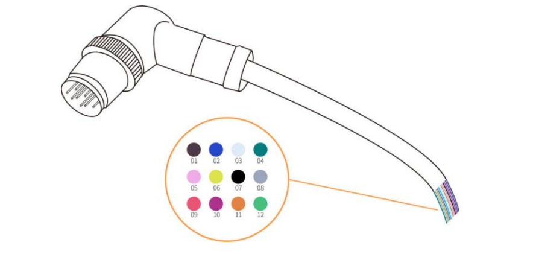

# 2.Installation

The following subsections will guide you through the installation and general setup of xArm Gripper.

(1)The Scope of Delivery section

(2)The Mechanical Installation section

(3)The Electrical Setup section

**Warning**

**Before installing:**

Read and understand the safety instructions related to the xArm Gripper.

Verify your package according to the Scope of delivery and your order info.

Have the required parts, equipment and tools listed in the requirements readily available.

**Installing:**

Satisfy the environmental conditions.

Do not operate the Gripper, or even turn on the power supply, before it is firmly anchored and the danger zone is cleared.

Caution the fingers of the gripper which may move and cause injury or damage.

## 2.1.Scope of Delivery
### 2.1.1. General Kit
A Gripper Kit generally includes these items:

xArm Gripper

Cross countersunk head screws M6*8 (4)

## 2.2.  Mechanical Installation

xArm Gripper installation steps (as shown below):

1. Move the robotic arm to a safe position. Avoid touching the robotic arm mounting surface or other equipment;

2. Power off the robotic arm by pressing the emergency stop button on the control box;

3. Fix the gripper on the end of the robotic arm with 2 M6 bolts;

4. Connect the robotic arm and the gripper with the gripper connection cable;
      

**Note:**

1. When wiring the gripper connection cable, be sure to power off the robotic arm, the emergency stop button is in the pressed state and the power indicator of the robotic arm is off, so as to avoid robotic arm failure caused by hot plugging;

2. Due to the limitation of the length of the gripper connection cable, the gripper connector and the  tool/end effector connector must be on the same side;

3. When connecting the gripper and the robotic arm, be sure to align the positioning holes at the ends of the gripper and the robotic arm. Since the male pins of the gripper connection cable are relatively thin, avoid bending the male pins during disassembly.

## 2.3.  Electrical Setup
Power and communication are established with the xArm Gripper via a single gripper connection cable. The gripper connection cable provides a 24V power supply to the Gripper and enables serial RS485 communication to the control box.

**Warning**

Power must be off before connecting the Gripper and the robotic arm via the gripper connection cable.

### 2.3.1.  Pinout Interface

 

There are 12 pins inside the cable with different colors, each color represents different functions, please refer to the following table:

| Pin sequence | Color       | Signal               |
| ------------ | ----------- | -------------------- |
| 1            | Brown       | +24V（Power）        |
| 2            | Blue        | +24V（Power）        |
| 3            | White       | 0V (GND)             |
| 4            | Green       | 0V (GND)             |
| 5            | Pink        | User 485-A           |
| 6            | Yellow      | User 485-B           |
| 7            | Black       | Tool Output 0（TO0） |
| 8            | Grey        | Tool Output 1（TO1） |
| 9            | Red         | Tool Input 0（TI0）  |
| 10           | Purple      | Tool Input 1（TI1）  |
| 11           | Orange      | Analog input 0 (AI0) |
| 12           | Light Green | Analog input 1 (AI1) |