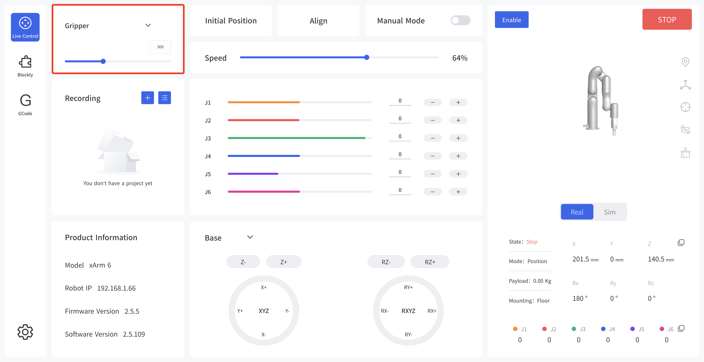
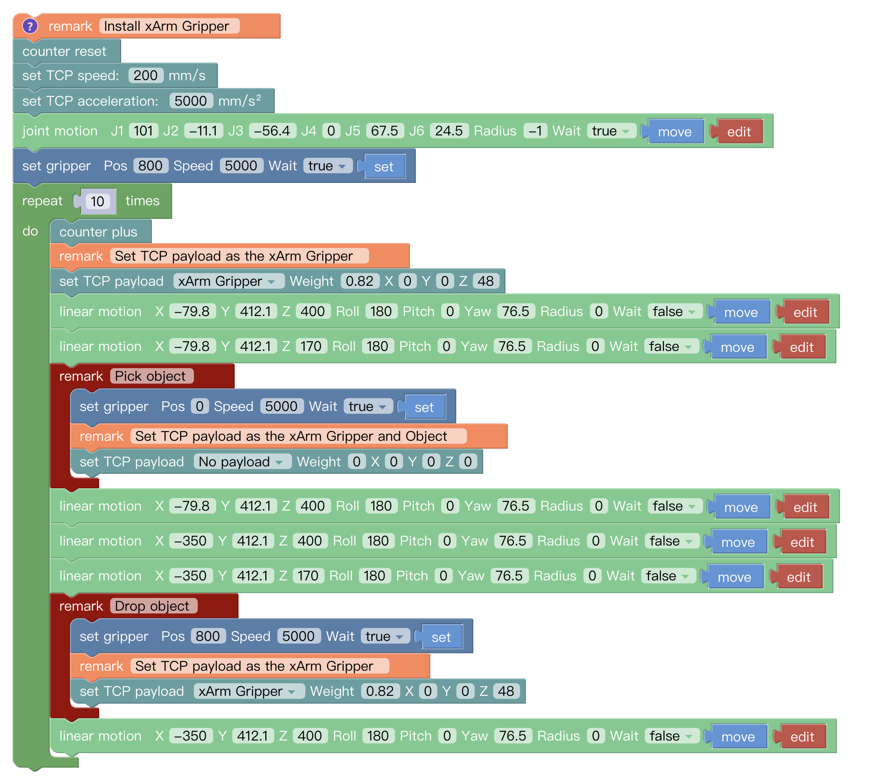
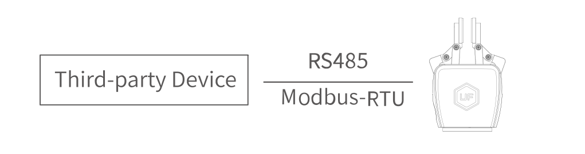

# 3.Control
## 3.1.Use xArm Studio to Control xArm Gripper

1. Set up xArm Gripper

* Control the xArm gripper in the live control

Control Method:

1) By dragging this progress bar, you can control the opening and closing stroke of the gripper.

* Control the xArm gripper through Blockly

xArm Gripper.Blockly

The role of this program: execute this program to control the gripper to pick the target object at the specified position, and then place the target object at the target position.

**Note:**

1) When the gripper is installed on the robotic arm, the TCP Payload of the gripper should be set in the Blockly program. When the total weight of the gripper changes after the object is picked, a new TCP Payload needs to be set.

## 3.2.Use Python-SDK to Control xArm Gripper

For details on controlling Gripper with python-SDK, please refer to the link below:

https://github.com/xArm-Developer/xArm-Python-SDK/blob/master/example/wrapper/common/5004-set_gripper.py
## 3.3.Use ROS-SDK to Control xArm Gripper

Please refer to Section 5.7.7 in the ReadMe file attached to the ROS package to control the gripper.
xArm ROS-SDK link :

https://github.com/xArm-Developer/xarm_ros

## 3.4.Use Private Protocol Communication Protocol to Control   xArm Gripper

This section mainly explains how to control the xArm Gripper by using the Private Protocol protocol through xArm control box.

### 3.4.1.Private Protocol Communication Format

**Private Protocol:**

Modbus protocol is an application layer message transmission protocol, including three message types: ASCII, RTU, and TCP. The standard Modbus protocol physical layer interface includes RS232, RS422, RS485 and Ethernet interfaces, and adopts master / slave communication.
**Private Protocol Communication Process:**

1.Establish a TCP connection

2.Prepare Modbus messages

3.Use the send command to send a message

4.Waiting for a response under the same connection 

5.Use the recv command to read the message and complete a data exchange

6.When the communication task ends, close the TCP connection

**Parameter:**

Default TCP Port: 502    Protocol: 0x00 0x02 

**On the problem of users using communication protocols to organize data in big endian and little endian:**

In this article, data analysis is big-endian analysis.

### 3.4.2.Read xArm Gripper Register

#### 3.4.2.1. Register Function

| **Read Register**         |                        |             |        |
| ------------------------- | ---------------------- | ----------- | ------ |
| **Request**               |                        |             |        |
| MBTP Header               | Transaction Identifier | 2 Bytes     | 0x0001 |
| Protocol Identifier       | 2 Bytes                | 0x0002      |        |
| Length                    | 2 Bytes                | 6+**N\***x2 |        |
| Unit Identifier           | 1 Byte                 | 0x7C        |        |
| Internal Use              | Internal Use           | 1 Byte      | 0x09   |
| Modbus RTU Data           | Slave ID (Gripper)     | 1 Byte      | 0x08   |
| Function Code             | 1 Byte                 | 0x03        |        |
| Register Starting Address | 2 Bytes                | **Address** |        |
| Quantity of Registers     | **N\***x2 Bytes        | **N\***     |        |
| **Response**              |                        |             |        |
| MBTP Header               | Transaction Identifier | 2 Bytes     | 0x0001 |
| Protocol Identifier       | 2 Bytes                | 0x0002      |        |
| Length                    | 2 Bytes                | 6+**N\***x2 |        |
| Unit Identifier           | 1 Byte                 | 0x7C        |        |
| Status Value              | 1 Byte                 | 0x00        |        |
| Internal Use              | Internal Use           | 1 Byte      | 0x09   |
| Modbus RTU Data           | Slave ID               | 1 Byte      | 0x08   |
| Function Code             | 1 Byte                 | 0x03        |        |
| Byte Count                | 1 Byte                 | **N\*x2**   |        |
| Registers Value           | **N\***x2 Bytes        | **Value**   |        |

N* = Quantity of Registers			
Address = Register Starting Address

**Resgister：**

|                               | **Resgister Starting Address** | **Registers Value** |                                                              |
| ----------------------------- | ------------------------------ | ------------------- | ------------------------------------------------------------ |
| Get Gripper status Register   | 0x0000                         | 2 Bytes             | ***\*Stop status\****: 0x0000  ***\*Motion status:\**** 0x0001***\*Clipping status:\**** 0x0010 |
| Get Gripper position Register | 0x0702                         | 4bytes              | 0xFFFFFFFB-0x00000320                                        |
| Get Gripper Error Register    | 0x000F                         | 2 Bytes             | **An error occurs:** all other return values indicate an error(except 0)**No error occurred:** 0x0000 |
#### 3.4.2.2.Example

**1.Get the xArm Gripper status**

| **Get the xArm Gripper status**                  |                        |            |            |
| ------------------------------------------------ | ---------------------- | ---------- | ---------- |
| **Request**                                      |                        |            |            |
| MBTP Header                                      | Transaction Identifier | 2 Bytes    | 0x00，0x01 |
| Protocol Identifier                              | 2 Bytes                | 0x00，0x02 |            |
| Length                                           | 2 Bytes                | 0x00，0x08 |            |
| Unit Identifier                                  | 1 Byte                 | 0x7C       |            |
| Internal Use                                     | Internal Use           | 1 Byte     | 0x09       |
| Modbus RTU Data                                  | Slave ID (Gripper)     | 1 Byte     | 0x08       |
| Function Code                                    | 1 Byte                 | 0x03       |            |
| Register Starting Address                        | 2 Bytes                | 0x00，0x00 |            |
| Quantity of Registers                            | 2 Bytes                | 0x00，0x01 |            |
| **Response**                                     |                        |            |            |
| MBTP Header                                      | Transaction Identifier | 2 Bytes    | 0x00，0x01 |
| Protocol Identifier                              | 2 Bytes                | 0x00，0x02 |            |
| Length                                           | 2 Bytes                | 0x00，0x08 |            |
| Unit Identifier                                  | 1 Byte                 | 0x7C       |            |
| Status Value                                     | 1 Byte                 | 0x00       |            |
| Internal Use                                     | Internal Use           | 1 Byte     | 0x09       |
| Modbus RTU Data                                  | Slave ID               | 1 Byte     | 0x08       |
| Function Code                                    | 1 Byte                 | 0x03       |            |
| Byte Count                                       | 1 Byte                 | 0x02       |            |
| Registers Value(Robotic arm is in motion status) | 2 Bytes                | 0x00，0x01 |            |
**2.Get the xArm Gripper position**

| **Get the xArm Gripper position** |                        |                     |           |
| --------------------------------- | ---------------------- | ------------------- | --------- |
| **Request**                       |                        |                     |           |
| MBTP Header                       | Transaction Identifier | 2 Bytes             | 0x00,0x01 |
| Protocol Identifier               | 2 Bytes                | 0x00,0x02           |           |
| Length                            | 2 Bytes                | 0x00,0x08           |           |
| Unit Identifier                   | 1 Byte                 | 0x7C                |           |
| Internal Use                      | Internal Use           | 1 Byte              | 0x09      |
| Modbus RTU Data                   | Slave ID (Gripper)     | 1 Byte              | 0x08      |
| Function Code                     | 1 Byte                 | 0x03                |           |
| Register Starting Address         | 2 Bytes                | 0x07,0x02           |           |
| Quantity of Registers             | 2 Bytes                | 0x00,0x02           |           |
| **Response**                      |                        |                     |           |
| MBTP Header                       | Transaction Identifier | 2 Bytes             | 0x00,0x01 |
| Protocol Identifier               | 2 Bytes                | 0x00,0x02           |           |
| Length                            | 2 Bytes                | 0x00,0x09           |           |
| Unit Identifier                   | 1 Byte                 | 0x7C                |           |
| Status Value                      | 1 Byte                 | 0x00                |           |
| Parameters                        | Sate                   | 1 Byte              | 0x00      |
| Internal Use                      | Internal Use           | 1 Byte              | 0x09      |
| Modbus RTU Data                   | Slave ID               | 1 Byte              | 0x08      |
| Function Code                     | 1 Byte                 | 0x03                |           |
| Byte Count                        | 1 Byte                 | 0x04                |           |
| Registers Value(position: 400)    | 4 Bytes                | 0x00,0x00,0x01,0x90 |           |
**3.Get the xArm Gripper Error**

| **Get the xArm Gripper Error**                    |                        |           |           |
| ------------------------------------------------- | ---------------------- | --------- | --------- |
| **Request**                                       |                        |           |           |
| MBTP Header                                       | Transaction Identifier | 2 Bytes   | 0x00,0x01 |
| Protocol Identifier                               | 2 Bytes                | 0x00,0x02 |           |
| Length                                            | 2 Bytes                | 0x00,0x08 |           |
| Unit Identifier                                   | 1 Byte                 | 0x7C      |           |
| Internal Use                                      | Internal Use           | 1 Byte    | 0x09      |
| Modbus RTU Data                                   | Slave ID (Gripper)     | 1 Byte    | 0x08      |
| Function Code                                     | 1 Byte                 | 0x03      |           |
| Register Starting Address                         | 2 Bytes                | 0x00,0x0F |           |
| Quantity of Registers                             | 2 Bytes                | 0x00,0x01 |           |
| **Response**                                      |                        |           |           |
| MBTP Header                                       | Transaction Identifier | 2 Bytes   | 0x00,0x01 |
| Protocol Identifier                               | 2 Bytes                | 0x00,0x02 |           |
| Length                                            | 2 Bytes                | 0x00,0x08 |           |
| Unit Identifier                                   | 1 Byte                 | 0x7C      |           |
| Status Value                                      | 1 Byte                 | 0x00      |           |
| Parameters                                        | Sate                   | 1 Byte    | 0x00      |
| Internal Use                                      | Internal Use           | 1 Byte    | 0x09      |
| Modbus RTU Data                                   | Slave ID               | 1 Byte    | 0x08      |
| Function Code                                     | 1 Byte                 | 0x03      |           |
| Byte Count                                        | 1 Byte                 | 0x02      |           |
| Registers Value(No error occurred in the Gripper) | 2 Bytes                | 0x00,0x00 |           |
### 3.4.3.Write xArm Gripper Register

#### 3.4.3.1. Register Function

| **Write Register**        |                        |                             |           |
| ------------------------- | ---------------------- | --------------------------- | --------- |
| **Request**               |                        |                             |           |
| MBTP Header               | Transaction Identifier | 2 Bytes                     | 0x00,0x01 |
| Protocol Identifier       | 2 Bytes                | 0x00,0x02                   |           |
| Length                    | 2 Bytes                | ***\*9+\*******\*N\*x2\**** |           |
| Unit Identifier           | 1 Byte                 | 0x7C                        |           |
| Internal Use              | Internal Use           | 1 Byte                      | 0x09      |
| Modbus RTU Data           | Slave ID (Gripper)     | 1 Byte                      | 0x08      |
| Function Code             | 1 Byte                 | 0x10                        |           |
| Register Starting Address | 2 Bytes                | **Address**                 |           |
| Quantity of Registers     | 2 Bytes                | **N\***                     |           |
| Byte Count                | 1 Byte                 | **N\*x2**                   |           |
| Registers Value           | **N\***x2 Bytes        | **Value**                   |           |
| **Response**              |                        |                             |           |
| MBTP Header               | Transaction Identifier | 2 Bytes                     | 0x00,0x01 |
| Protocol Identifier       | 2 Bytes                | 0x00,0x02                   |           |
| Length                    | 2 Bytes                | 0x00,0x09                   |           |
| Unit Identifier           | 1 Byte                 | 0x7C                        |           |
| Status Value              | 1 Byte                 | 0x00                        |           |
| Internal Use              | Internal Use           | 1 Byte                      | 0x09      |
| Modbus RTU Data           | Slave ID               | 1 Byte                      | 0x08      |
| Function Code             | 1 Byte                 | 0x10                        |           |
| Register Starting Address | 2 Bytes                | **Address**                 |           |
| Quantity of Registers     | 2 Bytes                | **N\***                     |           |

N* = Quantity of Registers	

Address = Register Starting Address

**Resgister:**

|                                 | **Resgister Starting Address** | **Registers Value** |                                                              |
| ------------------------------- | ------------------------------ | ------------------- | ------------------------------------------------------------ |
| Set Gripper Mode Register       | 0x0101                         | 2bytes              | **Position mode：**0x0000                                    |
| Enable/Disable Gripper Register | 0x0100                         | 2 Bytes             | **Enable :** 0x0001  **Disable :** 0x0000                    |
| Set Gripper Position Register   | 0x0700                         | 4 Bytes             | ***\*Open the Gripper :\**** 0x0000 0x0082***\*Close the Gripper :\**** 0x0000 0x0032 |
| Set Position Speed Register     | 0x0303                         | 2 Bytes             | 0x0100-0x0400***\*Unit :\**** r/min                          |
#### 3.4.3.2.Example
**1.Set xArm Gripper Mode**

| **Set xArm Gripper Mode**      |                        |           |           |
| ------------------------------ | ---------------------- | --------- | --------- |
| **Request**                    |                        |           |           |
| MBTP Header                    | Transaction Identifier | 2 Bytes   | 0x00,0x01 |
| Protocol Identifier            | 2 Bytes                | 0x00,0x02 |           |
| Length                         | 2 Bytes                | 0x00,0x0B |           |
| Unit Identifier                | 1 Byte                 | 0x7C      |           |
| Internal Use                   | Internal Use           | 1 Byte    | 0x09      |
| Modbus RTU Data                | Slave ID (Gripper)     | 1 Byte    | 0x08      |
| Function Code                  | 1 Byte                 | 0x10      |           |
| Register Starting Address      | 2 Bytes                | 0x01,0x01 |           |
| Quantity of Registers          | 2 Bytes                | 0x00,0x01 |           |
| Byte Count                     | 1 Byte                 | 0x02      |           |
| Registers Value(Position mode) | 2 Bytes                | 0x00,0x00 |           |
| **Response**                   |                        |           |           |
| MBTP Header                    | Transaction Identifier | 2 Bytes   | 0x00,0x01 |
| Protocol Identifier            | 2 Bytes                | 0x00,0x02 |           |
| Length                         | 2 Bytes                | 0x00,0x09 |           |
| Unit Identifier                | 1 Byte                 | 0x7C      |           |
| Status Value                   | 1 Byte                 | 0x00      |           |
| Parameters                     | Sate                   | 1 Byte    | 0x00      |
| Internal Use                   | Internal Use           | 1 Byte    | 0x09      |
| Modbus RTU Data                | Slave ID               | 1 Byte    | 0x08      |
| Function Code                  | 1 Byte                 | 0x10      |           |
| Register Starting Address      | 2 Bytes                | 0x01,0x01 |           |
| Quantity of Registers          | 2 Bytes                | 0x00,0x01 |           |
**2.Enable/Disable xArm Gripper**

| **Enable/Disable xArm Gripper** |                        |           |           |
| ------------------------------- | ---------------------- | --------- | --------- |
| **Request**                     |                        |           |           |
| MBTP Header                     | Transaction Identifier | 2 Bytes   | 0x00,0x01 |
| Protocol Identifier             | 2 Bytes                | 0x00,0x02 |           |
| Length                          | 2 Bytes                | 0x00,0x0B |           |
| Unit Identifier                 | 1 Byte                 | 0x7C      |           |
| Internal Use                    | Internal Use           | 1 Byte    | 0x09      |
| Modbus RTU Data                 | Slave ID (Gripper)     | 1 Byte    | 0x08      |
| Function Code                   | 1 Byte                 | 0x10      |           |
| Register Starting Address       | 2 Bytes                | 0x01,0x00 |           |
| Quantity of Registers           | 2 Bytes                | 0x00,0x01 |           |
| Byte Count                      | 1 Byte                 | 0x02      |           |
| Registers Value                 | 2 Bytes                | 0x00,0x01 |           |
| **Response**                    |                        |           |           |
| MBTP Header                     | Transaction Identifier | 2 Bytes   | 0x00,0x01 |
| Protocol Identifier             | 2 Bytes                | 0x00,0x02 |           |
| Length                          | 2 Bytes                | 0x00,0x09 |           |
| Unit Identifier                 | 1 Byte                 | 0x7C      |           |
| Status Value                    | 1 Byte                 | 0x00      |           |
| Parameters                      | Sate                   | 1 Byte    | 0x00      |
| Internal Use                    | Internal Use           | 1 Byte    | 0x09      |
| Modbus RTU Data                 | Slave ID               | 1 Byte    | 0x08      |
| Function Code                   | 1 Byte                 | 0x10      |           |
| Register Starting Address       | 2 Bytes                | 0x01,0x00 |           |
| Quantity of Registers           | 2 Bytes                | 0x00,0x01 |           |

**3.Set xArm Gripper Speed**

| **Set xArm Gripper Speed** |                        |           |           |
| -------------------------- | ---------------------- | --------- | --------- |
| **Request**                |                        |           |           |
| MBTP Header                | Transaction Identifier | 2 Bytes   | 0x00,0x01 |
| Protocol Identifier        | 2 Bytes                | 0x00,0x02 |           |
| Length                     | 2 Bytes                | 0x00,0x0B |           |
| Unit Identifier            | 1 Byte                 | 0x7C      |           |
| Internal Use               | Internal Use           | 1 Byte    | 0x09      |
| Modbus RTU Data            | Slave ID (Gripper)     | 1 Byte    | 0x08      |
| Function Code              | 1 Byte                 | 0x10      |           |
| Register Starting Address  | 2 Bytes                | 0x03,0x03 |           |
| Quantity of Registers      | 2 Bytes                | 0x00,0x01 |           |
| Byte Count                 | 1 Byte                 | 0x02      |           |
| Registers Value(1500r/min) | 2 Bytes                | 0x05,0xDC |           |
| **Response**               |                        |           |           |
| MBTP Header                | Transaction Identifier | 2 Bytes   | 0x00,0x01 |
| Protocol Identifier        | 2 Bytes                | 0x00,0x02 |           |
| Length                     | 2 Bytes                | 0x00,0x09 |           |
| Unit Identifier            | 1 Byte                 | 0x7C      |           |
| Status Value               | 1 Byte                 | 0x00      |           |
| Parameters                 | Sate                   | 1 Byte    | 0x00      |
| Internal Use               | Internal Use           | 1 Byte    | 0x09      |
| Modbus RTU Data            | Slave ID               | 1 Byte    | 0x08      |
| Function Code              | 1 Byte                 | 0x10      |           |
| Register Starting Address  | 2 Bytes                | 0x03,0x03 |           |
| Quantity of Registers      | 2 Bytes                | 0x00,0x01 |           |

**4.Set xArm Gripper Position**

| **Set xArm Gripper Position** |                        |                     |            |
| ----------------------------- | ---------------------- | ------------------- | ---------- |
| **Request**                   |                        |                     |            |
| MBTP Header                   | Transaction Identifier | 2 Bytes             | 0x00，0x01 |
| Protocol Identifier           | 2 Bytes                | 0x00，0x02          |            |
| Length                        | 2 Bytes                | 0x00，0x0D          |            |
| Unit Identifier               | 1 Byte                 | 0x7C                |            |
| Internal Use                  | Internal Use           | 1 Byte              | 0x09       |
| Modbus RTU Data               | Slave ID (Gripper)     | 1 Byte              | 0x08       |
| Function Code                 | 1 Byte                 | 0x10                |            |
| Register Starting Address     | 2 Bytes                | 0x07,0x00           |            |
| Quantity of Registers         | 2 Bytes                | 0x00,0x02           |            |
| Byte Count                    | 1 Byte                 | 0x04                |            |
| Registers Value(400)          | 4 Bytes                | 0x00,0x00,0x01,0x90 |            |
| **Response**                  |                        |                     |            |
| MBTP Header                   | Transaction Identifier | 2 Bytes             | 0x00,0x01  |
| Protocol Identifier           | 2 Bytes                | 0x00,0x02           |            |
| Length                        | 2 Bytes                | 0x00,0x09           |            |
| Unit Identifier               | 1 Byte                 | 0x7C                |            |
| Status Value                  | 1 Byte                 | 0x00                |            |
| Parameters                    | Sate                   | 1 Byte              | 0x00       |
| Internal Use                  | Internal Use           | 1 Byte              | 0x09       |
| Modbus RTU Data               | Slave ID               | 1 Byte              | 0x08       |
| Function Code                 | 1 Byte                 | 0x10                |            |
| Register Starting Address     | 2 Bytes                | 0x07,0x00           |            |
| Quantity of Registers         | 2 Bytes                | 0x00,0x02           |            |

### 3.4.4.xArm Gripper Control Process

The complete process of controlling the motion of the xArm Gripper is as follows:

(1) Enable the Gripper

0x00, 0x01, 0x00, 0x02, 0x00, 0x0B, 0x7C, 0x09, 0x08, 0x10, 0x01, 0x00, 0x00, 0x01, 0x02, 0x00, 0x01

(2) Open the Gripper

0x00, 0x01, 0x00, 0x02, 0x00, 0x0D, 0x7C, 0x09, 0x08, 0x10, 0x07, 0x00, 0x00, 0x02, 0x04, 0x00, 0x00, 0x01, 0x90

(3) Close the Gripper

0x00, 0x01, 0x00, 0x02, 0x00, 0x0D, 0x7C, 0x09, 0x08, 0x10, 0x07, 0x00, 0x00, 0x02, 0x04, 0x00, 0x00, 0x00, 0x32

## 3.5.Use Modbus-RTU Communication Protocol to Control xArm Gripper
### 3.5.1.Modbus RTU Communication Format 

The gripper defaults to the standard Modbus RTU protocol at a default baud rate is 2Mbps and the slave ID is 0x08. The currently supported function codes are: 0x03 / 0x10. In this article, data analysis is big-endian analysis.
| **Read Register**         |                    |            |      |
| ------------------------- |--------------------| ---------- | ---- |
| **Request**               |                    |            |      |
| Modbus RTU Data           | Slave ID (Gripper) | 1 Byte     | 0x08 |
| Function Code             | 1 Byte             | 0x03       |      |
| Register Starting Address | 2 Bytes            | **Address** |      |
| Quantity of Register      | 2 Bytes            | **N\***    |      |
| Modbus CRC16              | 2 Bytes            | ***\*CRC\*\**** |      |
| **Response**              |                    |            |      |
| Modbus RTU Data           | Slave ID           | 1 Byte     | 0x08 |
| Function Code             | 1 Byte             | 0x03       |      |
| Byte Count                | 1 Byte             | **N\*x2**  |      |
| Registers Value           | N*x2 Bytes         | **Value**  |      |
| Modbus CRC16              | 2 Bytes            | **CRC** |      |
### 3.5.2.Read xArm Gripper Register

N* = Quantity of Registers		

Address = Register Starting Address

CRC* = Cyclic Redundancy Check

**Resgister：**

|                               | **Resgister Starting Address** | **Register Value** |                                                              |
| ----------------------------- | ------------------------------ | ------------------ | ------------------------------------------------------------ |
| Get Gripper status Register   | 0x0000                         | 2 Bytes            | ***\*Stop status\****: 0x0000  ***\*Motion status:\**** 0x0001***\*Clipping status:\**** 0x0010 |
| Get Gripper position Register | 0x0702                         | 4bytes             | 0xFFFFFFFB-0x00000320                                        |
| Get Gripper Error Register    | 0x000F                         | 2 Bytes            | **An error occurs:** all other return values indicate an error(except 0)**No error occurred:** 0x0000 |
### 3.5.3.Write xArm Gripper Register

| **Write Register**        |                    |                 |      |
| ------------------------- | ------------------ | --------------- | ---- |
| **Request**               |                    |                 |      |
| Modbus RTU Data           | Slave ID (Gripper) | 1 Byte          | 0x08 |
| Function Code             | 1 Byte             | 0x10            |      |
| Register Starting Address | 2 Bytes            | **Address**     |      |
| Quantity of Register      | 2 Bytes            | **N\***         |      |
| Byte Count                | 1 Byte             | **N\*x2**       |      |
| Registers Value           | **N\***x2 Bytes    | **Value**       |      |
| Modbus CRC16              | 2 Bytes            | ***\*CRC\*\**** |      |
| **Response**              |                    |                 |      |
| Modbus RTU Data           | Slave ID           | 1 Byte          | 0x08 |
| Function Code             | 1 Byte             | 0x10            |      |
| Register Starting Address | 2 Bytes            | **Address**     |      |
| Quantity of Registers     | 2 Bytes            | **N\***         |      |
| Modbus CRC16              | 2 Bytes            | ***\*CRC\*\**** |      |
N* = Quantity of Registers	

**Address** = Register Starting Address

CRC* = Cyclic Redundancy Check 

**Resgister:**

|                                 | **Resgister Starting Address** | **Register Value** |                                                              |
| ------------------------------- | ------------------------------ | ------------------ | ------------------------------------------------------------ |
| Enable/Disable Gripper Register | 0x0100                         | 2 Bytes            | **Enable :** 0x0001  **Disable :** 0x0000                    |
| Set Gripper Position Register   | 0x0700                         | 4 Bytes            | ***\*Open the Gripper :\**** 0x0000 0x0082***\*Close the Gripper :\**** 0x0000 0x0032 |
| Set Position Speed Register     | 0x0303                         | 2 Bytes            | 0x0100-0x0400***\*Unit :\**** r/min                          |
| Set Gripper Mode Register       | 0x0101                         | 2bytes             | **Position mode：**0x0000                                    |
### 3.5.4.Modbus RTU Example

This section demonstrates the example given in the Control Logic section when programmed using the Modbus RTU protocol. 
Step1：Set xArm Gripper Mode
**Step1：Set xArm Gripper Mode**

| **Set xArm Gripper Mode** |                    |           |      |
| ------------------------- | ------------------ | --------- | ---- |
| **Request**               |                    |           |      |
| Modbus RTU Data           | Slave ID (Gripper) | 1 Byte    | 0x08 |
| Function Code             | 1 Byte             | 0x10      |      |
| Register Starting Address | 2 Bytes            | 0x01,0x01 |      |
| Quantity of Registers     | 2 Bytes            | 0x00,0x01 |      |
| Byte Count                | 1 Byte             | 0x02      |      |
| Registers Value           | 2 Bytes            | 0x00,0x00 |      |
| Modbus CRC16              | 2 Bytes            | 0xDD,0x11 |      |
| **Response**              |                    |           |      |
| Modbus RTU Data           | Slave ID           | 1 Byte    | 0x08 |
| Function Code             | 1 Byte             | 0x10      |      |
| Register Starting Address | 2 Bytes            | 0x01,0x01 |      |
| Quantity of Registers     | 2 Bytes            | 0x00,0x01 |      |
| Modbus CRC16              | 2 Bytes            | 0x51,0x6C |      |
**Step2：Enable xArm Gripper**

| **Enable xArm Gripper**   |                    |           |      |
| ------------------------- | ------------------ | --------- | ---- |
| **Request**               |                    |           |      |
| Modbus RTU Data           | Slave ID (Gripper) | 1 Byte    | 0x08 |
| Function Code             | 1 Byte             | 0x10      |      |
| Register Starting Address | 2 Bytes            | 0x01,0x00 |      |
| Quantity of Registers     | 2 Bytes            | 0x00,0x01 |      |
| Byte Count                | 1 Byte             | 0x02      |      |
| Registers Value           | 2 Bytes            | 0x00,0x01 |      |
| Modbus CRC16              | 2 Bytes            | 0x1D,0x00 |      |
| **Response**              |                    |           |      |
| Modbus RTU Data           | Slave ID           | 1 Byte    | 0x08 |
| Function Code             | 1 Byte             | 0x10      |      |
| Register Starting Address | 2 Bytes            | 0x01,0x00 |      |
| Quantity of Registers     | 2 Bytes            | 0x00,0x01 |      |
| Modbus CRC16              | 2 Bytes            | 0x00,0xAC |      |
**Step3:Set xArm Gripper Speed**

| **Set xArm Gripper Speed** |                    |           |      |
| -------------------------- | ------------------ | --------- | ---- |
| **Request**                |                    |           |      |
| Modbus RTU Data            | Slave ID (Gripper) | 1 Byte    | 0x08 |
| Function Code              | 1 Byte             | 0x10      |      |
| Register Starting Address  | 2 Bytes            | 0x03,0x03 |      |
| Quantity of Registers      | 2 Bytes            | 0x00,0x01 |      |
| Byte Count                 | 1 Byte             | 0x02      |      |
| Registers Value(1500r/min) | 2 Bytes            | 0x05,0xDC |      |
| Modbus CRC16               | 2 Bytes            | 0xFD,0xFA |      |
| **Response**               |                    |           |      |
| Modbus RTU Data            | Slave ID           | 1 Byte    | 0x08 |
| Function Code              | 1 Byte             | 0x10      |      |
| Register Starting Address  | 2 Bytes            | 0x03,0x03 |      |
| Quantity of Registers      | 2 Bytes            | 0x00,0x01 |      |
| Modbus CRC16               | 2 Bytes            | 0xF1,0x14 |      |

**Step4:Set xArm Gripper Position**

| **Set xArm Gripper Position**  |                    |                     |      |
| ------------------------------ | ------------------ | ------------------- | ---- |
| **Request**                    |                    |                     |      |
| Modbus RTU Data                | Slave ID (Gripper) | 1 Byte              | 0x08 |
| Function Code                  | 1 Byte             | 0x10                |      |
| Register Starting Address      | 2 Bytes            | 0x07,0x00           |      |
| Quantity of Registers          | 2 Bytes            | 0x00,0x02           |      |
| Byte Count                     | 1 Byte             | 0x04                |      |
| Registers Value(position：400) | 4 Bytes            | 0x00,0x00,0x01,0x90 |      |
| Modbus CRC16                   | 2 Bytes            | 0xFA，0xFF          |      |
| **Response**                   |                    |                     |      |
| Modbus RTU Data                | Slave ID           | 1 Byte              | 0x08 |
| Function Code                  | 1 Byte             | 0x10                |      |
| Register Starting Address      | 2 Bytes            | 0x07,0x00           |      |
| Quantity of Registers          | 2 Bytes            | 0x00,0x02           |      |
| Modbus CRC16                   | 2 Bytes            | 0x40,0x25           |      |
