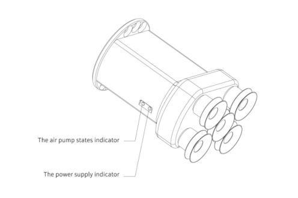



# 1.**xArm Vacuum Gripper Introduction**

The vacuum gripper is ideal for picking up even workpieces less than 5 Kg. The vacuum gripper is equipped with 5 suction cups, which can be partially selected for use according to the size of the object surface, and the unused suction cup needs to be sealed. 

**Note:** 

If the surface of the object is not smooth, there will be air leakage from the suction cup which makes the object fail to be picked up firmly. 

Indicator status: When the vacuum gripper is powered on, the power supply indicator near the vacuum gripper is constantly red. When the vacuum gripper is on, the IO status indicator is constantly green.

## 1.2 **Setup and Control**

The vacuum gripper is powered and controlled directly via a single connection cable that carries a 24V DC supply and IO control.
## 1.3 **Safety**

**Warning**

The operator must have read and understood all of the instructions in the following manual before handling the xArm Vacuum Gripper.

**Caution**

The term "operator" refers to anyone responsible for any of the following operations on the vacuum gripper:

- Installation

- Control

- Maintenance

- Inspection

-  Calibration

- Programming

- Decommissioning

This documentation explains the various components of the vacuum gripper and general operations regarding the whole life-cycle of the product from installation to operation and decommissioning.

The drawings and photos in this documentation are representative examples and differences may exist between them and the delivered product.

### 1.3.1 **Warning**
**Caution**

Any use of the vacuum gripper in noncompliance of these warnings is inappropriate and may cause injury or damage.

**Warning**

● The vacuum gripper needs to be properly secured before operating the robot.

● Do not install or operate a vacuum gripper that is damaged or lacking parts.

● Never supply the vacuum gripper with an alternative current (AC) source.

● Make sure all cord sets are always secured at both ends,vacuum gripper end & robot end

● Always satisfy the recommended keying for electrical connections.

● Be sure no one is in the robot and/or vacuum gripper path before initializing the robot's routine.

● Always satisfy the vacuum gripper payload.

● Do not use the vacuum gripper on people or animals.

### 1.3.2 **Risk Assessment and Final Application**

The vacuum gripper is meant to be used on an industrial robot. The robot, vacuum gripper and any other equipment used in the final application must be evaluated with a risk assessment. The robot integrator must ensure that all local safety measures and regulations are respected. Depending on the application, there may be risks that need additional protection/safety measures, for example, the work-piece the vacuum gripper is manipulating may be inherently dangerous to the operator.

### 1.3.3 **Intended Use**

The vacuum gripper is designed for grasping and temporarily securing or holding objects.

**Caution**

The vacuum gripper is NOT intended for applying force against objects or surfaces.

The product is intended for installation on a robot or other automated machinery and equipment.

**Info**

Always comply with local and/or national laws, regulations and directives on automation safety and general machine safety.

The unit may be used only within the range of its technical data. Any other use of the product is deemed improper and unintended use.

UFACTORY will not be liable for any damages resulting from any improper or unintended use.

