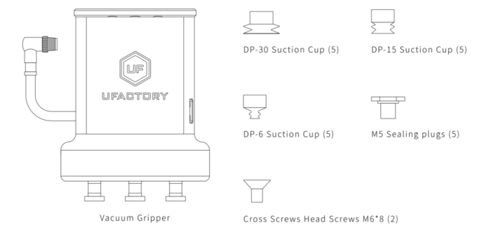
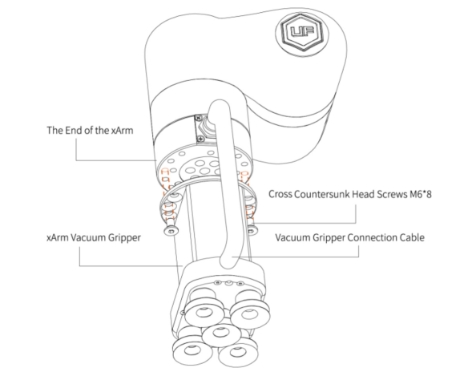
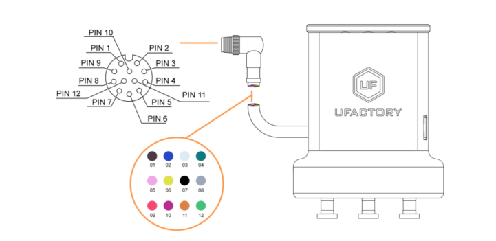



# 2. **Installation**

The following subsections will guide you through the installation and general setup of xArm Vacuum Gripper.

1) The Scope of Delivery Section
1) The Mechanical Installation Section
1) The Electrical Setup Section

**Warning**

Before installing:

Read and understand the safety instructions related to the xArm Vacuum Gripper.

Verify your package according to the Scope of delivery and your order info.

Have the required parts, equipment and tools listed in the requirements readily available.

Installing:

Satisfy the environmental conditions.

Do not operate the xArm Vacuum Gripper, or even turn on the power supply, before it is firmly anchored and the danger zone is cleared.

## 2.1 **Scope of Delivery**
### **2.1.1. General Kit**
A Vacuum Gripper Kit generally includes these items:

xArm vacuum gripper

Cross countersunk head screws M6\*8 (2)

M5 sealing plugs（5）

DP-6 suction cup（5）

DP-15 suction cup（5）

DP-30 suction cup（5）

## 2.2 **Mechanical Installation**

xArm Vacuum Gripper installation steps:

1. Move the robotic arm to a safe position. Avoid collision with the robotic arm mounting surface or other equipment; 
2. Power off the robotic arm by pressing the emergency stop button on the control box;
3. Fix the vacuum gripper on the end of the robotic arm with 2 M6 bolts; 
4. Connect the robotic arm and the vacuum gripper with the vacuum gripper connection cable.

**Note:**

1. When turning on the vacuum gripper connection cable, be sure to power off the robotic arm, to set the emergency stop button in the pressed state, and to ensure that power indicator of the robotic arm is off, as to avoid robotic arm failure caused by hot-plugging; 

2. Due to the length limitation of the vacuum gripper connection cable, the vacuum gripper interface and the tool IO interface must be in the same direction;

3. When connecting the vacuum gripper and the robotic arm, be sure to align the positioning holes on the two ends of the interface. The male pins of the connecting cable are relatively thin to avoid bending the male pins during disassembly.

## **2.3.  Electrical Setup**
Power and communication are established with the xArm Vacuum Gripper via a single vacuum gripper connection cable. The vacuum gripper connection cable provides a 24V power supply to the xArm Vacuum Gripper and enables IO communication to the robot control box. 

**Warning**

Power must be off before connecting the xArm Vacuum Gripper and the robotic arm via the vacuum gripper connection cable.

### **2.3.1.  Pinout Interface**
The xArm Vacuum Gripper is connected to the tool end of the robotic arm via a 12 pin connector.

|Pin sequence|Function|
| :-: | :-: |
|1|24V|
|2|24V|
|3|GND|
|4|GND|
|5|485-A(no use)|
|6|485-B(no use)|
|7|Digital Input 0|
|8|Digital Input 1|
|9|Digital Output 0|
|10|Digital Output 1(no use)|
|11|No Connect(no use)|

