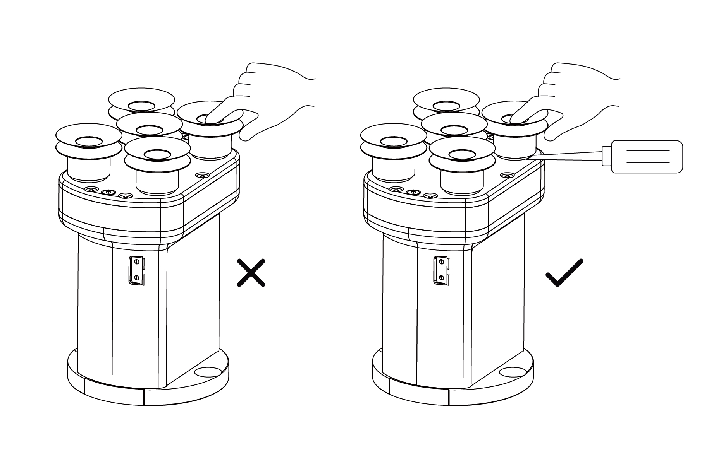

# 2. Installation

The following subsections will guide you through the installation and general setup of xArm Vacuum Gripper.

1) The Scope of Delivery Section
1) The Mechanical Installation Section

**Warning**

Before installing:

Read and understand the safety instructions related to the xArm Vacuum Gripper.

Verify your package according to the Scope of delivery and your order info.

Have the required parts, equipment and tools listed in the requirements readily available.

Installing:

Satisfy the environmental conditions.

Do not operate the xArm Vacuum Gripper, or even turn on the power supply, before it is firmly anchored and the danger zone is cleared.

## 2.1 **Scope of Delivery**
### **2.1.1. General Kit**
A Vacuum Gripper Kit generally includes these items:

UFACTORY Vacuum Gripper(1pcs)

Vacuum Gripper Communication cable(1pcs)

Cross countersunk head screws M6*12(2)

Cross countersunk head screws M6*16(2)

Cross countersunk head screws M6*22(2)

M5 sealing plugs(5pcs)

DP-6   suction cup(5pcs)  

DP-15 suction cup(5pcs)

DP-30 suction cup(5pcs)

## 2.2 **Mechanical Installation**

### 2.2.1  Installation Preparation:

1.Move the robotic arm to a safe position.Avoid collision with the 
    robotic arm mounting surface or other equipment;

2.Power off the robotic arm by pressing the emergency stop button 
    on the control box;

### 2.2.2 Installation Steps:

* If the end flange of the robotic is equipped with the pin 
connector （UF850, XX1305）

Fix the vacuum gripper on the end of the robotic arm with 
2 M6 bolts;

* If the end flange of the robotic is equipped without the pin connector

1)Remove 2 screws on the gripper flange, remove the black cover and install the communication cable;

(2)Fix the vacuum gripper on the end of the robotic arm with 2 M6 bolts;

(3)Connect the robotic arm and the vacuum gripper with the vacuum gripper connection cable;

**Note:**

1. When turning on the vacuum gripper connection cable,be sure  to press-down the E-stop button and power off the robotic arm, and to ensure that power indicator of the robotic arm is off,as to avoid robotic arm failure caused by hot plugging;
 
2. Due to the length limitation of the vacuum head connection cable, the vacuum head connection and the end connection need to be in the same direction;

3. When connecting the vacuum gripper and the robotic arm,be sure to align the positioning holes on the two ends of the interface.The male pins of the connecting cable are relatively thin to avoid bending the male pins during disassembly.

4. Please remove the suction cup from the bottom or it might be broken easily.

5. Please use a wrench to tighten the unused nozzle with M5 sealing plugs,to ensure air tightness.

