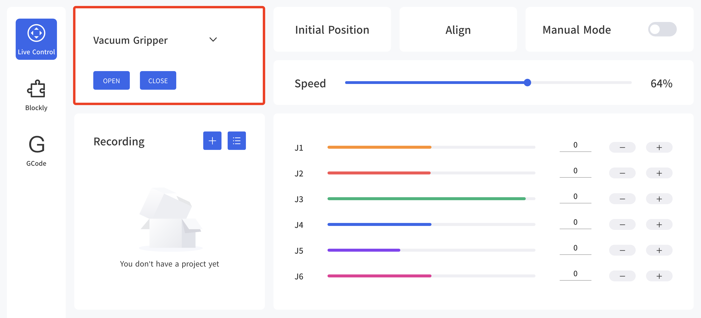

# 3. **Control**

## 3.1**Use xArm Studio to Control xArm Vacuum Gripper**

**1. Set up xArm Vacuum Gripper**

- Enter [Settings]-[Motion]-[TCP]


After installing the vacuum head, set the Tcp load and offset, select the 'xArm Vacuum Gripper' and remember to save it!

**2. Control xArm Vacuum Gripper**

- Control the vacuum gripper in the live control

Control Method:

\1) By clicking the [Open]/[Close] button, you can control the opening and closing of the vacuum gripper\.




- Control the vacuum gripper through Blockly


Find the file 1008_xArm_Vacuum_Gripper in the blockly module

The role of this program: execute this program to control the vacuum gripper to suck the target object at the specified position, and then place the target object at the target position.

Note:

1) When the vacuum gripper is installed on the robotic arm, the TCP Payload of the vacuum gripper should be set in the Blockly program. When the total weight of the vacuum gripper changes after the object is sucked, a new TCP Payload needs to be set.

## 3.2 **Use Python-SDK to Control xArm Vacuum Gripper**

The interface of controling vacuum gripper：

```
arm.set\_vacuum\_gripper(True, wait=False)    #open the vacuum gripper 

arm.set\_vacuum\_gripper(False, wait=False)   #close the vacuum gripper 

```
The download link of the Python-SDK:

[https://github.com/xArm-Developer/xArm-Python-SDK]( )

## 3.3 **Use ROS-SDK to Control xArm Vacuum Gripper**
Please refer to Section 5.7.8 in the ReadMe file attached to the ROS package to control the vacuum gripper.

xArm ROS-SDK link :

https://github.com/xArm-Developer/xarm_ros

## 3.4 **Use Modbus-TCP Communication Protocol to Control   xArm Vacuum Gripper**


his section mainly explains how to control the xArm Vacuum Gripper by using the Modbus-TCP protocol through xArm control box.


### 3.4.1 **Modbus-TCP Communication Format**
**Modbus-TCP:**

Modbus protocol is an application layer message transmission protocol, including three message types: ASCII, RTU, and TCP. The standard Modbus protocol physical layer interface includes RS232, RS422, RS485 and Ethernet interfaces, and adopts master / slave communication.

**Modbus TCP Communication Process:**

1. Establish a TCP connection
2. Prepare Modbus messages
3. Use the send command to send a message
4. Waiting for a response under the same connection 
5. Use the recv command to read the message and complete a data exchange
6. When the communication task ends, close the TCP connection

**Parameter:**

Default TCP Port: 502   

Protocol: 0x00 0x02 

**On the problem of users using communication protocols to organize data in big endian and little endian:**

In this article, data analysis is big-endian analysis.

### **Control of the xArm Vacuum Gripper**

- **Open/Close the vacuum gripper**

| **Open the Vacuum Gripper** | 00 01 00 02 00 08 7F 09 0A 15 00 80 80 4300 01 00 02 00 08 7F 09 0A 15 00 00 00 44 |
| --------------------------- | ------------------------------------------------------------ |
| **Close the Vacuum Gripper** | 00 01 00 02 00 08 7F 09 0A 15 00 00 80 4300 01 00 02 00 08 7F 09 0A 15 00 80 00 44 |

**Please refer to the table below for specific parameters.**

| **IO control on the End-effector** |                                                              |         |      |                     |
| ---------------------------------- | ------------------------------------------------------------ | ------- | ---- | ------------------- |
| **Register：127 (0x7F)**           |                                                              |         |      |                     |
| **Request**                        |                                                              |         |      |                     |
| Modbus TCP Header                  | Transaction Identifier                                       | 2 Bytes | u16  | 0x00,0x01           |
|                                    | Protocol                                                     | 2 Bytes | u16  | 0x00,0x02           |
|                                    | Length                                                       | 2 Bytes | u16  | 0x00,0x08           |
|                                    | Register                                                     | 1 Byte  | u8   | 0x7F                |
| Parameters                         | Host ID                                                      | 1 Byte  | u8   | 0x09                |
|                                    | Address                                                      | 2 Bytes | u16  | 0x0A,0x15           |
|                                    | Parameters1(Open 0)Data:256.0: Close 0  257.0: Open 0512.0: Close 1  514.0: Open 1 | 4 Bytes | fp32 | 0x00,0x80,0x80,0x43 |
| **Response**                       |                                                              |         |      |                     |
| Modbus TCP Header                  | Transaction Identifier                                       | 2 Bytes | u16  | 0x00,0x01           |
|                                    | Protocol                                                     | 2 Bytes | u16  | 0x00,0x02           |
|                                    | Length                                                       | 2 Bytes | u16  | 0x00,0x02           |
|                                    | Register                                                     | 1 Byte  | u8   | 0x7F                |
| Parameters                         | State                                                        | 1 Byte  | u8   | 0x00                |

- **Get the status of the vacuum gripper**

The steps to obtain the vacuum gripper status are shown in the following table:

| **Get Status（Request Commands）**                                                       | 00 01 00 02 00 04 80 09 0A 14       |
|----------------------------------------------------------------------------------------| ----------------------------------- |
| **Get Status（Response Commands）** **（The vacuum gripper picked up the object）**        | 00 01 00 02 00 06 80 00 00 00 00 01 |
| **Get Status（Response Commands)**  **(The vacuum gripper does not pick up the object）** | 00 01 00 02 00 06 80 00 00 00 00 00 |

**Please refer to the table below for specific parameters.**


| **Get the input of the end digital quantity** |                                                              |         |      |                     |
| --------------------------------------------- | ------------------------------------------------------------ | ------- | ---- | ------------------- |
| **Register：128 (0x80)**                      |                                                              |         |      |                     |
| **Request**                                   |                                                              |         |      |                     |
| Modbus TCP Header                             | Transaction Identifier                                       | 2 Bytes | u16  | 0x00,0x01           |
|                                               | Protocol                                                     | 2 Bytes | u16  | 0x00,0x02           |
|                                               | Length                                                       | 2 Bytes | u16  | 0x00,0x04           |
|                                               | Register                                                     | 1 Byte  | u8   | 0x80                |
| Parameters                                    | Host ID                                                      | 1 Byte  | u8   | 0x09                |
|                                               | Address                                                      | 2 Bytes | u16  | 0x0A, 0x14          |
| **Response**                                  |                                                              |         |      |                     |
| Modbus TCP Header                             | Transaction Identifier                                       | 2 Bytes | u16  | 0x00,0x01           |
|                                               | Protocol                                                     | 2 Bytes | u16  | 0x00,0x02           |
|                                               | Length                                                       | 2 Bytes | u16  | 0x00,0x06           |
|                                               | Register                                                     | 1 Byte  | u8   | 0x80                |
| Parameters                                    | State                                                        | 1 Byte  | u8   | 0x00                |
|                                               | Parameters1（0）The end byte indicates the input status. The digit of 0 corresponds to input 0 and the digit of 1 corresponds to input 1. | 4 Bytes | u8*4 | 0x00,0x00,0x00,0x00 |


