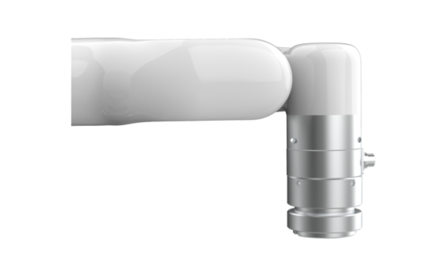


# 1.**总体介绍**

## 1.**六维力矩传感器简要介绍**

六维力矩传感器是为采集力和力矩数据而设计的，能够同时测量三维空间所受到的力和力矩大小。它安装在机器人末端工具法兰上，通过一条柔性线缆进行供电和通信。

# 1.2. **安全**

操作员在使用UFACTORY六维力矩传感器之前必须已阅读并理解手册中的所有说明。

## 1.3**警告**
在操作机器人之前，必须正确安装好六维力矩传感器。

请勿安装或操作已损坏或缺少零件的六维力矩传感器。

切勿为六维力矩传感器通交流电。

确保所有接线端子稳定连接在机械臂和六维力矩传感器两端。

请始终满足力矩传感器的有效负载规格。

请确保没有杂物在机械臂和六维力矩传感器的运动路径中。

**注意**

术语“操作员”是指负责在UFACTORY六维力矩传感器上进行以下任何操作的任何人：

- **安装**
- **控制**
- **维护**
- **检查**
- **退役**
- **校准**

“过载”是指超出力矩传感器规定的测量范围，对于Fx,Fy正负方向超过225N，Tx, Ty, Tz正负方向超过6Nm。 Fz正方向超过300N，Fz负方向超过600N，即视为过载。请注意过载，碰撞，高处掉落都可能会导致力矩传感器损坏。

本文档说明了UFACTORY六维力矩从安装到运行再到使用的整个生命周期的一般操作。

本文档中的图形和照片是代表性的示例，它们与交付的产品之间可能存在差异。
## 1.4**风险评估和最终应用** 
UFACTORY六维力矩传感器用于工业机器人，最终应用中使用的机器人、力矩传感器和任何其他设备必须进行风险评估。机器人集成商的责任是确保遵守所有本地安全措施和规定。根据不同的应用，可能存在需要采取额外保护/安全措施的风险，例如，六维力矩传感器的工件可能对操作员具有固有的危险。
## 1.5**有效性和责任**
始终遵守有关自动化安全和通用机器安全的本地和国家法律，法规和指令。

本设备只能在其技术数据范围内使用。产品的任何其他使用均被视为不当和意外使用。

对于因任何不当使用或不当使用引起的任何损坏，UFACTORY将不承担任何责任。

