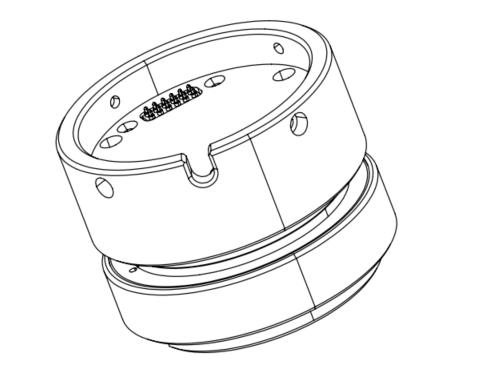
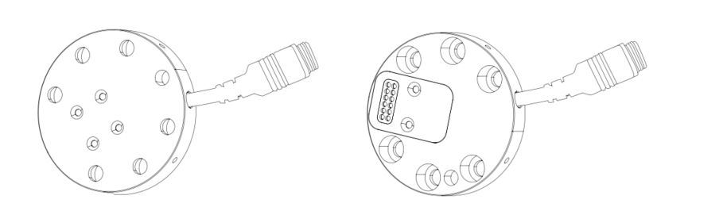
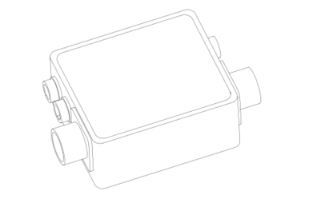
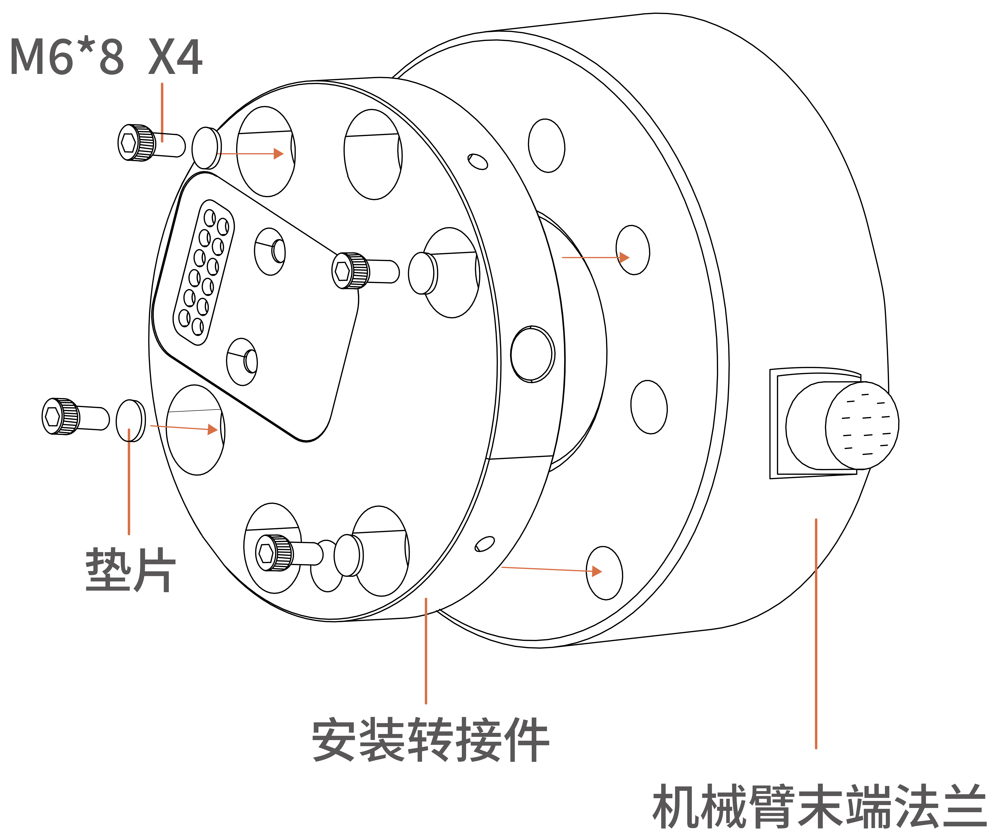
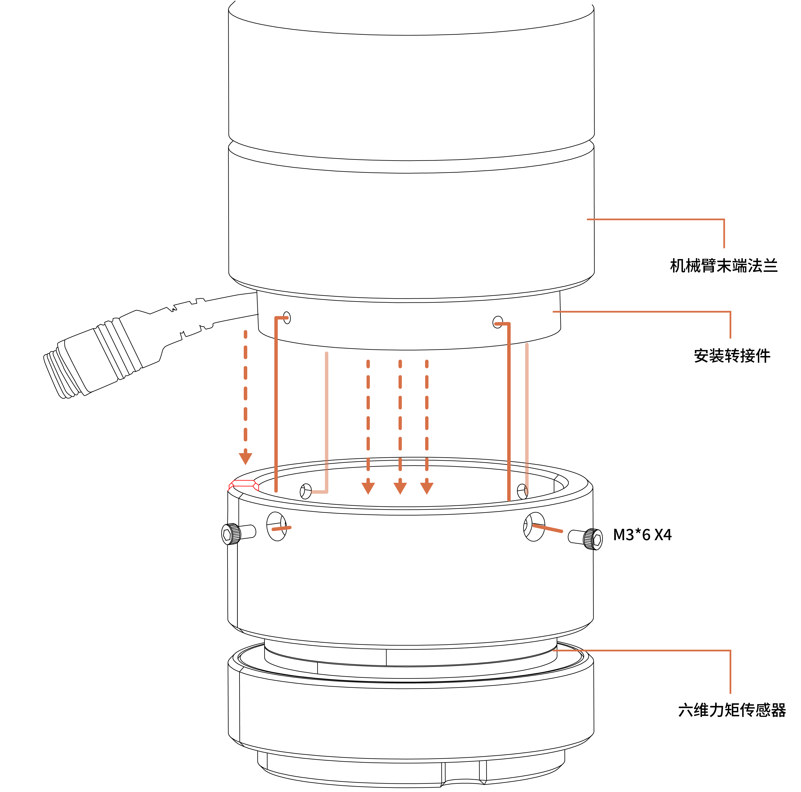
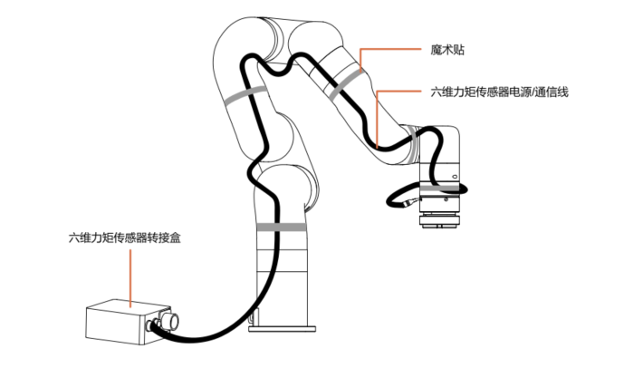


# 2. xArm六维力矩传感器安装
以下小节将指导您完成xArm六维力矩传感器的安装和常规设置。

（1）发货清单

（2）机械安装部分

**警告**

安装之前：

阅读并理解与UFACTORY六维力矩传感器有关的安全说明。

根据发货清单和订单验证包裹。

备有需求中列出的所需零件。

安装时：

满足环境条件。

在牢固地固定住力矩传感器并清除危险区域之前，请勿操作六维力矩传感器或打开电源。

## 2.1**发货清单**

UFACTORY六维力矩传感器套件通常包括以下物品（如下图所示）：

1. 六维力矩传感器\*1

2. 安装转接件\*1（正反两面）

3. 六维力矩传感器转接盒\*1

4. 机械臂供电电缆\*1
5. 机械臂通信电缆\*1
6. 六维力矩传感器供电/通信柔性电缆\*1
7. M3\*8杯头内六角螺丝（6个）和M3弹垫（6个）
8. M6\*8杯头内六角螺丝（6个）和M6弹垫（6个）
9. 2.5MM L型扳手\*1
10. 5MM L型扳手\*1
11. 魔术贴（3米）

## 2.2**机械安装**
1. 按下控制器上的急停按钮。
2. 用4颗M6\*8螺丝（一定要加弹垫）将六维力矩传感器安装转接件安装在末端法兰上。

3. 用4颗M3\*6螺丝（一定要加弹垫）将六维力矩传感器固定在安装转接件上。

4. 转接盒线缆连接：

根据转接盒的电气接口定义依次连接5根线缆。

5. 使用魔术贴，将六维力矩传感器电源/通信线缆粘在机械臂上，避免干扰。

（注意：不要粘太紧，请不要将魔术贴粘在力矩传感器上）

6. 松开控制器上的急停按钮
7. 使用SDK控制力矩传感器。      

   **注意：**

   连接所有线缆时控制器上的急停开关一定要处于按下状态，机械臂电源指示灯熄灭，避免热插拔引起机械臂故障； 

