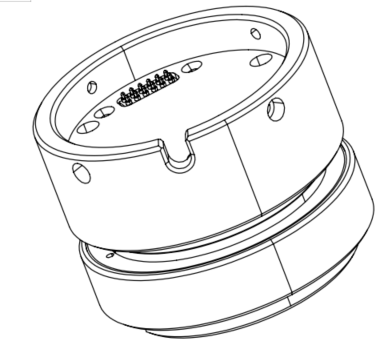
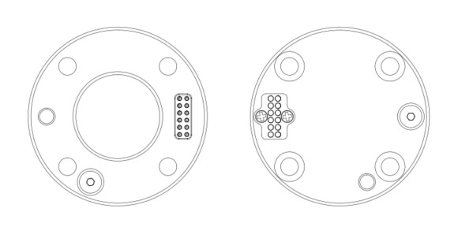


# 3.850六维力矩传感器安装

以下小节将指导您完成850六维力矩传感器的安装和常规设置。

（1）发货清单

（2）机械安装部分

**警告**

安装之前：

阅读并理解与六维力矩传感器有关的安全说明。

根据发货清单和订单验证包裹。

备有需求中列出的所需零件。

安装时：

满足环境条件。

在牢固地固定住力矩传感器并清除危险区域之前，请勿操作六维力矩传感器或打开电源。

## 3.1**发货清单**
六维力矩传感器套件通常包括以下物品（如下图所示）：

1-六维力矩传感器\*1

2-安装转接件\*1（正反两面）

3-M3\*8杯头内六角螺丝（6个）和M3弹垫（6个）

4-M6\*8杯头内六角螺丝（6个）和M6弹垫（6个）

5-2.5MM L型扳手\*1

6-5MM L型扳手\*1

## 3.2**机械安装**

1-按下控制器上的急停按钮。
2-用4颗M6\*8螺丝（一定要加弹垫）将六维力矩传感器安装转接件安装在末端法兰上。

![img.png

3-用4颗M3\*6螺丝（一定要加弹垫）将六维力矩传感器固定在安装转接件上。

![img_2.png

4-松开控制器上的急停按钮
5-使用SDK控制力矩传感器。      

**注意：**

连接所有线缆时控制器上的急停开关一定要处于按下状态，机械臂电源指示灯熄灭，避免热插拔引起机械臂故障； 

