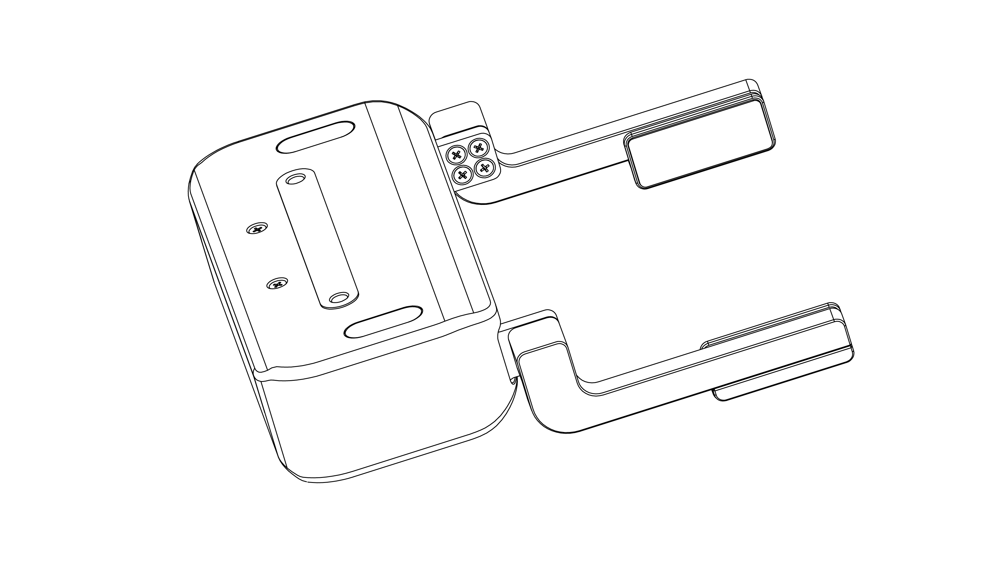
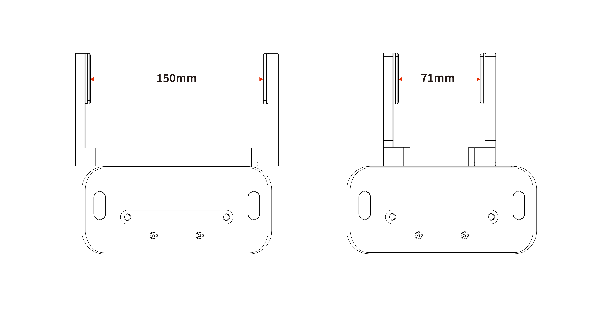
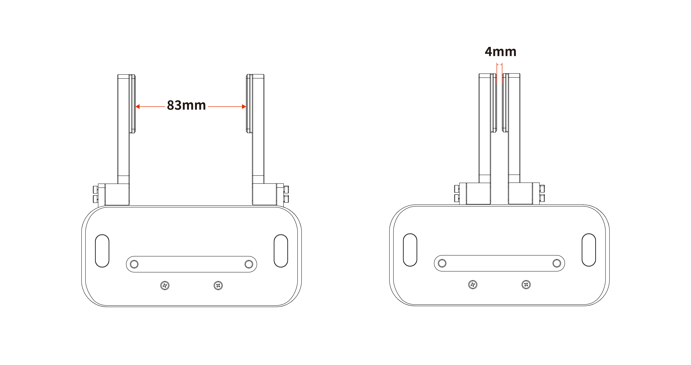

# 1. 介绍

BIO机械爪G2是专为处理液体板而设计的平行夹爪，具有快速安装以及简单应用的特点。其手指具有出色的抓握能力以及灵活性。  

BIO机械爪G2的手指可自由定制，用于处理不同形状的管状和板状的产品。

## 1.1 工作范围
BIO机械爪G2默认行程：71-150mm
  

BIO机械爪G2手指反装行程：4-83mm

## 1.2 设置与控制  
BIO机械爪G2通过一条电缆直接供电和控制，该电缆用于24V直流供电和基于RS-485的Modbus RTU通信。

## 1.3 安全
**警告**  
* 操作员在使用BIO机械爪之前必须已阅读并理解手册中的所有说明。
* 在操作机器人之前，必须正确固定好夹具。
* 请勿安装或操作已损坏或缺少零件的机械爪。
* 切勿为机械爪通交流电。
* 确保所有接线端子稳定连接在机械臂和机械爪两端。
* 请始终使用建议的电气连接。
* 在初始化机械臂程序之前，请确保没有人在机械臂和机械爪路径中。
* 始终不要超过机械爪的有效载荷。
* 根据您的应用情况，相应设置机械爪的速度。
* 接通电源时，手指和衣服应远离机械爪。
* 请勿在人或动物身上使用机械爪。
* 机械爪不适用于对物体或表面施加力。

**注意** 
术语“操作员”是指负责在BIO机械爪上进行以下任何操作的任何人：
* 安装
* 控制
* 维护
* 检查
* 标定
* 编程
* 退役  

本文档说明了BIO机械爪G2从安装到运行再到使用的整个生命周期的一般操作。  
本文档中的图形和照片是代表性的示例，它们与交付的产品之间可能存在差异。
  
BIO机械爪G2用于工业机器人，最终应用中使用的机器人、抓取器和任何其他设备必须进行风险评估。机器人集成商的责任是确保遵守所有本地安全措施和规定。根据不同的应用，可能存在需要采取额外保护/安全措施的风险，例如，机械爪操作的工件可能对操作员具有固有的危险。  

始终遵守有关自动化安全和通用机器安全的本地和国家法律，法规和指令。
本设备只能在其技术数据范围内使用。产品的任何其他使用均被视为不当和意外使用。
对于因任何不当使用或不当使用引起的任何损坏，UFACTORY将不承担任何责任。
