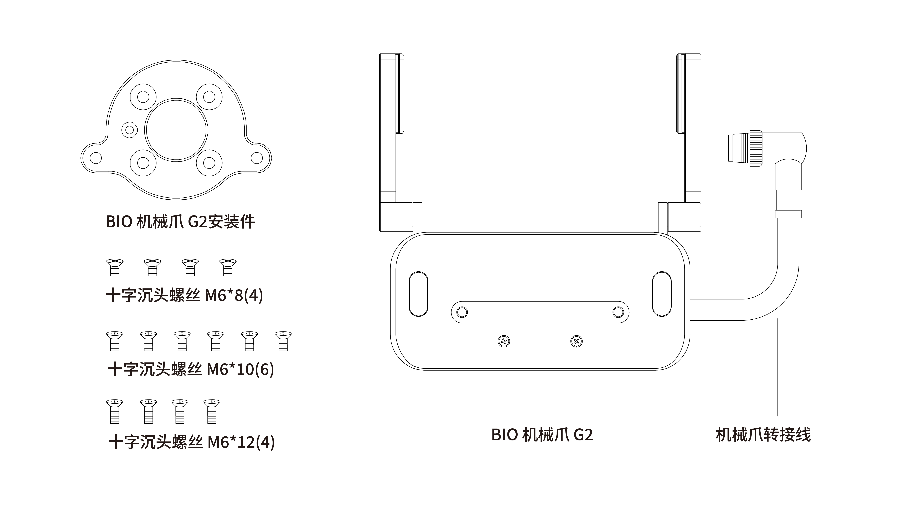
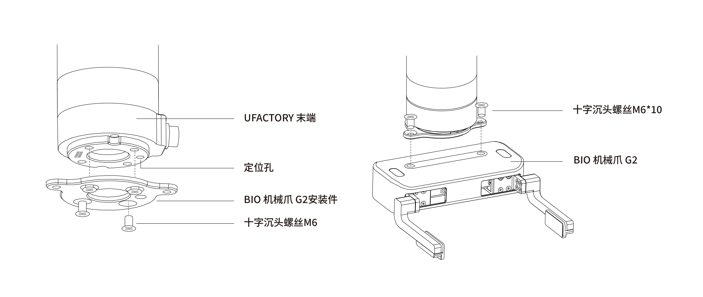
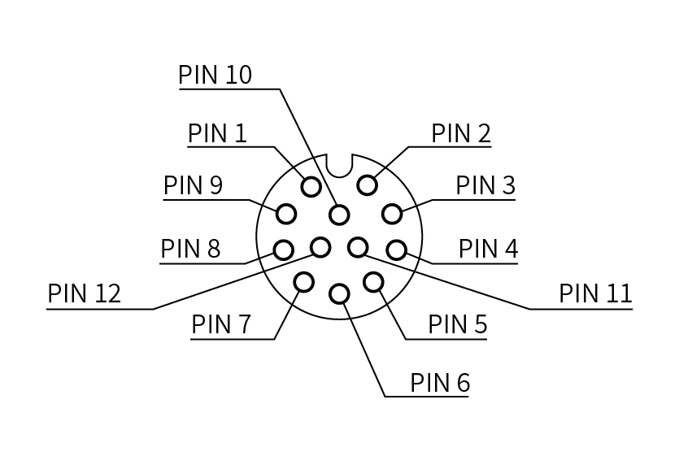
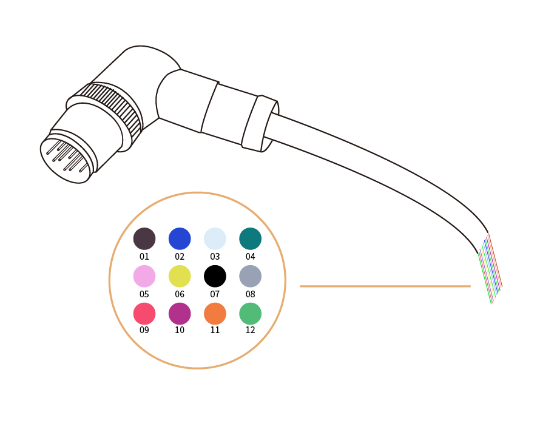
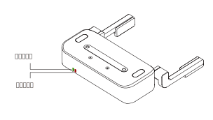

# 2. 安装

**警告**
安装之前：
阅读并理解与BIO机械爪有关的安全说明。
根据发货清单和订单验证包裹。
备有需求中列出的所需零件。  

安装时：
满足环境条件。
在牢固地固定住机械爪并清除危险区域之前，请勿操作机械爪或打开电源。
机械爪的手指可能会移动并造成伤害或损坏。

## 2.1 发货清单
BIO机械爪G2套件通常包括以下物品（如下图所示）：
* BIO机械爪G2（1个）
* BIO机械爪G2安装件（1个）
* 十字沉头螺丝M6*8（4个）
* 十字沉头螺丝M6*10（6个）
* 十字沉头螺丝M6*12（4个）

## 2.2 机械安装
BIO机械爪安装步骤（如下图所示）：
1. 将BIO机械爪G2安装板用螺丝固定到机械臂的工具末端，注意将安装板上的定位柱对齐机械臂末端的定位孔。
2. 将BIO机械爪G2用螺丝固定到BIO机械爪G2安装板上。
3. 用机械爪连接线将机械臂与BIO机械爪G2连接。

**注意**
* 接通机械爪连接线时一定要使机械臂断电，急停开关处于按下状态，机械臂电源指示灯 熄灭，避免热插拔引起机械臂故障； 
* 因机械爪连接线长度限制，机械爪接口与末端接口需在相同的方向；
* 机械爪连接线接通机械爪跟机械臂时注意务必对齐两端接口的定位孔，连接线的公针较为纤细，避免在拆装时使公针弯曲。

## 2.3 电气设置
BIO机械爪通过单根设备电缆与xArm机械臂建立电源和通信。设备电缆为机械爪提供24V电源，并实现了与机械臂控制器的串行RS485通信。

**请断开机械臂电源后**，再用机械爪连接线将机械爪和机械臂连接在一起。

### 2.3.1 引脚接口
机械爪通过位于其外表面上的12pin接头与机械臂工具端连接。
  
  

| 序号    | 功能                   |
| ----- | -------------------- |
| PIN1 &ensp;&ensp;&ensp;&ensp;&ensp;&ensp;&ensp;&ensp;&ensp;&ensp;  | 24V                  |
| PIN2  | 24V                  |
| PIN3  | GND                  |
| PIN4  | GND                  |
| PIN5  | 485-A                |
| PIN6  | 485-B                |
| PIN7  | Digital Input 0(TI0) |
| PIN8  | Digital Input1(TI1)  |
| PIN9  | Digital Output0(TO0) |
| PIN10 | Digital Output1(TO1) |
| PIN11 | No Connect           |
| PIN12 | No Connect           |

BIO机械爪G2使用24V(PIN1和PIN2), GND(PIN3和PIN4), 485A(PIN5), 485B(PIN6).

## 2.4 指示灯
BIO机械爪G2提供2个指示灯，电源指示灯与状态指示灯。
* 当机械爪上电时，电源指示灯常亮红色，状态指示灯闪烁绿色。
* 当机械爪夹住东西时，状态指示灯常亮绿色。
* 当机械爪有错误时，状态指示灯快速闪烁绿色。

