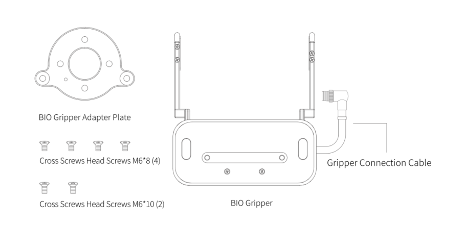
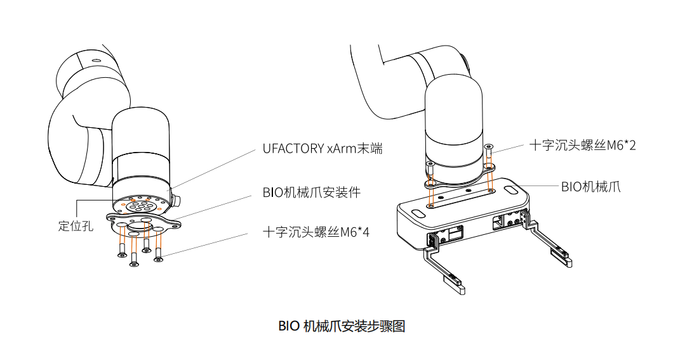

# 2. 安装

以下小节将指导您完成 BIO 机械爪的安装和常规设置。

1. 发货清单
2. 机械安装
3. 电气设置

**警告**  
安装之前：

- 阅读并理解与 BIO 机械爪有关的安全说明。
- 根据发货清单和订单验证包裹。
- 备有需求中列出的所需零件。

安装时：

- 满足环境条件。
- 在牢固地固定住机械爪并清除危险区域之前，请勿操作机械爪或打开电源。
- 机械爪的手指可能会移动并造成伤害或损坏。

### 2.1 发货清单

#### 2.1.1 通用套件

BIO 机械爪套件通常包括以下物品（如下图所示）：

- BIO 机械爪
- BIO 机械爪安装件
- 十字沉头螺丝 M6\*8 (4 个)
- 十字沉头螺丝 M6\*10 (2 个)

### 2.2 机械安装

BIO 机械爪安装步骤（如下图所示）：

1. 将 BIO 机械爪安装板用螺丝固定到机械臂的工具末端，注意将安装板上的定位柱对齐机械臂末端的定位孔。

2. 将 BIO 机械爪用螺丝固定到 BIO 机械爪安装板上。

3. 用机械爪连接线将机械臂与 BIO 机械爪连接。

**注意：**

1. 接通机械爪连接线时一定要使机械臂断电，急停开关处于按下状态，机械臂电源指示灯熄灭，避免热插拔引起机械臂故障。
2. 因机械爪连接线长度限制，机械爪接口与末端接口需在相同的方向。
3. 机械爪连接线接通机械爪跟机械臂时注意务必对齐两端接口的定位孔，连接线的公针较为纤细，避免在拆装时使公针弯曲。

### 2.3 电气设置

BIO 机械爪通过单根设备电缆与 xArm 机械臂建立电源和通信。设备电缆为机械爪提供 24V 电源，并实现了与机械臂控制器的串行 RS485 通信。

**警告：**  
请断开机械臂电源后，再用机械爪连接线将机械爪和机械臂连接在一起。

#### 2.3.1 引脚接口

机械爪通过位于其外表面上的 12pin 接头与机械臂工具端连接。

| 序号 | 功能               |
|------|--------------------|
| 1    | 24V                |
| 2    | 24V                |
| 3    | GND                |
| 4    | GND                |
| 5    | 485-A              |
| 6    | 485-B              |
| 7    | Digital Input 0    |
| 8    | Digital Input 1    |
| 9    | Digital Output 0   |
| 10   | Digital Output 1   |
| 11   | No Connect         |
| 12   | No Connect         |