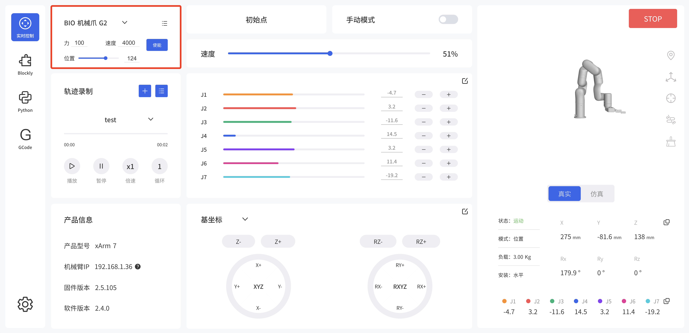
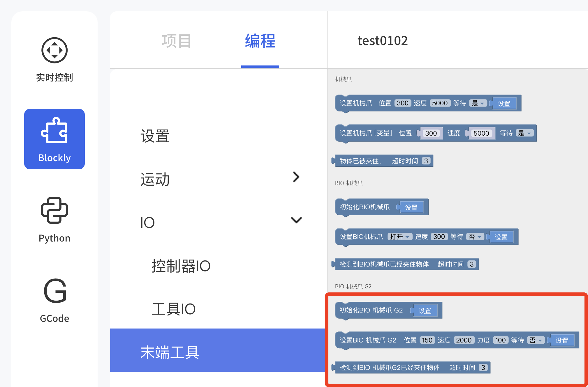

# 3. 控制方式

BIO机械爪G2提供两种控制模式。切换模式后，需重新使能机械爪。

**模式0：** 开合模式。（BIO机械爪G2默认的模式）  
**模式1：** 位置模式。支持传入位置，力，速度。
* 位置：71-150
* 速度：0-4500
* 力：0-100（百分比）


## 3.1 用UFactory Studio控制
设置BIO机械爪G2
进入设置 - 运动参数 - TCP设置，选择BIO-G2机械爪。


### 3.1.1 实时控制界面控制
进入实时控制界面，选择BIO机械爪G2，可进行使能，速度，力，位置控制。  
点击右上角按钮，可关闭位置与力控制（切换模式）。
  


### 3.1.2 Blockly控制
Blockly提供3个块控制BIO机械爪G2：
* 初始化BIO机械爪G2 
* 设置BIO机械爪G2，   参数：位置，速度，力度，是否等待
* 检测到BIO机械爪G2已经夹住物体， 参数：超时时间



### 3.1.3 Modbus RTU界面控制
进入设置-外接设备-Modbus RTU页面，发送相应的Modbus RTU指令进行控制。  
Modbus通讯协议请参考[3.3.1寄存器地址说明](#331-寄存器地址说明)


## 3.2 用Python-SDK控制

### 3.2.1 模式0（默认）
常用接口如下：  
`set_bio_gripper_enable` ：使能BIO机械爪G2  
`set_bio_gripper_speed` ：设置BIO机械爪G2速度  
`open_bio_gripper` ：打开BIO机械爪  
`close_bio_gripper` ：关闭BIO机械爪

Python示例：[5009-set_bio_gripper.py](https://github.com/xArm-Developer/xArm-Python-SDK/blob/master/example/wrapper/common/5009-set_bio_gripper.py)

### 3.2.2 模式1
常用接口如下：（Python SDK > 1.14.7）  
`set_bio_gripper_enable` ：使能BIO机械爪G2  
`set_bio_gripper_control_mode(mode=1)` ：切换为位置模式  
`set_bio_gripper_position` ：控制BIO机械爪G2的位置，力，速度

Python示例：
~~~python
import os
import sys
import time
sys.path.append(os.path.join(os.path.dirname(__file__), '../../..'))

from xarm.wrapper import XArmAPI

arm = XArmAPI('192.168.1.204')
arm.motion_enable(True)
arm.clean_error()
arm.set_mode(0)
arm.set_state(0)
time.sleep(1)

code = arm.set_bio_gripper_control_mode(mode=1)
print('set_bio_gripper_mode,code={}'.format(code))

code = arm.set_bio_gripper_enable(True)
print('set_bio_gipper_enable,code={}'.format(code))

while True:
    code = arm.set_bio_gripper_position(150, speed=3000, force=50)
    print('set_bio_gripper_position,code={}'.format(code))
    time.sleep(0.2)
    code = arm.set_bio_gripper_position(71, speed=3000, force=100)
    print('set_bio_gripper_position,code={}'.format(code))
    time.sleep(0.2)
~~~

## 3.3 用Modbus RTU通讯协议控制


### 3.3.1 寄存器地址说明
机械爪支持标准Modbus RTU协议，默认波特率2Mbps，机械爪ID为0x08。目前支持的功能码有：0x03/0x06/0x10。
* 0x03: 读取寄存器
* 0x06: 写单个寄存器
* 0x10: 写多个寄存器  


读取：

| 通讯地址   | 说明        |
| ------ | --------- |
| 0x0000 | 运行状态      |
| 0x0001 | 速度（r/min） |
| 0x0002 | 电流百分比     |
| 0x0003 | 电流        |
| 0x0004 | 指令位置      |
| 0x0006 | 电机位置      |
| 0x0008 | 位置误差      |
| 0x000F | 当前报警代码    |


写入：


| 通讯地址   | 说明        | 设定范围                                                                               | 单位    | 出厂设定 |
| ------ | --------- | ---------------------------------------------------------------------------------- | ----- | ---- |
| 0x0100 | 机械爪使能     | 0-1；                                                                               |       | 0    |
| 0x010A | 控制模式      | 0-2；</br>0：开合模式，1：位置模式。                                                                 |       | 0    |
| 0x0303 | 速度指令      | 0-4500                                                                             | r/min | 1000 |
| 0x0505 | 夹取检测阈值    | 30-100                                                                             | 0.01A | 50   |
| 0x0506 | 保持电流限幅(力) | 10-100                                                                             | 0.01A | 50   |
| 0x0508 | 跌落检测阈值    | 500-2000                                                                           | r/min | 1000 |
| 0x0601 | 通讯波特率     | 0: 4800 </br>1: 9600 </br>2: 19200</br>8: 921600</br>9: 1M</br>10: 1.5M</br>11: 2M | bps   | 11   |
| 0x0700 | 位置命令高位    | 0-0xFFFF                                                                           | -     | 0    |
| 0x0701 | 位置命令低位    | 0-0xFFFF                                                                           | -     | 0    |
| 0x0702 | 位置反馈高位    | 0-0xFFFF                                                                           | -     | 只读   |
| 0x0703 | 位置反馈低位    | 0-0xFFFF                                                                           | -     | 只读   |


运动状态（0x0000）
| 位1:0 | 00：停止状态    | 位3:2 | 00：未使能  |
| ---- | ---------- | ---- | ------- |
|      | 01：运动状态    |      | 10：使能状态 |
|      | 10：夹取状态    |      |         |
|      | 11: 机械爪有错误 |      |         |

### 3.3.2 读取保持寄存器

| 读取保持寄存器  |               |                 |           |
| ------------------ | -------------- |-----------------|-----------|
| **请求指令格式**   |                |                 |           |
| Modbus RTU 数据    | 机械爪 ID      | 1 Byte          | 0x08      |
|                    | 功能码         | 1 Byte          | 0x03      |
|                    | 寄存器起始地址 | 2 Bytes         | **Address** |
|                    | 寄存器数量     | 2 Bytes         | **N\***   |
|                    | Modbus CRC 16  | 2 Bytes         | **CRC\*** |
| **响应指令格式**   |                |                 |           |
| Modbus RTU 数据    | 机械爪 ID      | 1 Byte          | 0x08      |
|                    | 功能码         | 1 Byte          | 0x03      |
|                    | 字节数         | 1 Byte          | **N\*x2** |
|                    | 寄存器值       | **N\*x2** Bytes | **Value** |
|                    | Modbus CRC16   | 2 Bytes         | **CRC\*** |

注： N* = 寄存器数量	  
Address= 寄存器起始地址（见下面列表）  
CRC* = 循环冗余校验

**寄存器：**

|                | **寄存器起始地址** | **寄存器值** |                                                                                                                            |
| -------------- | ------------------ | ------------ |----------------------------------------------------------------------------------------------------------------------------|
| 获取机械爪状态 | 0x0000             | 2 Bytes      | **未使能状态：** 0x0000  </br>**使能中状态：** 0x0004  </br> **使能完成状态：** 0x0008 </br>   **停止状态：** 0x0008 </br>  **运动状态：** 0x0009 </br> **夹取状态：** 0x000A </br>  **报错状态：** 0x000B |
| 获取机械爪错误 | 0x000F             | 2 Bytes      | **有错误：**  其他返回值都代表有错误（除0以外）</br>**无错误：**  0x0000                                                                                |

### 3.3.3 写入寄存器

|    写入寄存器       |       |                 |             |
| ---------------- | -------------- |-----------------|-------------|
| **请求指令格式** |                |                 |             |
| Modbus RTU 数据  | 机械爪 ID      | 1 Byte          | 0x08        |
|                  | 功能码         | 1 Byte          | 0x10        |
|                  | 寄存器起始地址 | 2 Bytes         | **Address** |
|                  | 寄存器数量     | 2 Bytes         | **N\***     |
|                  | 字节数         | 1 Byte          | **N\*x2**   |
|                  | 寄存器         | **N\*x2** Bytes | **Value**   |
|                  | Modbus CRC 16  | 2 Bytes         | **CRC\***   |
| **响应指令格式** |                |                 |             |
| Modbus RTU 数据  | 机械爪 ID      | 1 Byte          | 0x08        |
|                  | 功能码         | 1 Byte          | 0x10        |
|                  | 寄存器起始地址 | 2 Bytes         | **Address** |
|                  | 寄存器数量     | 2 Bytes         | **N\***     |
|                  | Modbus CRC 16  | 2 Bytes         | **CRC\***   |


注： N* = 寄存器数量	
Address= 寄存器起始地址（见下面列表）	
CRC* = 循环冗余校验	


**寄存器：**

|                 | **寄存器起始地址** | **寄存器值** |                                                  |
| --------------- | ------------------ | ------------ |--------------------------------------------------|
| 使能/关闭机械爪 | 0x0100             | 2 Bytes      | **使能:** 0x0001 </br> **停用:** 0x0000                   |
| 设置机械爪位置  | 0x0700             | 4 Bytes      | **打开机械爪：** 0x0000 0x0082 </br>  **闭合机械爪：** 0x0000 0x0032 |
| 设置机械爪速度  | 0x0303             | 2 Bytes      | 0x0000-0x0BB8 </br> **单位：**  r/min                      |
| 清除机械爪错误  | 0x000F             | 2 Bytes      | 0x0000                                           |


### 3.3.4 Modbus RTU示例

使用Modbus RTU控制BIO机械爪G2开合，模式1。
1. 设置机械爪模式1。地址：0x010A， 最后两位为CRC: 6D AD，断电后仍生效。
```
发：08 06 11 0A 00 01 6D AD
收：08 06 11 0A 00 01 6D AD
```
2. 使能机械爪。地址：0x0100。
```
发：08 06 01 00 00 01 49 6F
收：08 06 01 00 00 01 49 6F
```
3. 打开机械爪，位置150，速度3000，力50。
```
设置速度3000
发：08 06 03 03 0b b8 7E 55
收：08 06 03 03 0b b8 7E 55

设置力50（百分比）
发：08 06 05 06 00 32 E8 4B
收：08 06 05 06 00 32 E8 4B

打开机械爪G2到150, 发送的位置需要做转换：（150-70）*3.75=(OCT)100=(HEX)01 2c
发：08 10 07 00 00 02 04 00 00 01 2c FB 4E
收：08 10 07 00 00 02 40 25
```
4. 关闭机械爪，位置71。
```
发：08 10 07 00 00 02 04 00 00 00 00 FB 03
收：08 10 07 00 00 02 40 25
```

5. 读取机械爪位置。
```
机械爪位置71
发：08 03 07 02 00 02 64 26
收：08 03 04 00 00 00 00 63 33
```
6. 读取报警代码。地址：0x000F
```
发：08 03 00 0F 00 01 B4 90
收：08 03 02 00 00 64 45
```


## 3.4 用私有TCP通讯协议控制


### 3.4.1 寄存器地址说明
参考[3.3.1 寄存器地址说明](#331-寄存器地址说明)

Modbus协议是一项应用层报文传输协议，有ASCII、RTU、TCP三种报文类型。标准Modbus协议物理层接口有RS232、RS422、RS485和以太网接口，采用master/slave方式通信。  
BIO机械爪G2支持**私有TCP**协议，与标准Modbus TCP类似但不完全相同。

私有TCP通信过程：  
（1）建立TCP连接  
（2）准备私有TCP报文  
（3）使用send命令发送报文  
（4）在同一连接下等待应答  
（5）使用recv命令读取报文，完成一次数据交换  
（6）通信任务结束时，关闭TCP连接  

参数：  
默认TCP端口：**502**          
协议标识：**0x00 0x02** 控制(当前只有这一个)    
在本章节中，数据解析均为**大端解析**。

### 3.4.2 读取保持寄存器

| 读取保持寄存器       |             |                 |              |
| ------------- | ----------- | --------------- | ------------ |
| **请求指令格式**    |             |                 |              |
| 私有TCP 包头 | 事务标识        | 2 Bytes         | 0x00，0x01    |
|               | 协议标识        | 2 Bytes         | 0x00，0x02    |
|               | 长度          | 2 Bytes         | 0x00，0x08    |
|               | 寄存器         | 1 Byte          | 0x7C         |
|               | 主机 ID（内部使用） | 1 Byte          | 0x09         |
| Modbus RTU 数据 | 机械爪 ID      | 1 Byte          | 0x08         |
|               | 功能码         | 1 Byte          | 0x03         |
|               | 寄存器起始地址     | 2 Bytes         | **Address**  |
|               | 寄存器数量       | 2 Bytes         | **N\***      |
| **响应指令格式**    |             |                 |              |
| 私有TCP 包头 | 事务标识        | 2 Bytes         | 0x00，0x01    |
|               | 协议          | 2 Bytes         | 0x00，0x02    |
|               | 长度          | 2 Bytes         | ***6+N\*x2** |
|               | 寄存器         | 1 Byte          | 0x7C         |
|               | 状态          | 1 Byte          | 0x00         |
|               | 主机 ID（内部使用） | 1 Byte          | 0x09         |
| Modbus RTU 数据 | 机械爪 ID      | 1 Byte          | 0x08         |
|               | 功能码         | 1 Byte          | 0x03         |
|               | 字节数         | 1 Byte          | **N\*x2**    |
|               | 寄存器值        | **N\*x2** Bytes | **Value**    |

**注：**  
N* = 寄存器数量    
Address = 寄存器起始地址（见下面列表）

**寄存器：**

|         | **寄存器起始地址** | **寄存器值** |                                                                                                                                                          |
| ------- | ----------- | -------- | -------------------------------------------------------------------------------------------------------------------------------------------------------- |
| 获取机械爪状态 | 0x0000      | 2 Bytes  | **未使能状态：** 0x0000</br>**使能中状态：** 0x0004</br>**使能完成状态：** 0x0008  </br>**停止状态：** 0x0008   </br>**运动状态：** 0x0009</br>**夹取状态：** 0x000A </br>**报错状态：** 0x000B |
| 获取机械爪错误 | 0x000F      | 2 Bytes  | **有错误：**  其他返回值都代表有错误（除0以外） </br>**无错误：**  0x0000                                                                                                        |
  

### 3.4.3 写入寄存器
|写入寄存器  |                |                 |                   |
| ---------------- | -------------- |-----------------| ----------------- |
| **请求指令格式** |                |                 |                   |
| 私有TCP 包头  | 事务标识       | 2 Bytes         | 0x00，0x01         |
|                  | 协议           | 2 Bytes         | 0x00，0x02         |
|                  | 长度           | 2 Bytes         | **9+N\*x2** |
|                  | 寄存器         | 1 Byte          | 0x7C              |
|         | 主机ID（内部使用 ）       | 1 Byte          | 0x09              |
| Modbus RTU 数据  | 机械爪ID      | 1 Byte          | 0x08              |
|                  | 功能码         | 1 Byte          | 0x10              |
|                  | 寄存器起始地址 | 2 Bytes         | **Address**       |
|                  | 寄存器数量     | 2 Bytes         | **N\***           |
|                  | 字节数         | 1 Byte          | **N\*x2**         |
|                  | 寄存器         | **N\*x2** Bytes | **Value**         |
| **响应指令格式** |                |                 |                   |
| 私有TCP 包头  | 事务标识       | 2 Bytes         | 0x00，0x01         |
|                  | 协议           | 2 Bytes         | 0x00，0x02         |
|                  | 长度           | 2 Bytes         | 0x00，0x09         |
|                  | 寄存器         | 1 Byte          | 0x7C              |
|                  | 状态           | 1 Byte          | 0x00              |
|         | 主机 ID        | 1 Byte          | 0x09              |
| Modbus RTU 数据  | 机械爪ID（内部使用 ）     | 1 Byte          | 0x08              |
|                  | 功能码         | 1 Byte          | 0x10              |
|                  | 寄存器起始地址 | 2 Bytes         | **Address**       |
|                  | 寄存器数量     | 2 Bytes         | **N\***           |

注： N* = 寄存器数量	  
Address= 寄存器起始地址（见下面列表）	

**寄存器：**

|                 | **寄存器起始地址** | **寄存器值** |                                                   |
| --------------- | ------------------ | ------------ |---------------------------------------------------|
| 使能/关闭机械爪 | 0x0100             | 2 Bytes      | **使能:** 0x0001  **停用:** 0x0000                    |
| 设置机械爪位置  | 0x0700             | 4 Bytes      | **打开机械爪：** 0x0000 0x0082  **闭合机械爪：** 0x0000 0x0032 |
| 设置机械爪速度  | 0x0303             | 2 Bytes      | 0x0000-0x0BB8                                     |
| 清除机械爪错误  | 0x000F             | 2 Bytes      | 0x0000                                            |

### 3.4.4 私有TCP示例
使用私有TCP控制BIO机械爪G2开合，模式0。
1. 设置机械爪模式0。地址：0x010A，断电后仍生效。
```
发：00 01 00 02 00 08 7C 09 08 06 11 0A 00 00
收：00 01 00 02 00 09 7C 50 09 08 06 11 0A 00 00
```
2. 使能机械爪。地址：0x0100
```
发：00 01 00 02 00 0B 7C 09 08 10 01 00 00 01 02 00 01
收：00 01 00 02 00 09 7C 50 09 08 10 01 00 00 01
```
3. 打开机械爪。
```
模式0没有位置控制，发送位置＞90,则打开机械爪。 (OCT)130=(HEX)0082
发：00 01 00 02 00 0d 7C 09 08 10 07 00 00 02 04 00 00 00 82
收：00 01 00 02 00 09 7C 50 09 08 10 07 00 00 02
```

4. 关闭机械爪。
```
模式0没有位置控制，发送位置≤90,则关闭机械爪。 (OCT)50=(HEX)0032
发：00 01 00 02 00 0d 7C 09 08 10 07 00 00 02 04 00 00 00 32
收：00 01 00 02 00 09 7C 50 09 08 10 07 00 00 02
```


