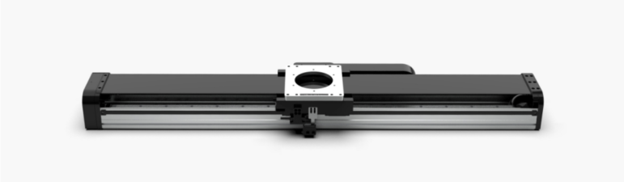
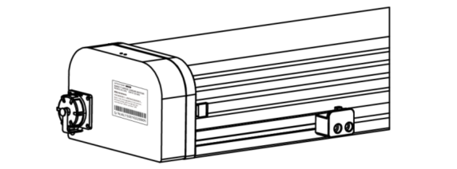
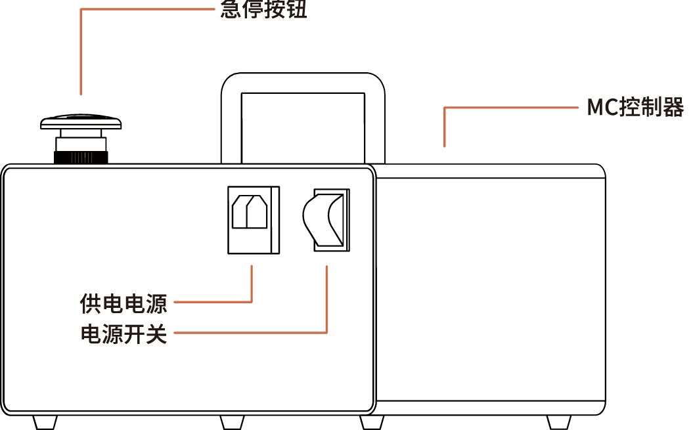
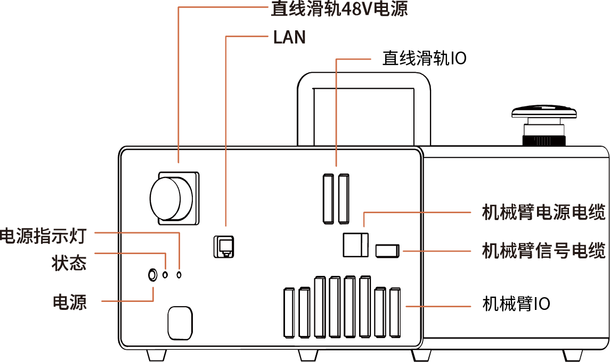
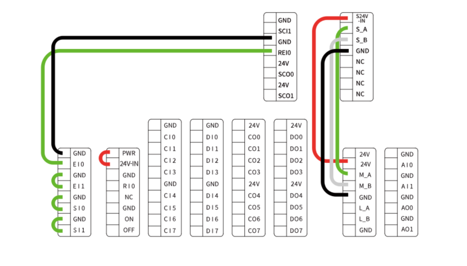

# 1.简要介绍

## 1.1 UFactory直线滑轨简要介绍
UFactory直线滑轨需要配合AC Control Box Pro控制器使用，能够支持和引导运动部件，按给定的方向平稳地做直线运动，一定程度上增大机械臂的工作范围。

## 1.2 Linear Motor Model

UFactory直线滑轨有两个型号，可根据SN划分。SN位于直线滑轨端板处，见下图

直线滑轨原点：位置-0。

直线滑轨的速度范围是：1到1000(mm/s)。

直线滑轨的位置数值范围：

AL0700：0到700(mm)

AL1000：0到1000(mm)

AL1500：0到1500(mm)

## 1.3 AC Control Box Pro控制器

UFactory直线滑轨必须配合AC Control Box控制器使用。

控制器IO连接如下图，出厂时已连接好。

## 1.4 安全

操作员在使用UFactory直线滑轨之前必须已阅读并理解手册中的所有说明。

### 1.4.1 Warning

1. 在操作机器人之前，必须正确安装好直线滑轨。

   请勿安装或操作已损坏或缺少零件的直线滑轨。

   切勿为直线滑轨通交流电。

2. 确保所有接线端子稳定连接在机械臂和直线滑轨两端。

   请始终使用建议的安装方式。

   在初始化直线滑轨之前，请确保没有杂物在机械臂和直线滑轨路径中。

   根据您的应用情况，相应设置直线滑轨的速度和位置。

   **注意**

   术语“操作员”是指负责在UFactory直线滑轨上进行以下任何操作的任何人：

**● 安装**

 **● 控制**

  **● 维护**

  **● 检查**

 **● 编程**

  **● 退役**

 本文档说明了UFactory直线滑轨从安装到运行再到使用的整个生命周期的一般操作。

本文档中的图形和照片是代表性的示例，它们与交付的产品之间可能存在差异。

### 1.4.2 风险评估和最终应用

UFactory直线滑轨用于工业机器人，最终应用中使用的机器人、直线滑轨和任何其他设备必须进行风险评估。机器人集成商的责任是确保遵守所有本地安全措施和规定。根据不同的应用，可能存在需要采取额外保护/安全措施的风险，例如，直线滑轨操作的工件可能对操作员具有固有的危险。

### 1.4.3 有效性和责任

始终遵守有关自动化安全和通用机器安全的本地和国家法律，法规和指令。

本设备只能在其技术数据范围内使用。产品的任何其他使用均被视为不当和意外使用。

对于因任何不当使用或不当使用引起的任何损坏，UFACTORY将不承担任何责任。

 

