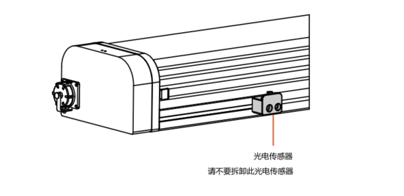
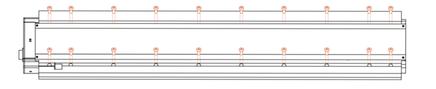
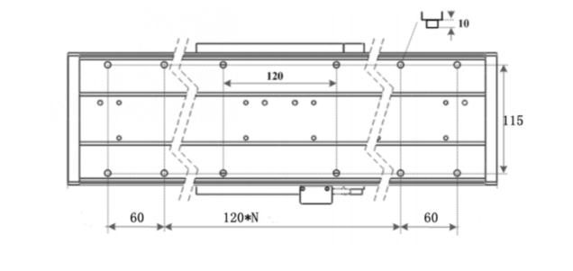
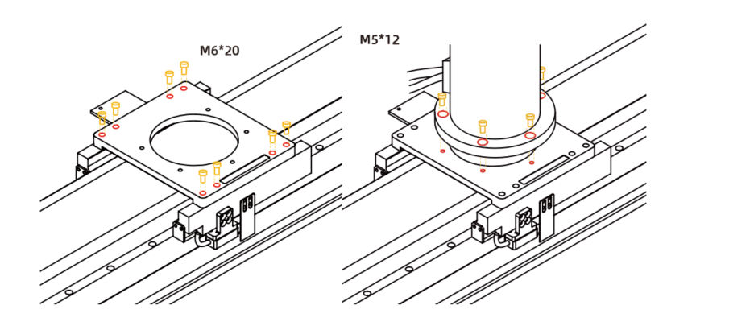
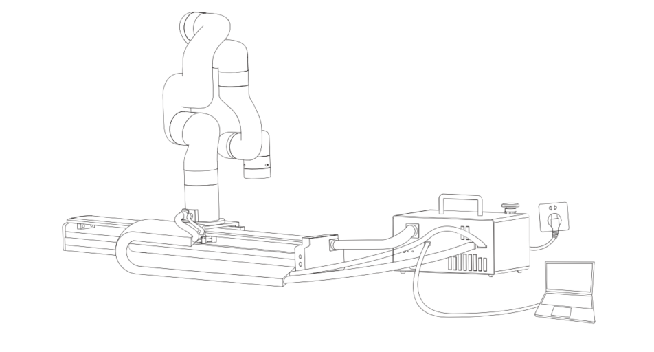

# 2.安装

以下小节将指导您完成UFactory直线滑轨的安装和常规设置。

（1）发货清单

（2）机械安装部分

**警告**

安装之前：

阅读并理解与UFactory直线滑轨有关的安全说明。

根据发货清单和订单验证包裹。

备有需求中列出的所需零件。

安装时：

满足环境条件。

在牢固地固定住直线滑轨并清除危险区域之前，请勿操作直线滑轨或打开电源。

请不要拆卸直线滑轨上的光电传感器，否则会丢失直线滑轨原点位置。

**请勿让强磁体靠近磁栅**

## 2.1.发货清单

UFactory直线滑轨套件通常包括以下物品（如下图所示）：

UFactory直线滑轨*1（包括机械臂供电电缆*1、机械臂通信电缆*1）

直线滑轨供电电缆*1

AC Control Box Pro控制器*1

AC Control Box Pro控制器电源电缆*1

网线*1

M6*20杯头内六角螺丝(28个)和M6弹垫(28个)

M5*12杯头内六角螺丝(5个)和M5弹垫(5个)

5MM L型扳手*1

4MM L型扳手*1

USB转485线缆*1

## 2.2 机械安装
UFactory直线滑轨通过单根设备电缆直接与AC Control Box Pro控制器连接。设备电缆为直线滑轨提供48V电源，并实现了与机械臂控制器的串行RS485通信。

 

安装直线滑轨流程：

1-确定直线滑轨及机械臂工作空间（避免碰到其他设备或障碍物)；直线滑轨上有20个φ6.6螺丝孔，用于将直线滑轨固定在工作台上。包装内有28颗M6*20螺丝，请用其中20颗M6*20螺丝将直线滑轨固定。请水平方向安装直线滑轨，切勿垂直方向安装；

切勿垂直方向安装；

直线滑轨螺丝孔尺寸（单位：mm）

2-用8颗M6*20螺丝将底座板固定于直线滑轨上。

3-用5颗M5*12螺丝将机械臂固定于直线滑轨底座板上

4-线缆连接：

* 1）将直线滑轨供电电缆、网线插入AC Control Box Pro控制器，接口具备防呆功能

* 2)将机械臂供电电缆和机械臂通信电缆接头插入机械臂接口，接口具备防呆功能；

* 3）将机械臂供电电缆、通信电缆插入AC Control Box Pro控制器，接口具备防呆功能；

5- 打开控制器电源开关，松开急停按钮

6-xArmStudio-设置-工具设置-直线滑轨，点击"初始化"按钮回零并初始化滑轨。

**注意：**
   1. 连接所有线缆时控制器上的急停开关一定要处于按下状态，机械臂电源指示灯熄灭，避免热插拔引起机械臂故障； 
   2. 因直线滑轨没有刹车设计，必须水平方向安装直线滑轨；