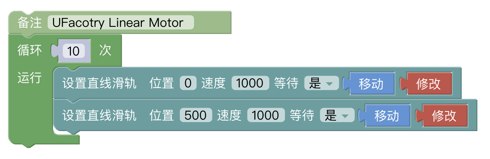

# 3.直线滑轨的控制方式

## 3.1  用 xArm Studio控制直线滑轨

### 3.1.1 设置直线滑轨

进入【设置】-【外接设备】-【直线滑轨】

  * 是否安装直线滑轨：打开

  *  点击"初始化"按钮\

1. 在直线滑轨设置界面，打开"是否安装直线滑轨"选项。

2. 在直线滑轨设置界面，直线滑轨每次通电后，点击"初始化"按钮，对直线滑轨进行使能初始化并回零。初始化完成后，才能控制滑轨。

### 3.1.2 控制直线滑轨

1. 在直线滑轨设置界面控制滑轨

可通过进度条、+/-键、速度百分比输入框来调整直线滑轨的速度和位置。\.

2. 可以通过观察直线滑轨的IO 查看对应功能的IO状态情况。

3. 通过Blockly来控制直线滑轨

这段程序的作用：执行此程序，可控制直线滑轨从原点到最远点以最高速度往复运动10次。

点击【修改】按钮，弹出快捷按钮调整位置

注意：

1）当直线滑轨首次上电时，直线滑轨需要完成初始化后才能使用。

## 3.2. 用 Python-SDK 控制直线滑轨

对于使用Python-SDK控制直线滑轨的详细内容请见点击下面的链接查看:

https://github.com/xArm-Developer/xArm-Python-SDK/blob/master/example/wrapper/common/9000-set_linear_track.py

## 3.3.指示灯
直线滑轨指示灯位于直线滑轨端板处。

1. 电源指示灯：上电时，亮红灯
2. 状态指示灯：绿灯常亮表示直线滑轨正常运行；绿灯闪烁表示直线滑轨出现故障。

## 3.4.直线滑轨IO
直线滑轨配置三路IO，一路输入IO，两路输出IO。

SCI 1：直线滑轨急停，低电平有效。

SCO 0：输出高电平，表示直线滑轨有错误。

SCO 1：输出高电平，定位结束表示位置已到达

