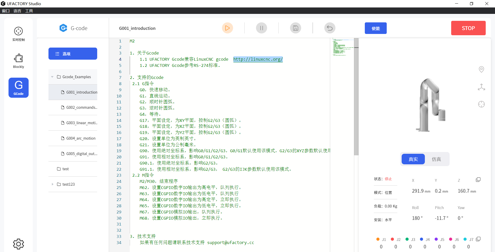

# UFACTORY Gcode

UFACTORY Gcode指令兼容 Linux CNC gcode http://linuxcnc.org/， 参考RS-274标准进行开发。
更新时间：2024-07-24

固件版本：≥ v2.5.0

UFACTORY Studio版本：≥ v2.5.0

TCP 端口：504

### 支持指令

### 1. G 指令

* **G0** X Y Z A B C # 固定速度为 240mm/s
* **G1** X Y Z A B C F # XYZ 单位 mm，ABC 对应 roll/pitch/yaw（单位°），F 为速度 （单位 mm/min 或英寸 /min，缺省为上一次 G1 指令的速度或 100mm/s）(当有 XYZABC 参 数时，G1 也可以省略)
* **G2** X Y Z R P F # （顺时针）半径格式圆，XYZ表示目标位置，R表示圆半径，P表示整圆圈数，F表示速度
* **G2** X Y Z I J K P F # （顺时针）中心格式圆弧， XYZ表示目标位置，IJK对应圆心，P表示整圆圈数，F表示速度
* **G3** X Y Z R P F # （逆时针）半径格式圆，XYZ表示目标位置，R表示圆半径，P表示整圆圈数，F表示速度
* **G3** X Y Z I J K P F # （逆时针）中心格式圆弧， XYZ表示目标位置，IJK对应圆心，P表示整圆圈数，F表示速度
* **G4** P # 休眠指令， P 为要休眠的秒数
* **G20** # 单位为英寸 , 影响 G0/G1
* **G21** # 单位为毫米 , 影响 G0/G1
* **G90** # 绝对定位 , 影响 G0/G1
* **G90.1** # 圆弧指令使用绝对定位，影响G2/G3
* **G91** # 相对定位 , 影响 G0/G1
* **G91.1** # 圆弧指令使用相对定位，影响G2/G3, G2/G3的IJK参数默认使用该模式

用户可以通过‘UFACTORY Studio-Gcode’页面进行调试，此模块提供一些简单例子供参考。



### 2. M指令

* **M2/M30** # 停止程序并重置参数（单位使用毫米，绝对定位，G1 的默认速度为 100mm/s）
* **M62 P** # (设置 CGPIO 数字 IO 输出高电平 , 队列执行), P 为 IONUM
* **M63 P** # (设置 CGPIO 数字 IO 输出低电平 , 队列执行), P 为 IONUM
* **M64 P** # (设置 CGPIO 数字 IO 输出高电平 , 立即执行), P 为 IONUM
* **M65 P** # (设置 CGPIO 数字 IO 输出低电平 , 立即执行), P 为 IONUM
* **M67 E Q** # (设置 CGPIO 模拟 IO 输出 , 队列执行), E 为 IONUM, Q 为要设置的值
* **M68 E Q** # (设置 CGPIO 模拟 IO 输出 , 立即执行), E 为 IONUM, Q 为要设置的值
* **M100 P Q** #(使能或断使能), P1使能, P0断使能, Q为关节ID(默认为8，代表所有关节)
* **M101**   #清除错误
* **M102**   #清除警告
* **M103 P**   #设置模式，P为要设置的模式
* **M104 P**   #设置状态，P为要设置的状态
* **M115 P{} Q{}**   #设置TGPIO的数字输出                                                                                                                           &#x20;

&#x20;      P: 0/ 1/ 2/ 3/ 4\
&#x20;      Q: 0/ 1/ 10/ 11\
&#x20;          Q0:设置低电平(队列执行)    Q1:设置高电平(队列执行)\
&#x20;          Q10:设置低电平(立即执行)   Q11:设置高电平(立即执行)                                                                                                                                                          &#x20;

* **M116 P{} Q{}**  #控制末端执行器                                                                                                                                       &#x20;

&#x20;       P1: xArm机械爪，Q表示机械爪位置\
&#x20;       P2: xArm真空吸头\
&#x20;          Q0:打开(队列执行)      Q1:关闭(队列执行)\
&#x20;          Q10:打开(立即执行)     Q11:关闭(立即执行)\
&#x20;       P3: xArm BIO机械爪，   Q0:关闭 Q1:打开\
&#x20;       P4/P5: Robotiq-2F-85机械爪，Robotiq-2F-140机械爪, Q表示位置(0\~255)\
&#x20;       P11: Lite6机械爪\
&#x20;          Q0:关闭(队列执行)      Q1:打开(队列执行)\
&#x20;          Q10:关闭(立即执行)     Q11:打开(立即执行)\
&#x20;       P12: Lite6真空吸头\
&#x20;          Q0:打开(队列执行)        Q1:关闭(队列执行)\
&#x20;          Q10:打开(立即执行)       Q11:关闭(立即执行)


### 注意

1. 端口暂时使用 504
2. 回复暂时有 5 字节： 
* byte0: Gcode命令返回值,0表示成功(非 0 表示该命令不支持或格式不对)
* byte1: 模式和状态
* byte2: 错误码
* byte3 & byte4: 保留
3. 建议每次发一行非空数据（带换行符），固件按行回复的 `sock.send(b'G0 X300\n')`
4. 要接收回复，不然久了缓冲区会满 `sock.recv(5)`
 

## 示例

```python

import socket
import time

sock = socket.socket(socket.AF_INET, socket.SOCK_STREAM)
sock.setsockopt(socket.SOL_SOCKET, socket.SO_REUSEADDR, 1)
sock.setblocking(True)
sock.connect(('192.168.1.240', 504))

def send_and_recv(data):
    for line in data.split('\n'):
        line = line.strip()
        if not line:
            continue
        sock.send(line.encode('utf-8', 'replace') + b'\n')
        ret = sock.recv(5)
        print(ret)
        code, mode_state, err = ret[0:3]
        print(code,err)
        state, mode = mode_state & 0x0F, mode_state >> 4
        print(state)
        cmdnum = ret[3] << 8 | ret[4]
        if code != 0 or state >= 4 or err > 0:
            print('code: {}, mode: {}, state: {}, err: {}, cmdnum: {}, cmd: {}'.format(code, mode, state, err, cmdnum, line))
            
# move x to x=500mm, speed= 10000 mm/min
send_and_recv('G1 X400 F10000')

```
