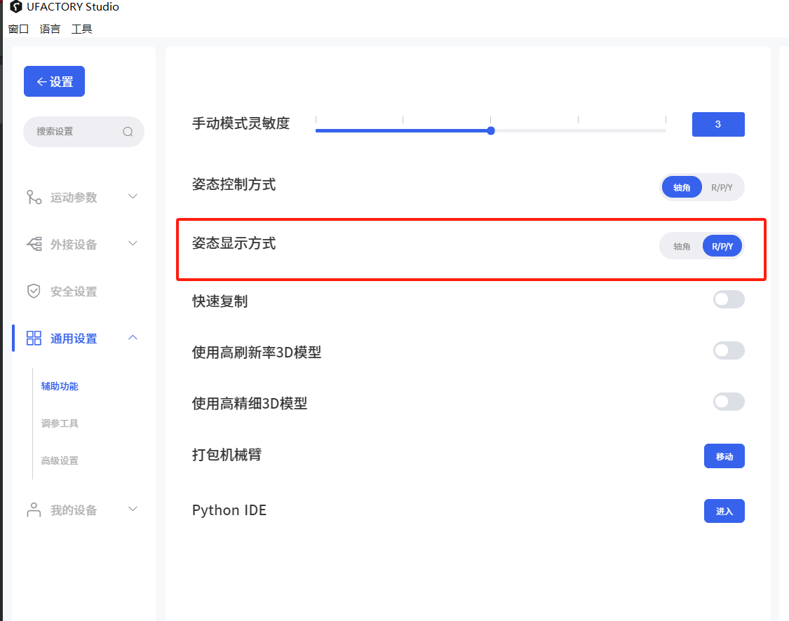
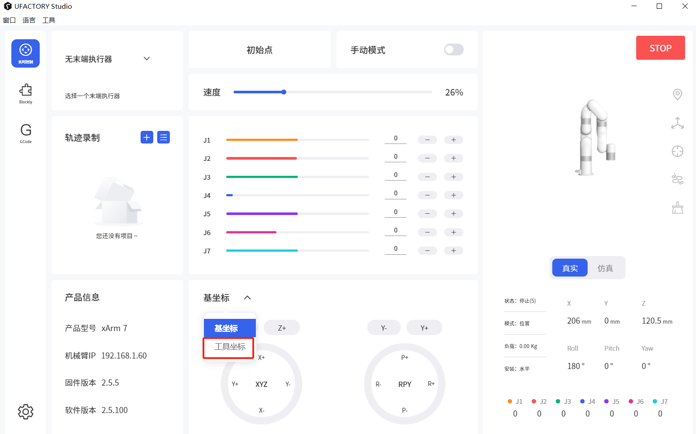
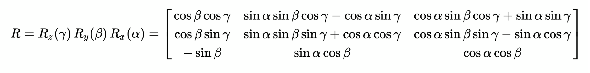

# 为什么当我调整 Roll 和 Yaw 时机械臂表现相同？

**问题一： 为什么我用SDK获取到的Raw/Pitch/Yaw ，与studio中实时控制页面显示的不一致？**

SDK默认读到的是Raw/Pitch/Yaw，而在studio默认显示的轴角Rx,Ry,Rz。 可以通过此页面进行调整，显示为Raw/Pitch/Yaw。

**问题二： 为什么当我调整 Roll 和 Yaw 时机械臂表现相同？**

一般发生在Pitch=±90°时，就是云台锁，这时手臂将失去一个自由度。
机械臂上的云台锁有2个典型特征。

1.当机械臂处于Pitch=±90°的位置时，调整机械臂的Roll与调整Yaw的结果相同。 您可以通过切换到 UFACTORY xArm Studio 上的“工具坐标”或使用 UFACTORY xArm Python 或 C++ SDK 的“set\_tool\_position”来绕过此问题。

2.当机械臂在Pitch=±90°的位置时，机械臂会报告一个与你发送给机械臂的位置不同的Roll和Yaw，由于机械臂将失去一个自由度，因此我们保持Yaw=0°。 roll值可参考以下矩阵。
考虑roll、pitch和yaw的值分别为 α、β 和 γ。 TCP 方向的旋转矩阵（R）应为

可以用这个公式进行验证：
(Roll\_send-Roll\_report)+(Yaw\_send-Yaw\_report)=0或±360 °

示例：
1) 将手臂移动到位置： [350, 0, 200, 90, 0, 0]

2) 发送位置 [350, 0, 200, 0, 90, 30] 给手臂.

3) 检查手臂的位置，应该是： [350, 0, 200, -30, 90, 0]

如果您想了解更多关于 “云台锁” 的信息，请参阅：

https://en.wikipedia.org/wiki/Gimbal_lock
