# 如何替换Lite6的末端法兰？

你将收到：

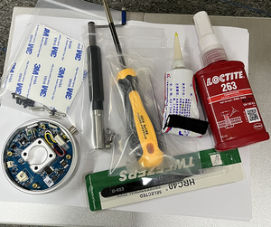
## 1.移除末端法兰
1) 关闭 Lite6 电源，将其水平放在桌面上。
标记末端的位置，在最后一步，我们需要对齐这条线，以便重新安装末端法兰。

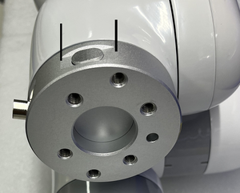
2) 用镊子取下圆形贴纸。

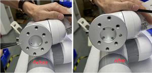

3) 使用 M3 L 型扳手卸下 4 个螺钉。
    

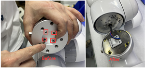
4) 用十字螺丝刀卸下 4 个螺丝。

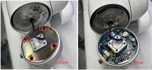 

5) 用镊子夹取下面针脚中的黄色液体胶水。
   
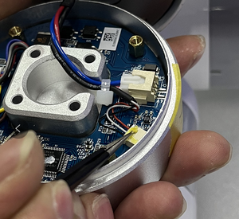

6) 用镊子拔出针模块。
   
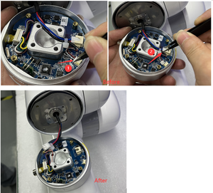

## 2.安装末端法兰
1) 用镊子插入 2 针模块。 在一个引脚模块中使用黄色液体胶水粘住

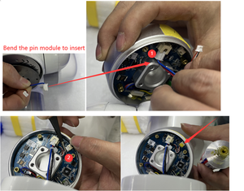

2) 装上金属盖，拧紧 4 个螺丝，并在 4 个螺丝上涂上黄色液体胶水。

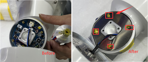

3) 将线缆插入圆孔，对准之前的标记线。

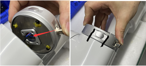

4) 在 4个螺钉上涂上红色液体胶水，然后拧紧 4 个螺钉。

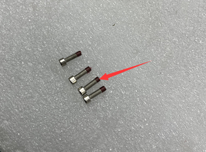

5) 贴上圆形贴纸。

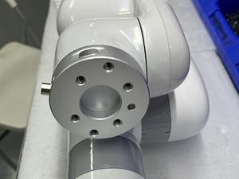