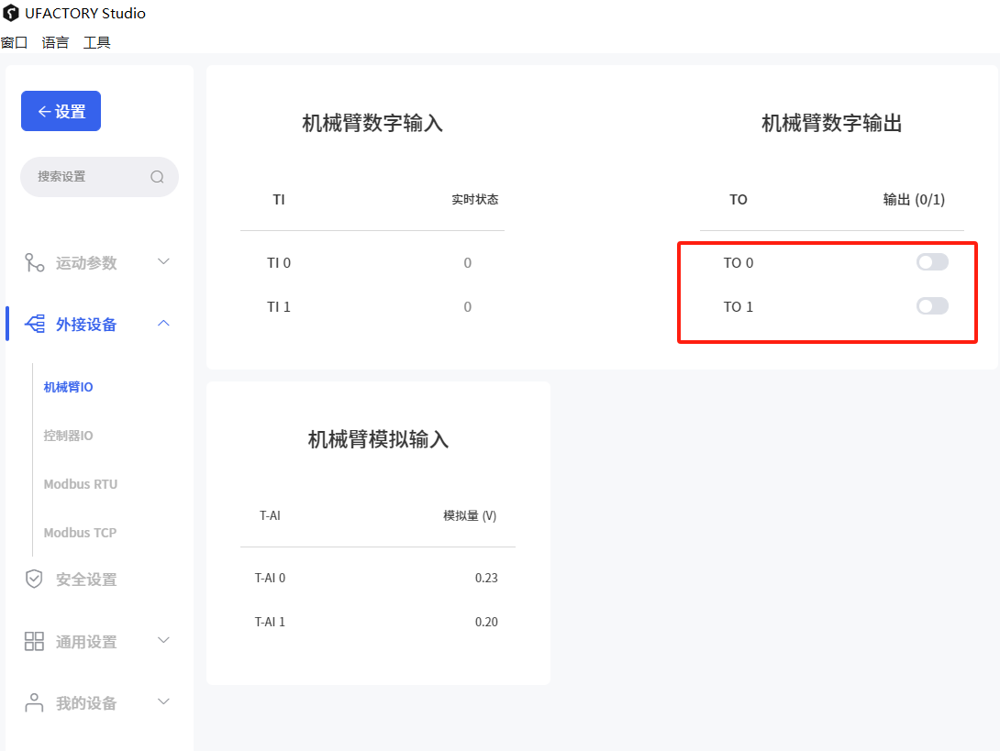

# 如何确认数字输入和输出是否正常

**以TO和CI为例**

## 1.硬件连接

如图，连接TO0与CI0，   TO1与CI1，然后将末端通信线连接至手臂末端，IO模块连接到控制器IO接口

## 2.软件操作

1）进入”设置-外部设备-控制器IO“，CI0 ，CI1默认为1（高电平）

.png)

2）选择机械臂IO，将TO0 ，TO1都设置为1（高电平）

3\) 返回控制器IO，CI0 ，CI1应该都被设置为了0（低电平）

