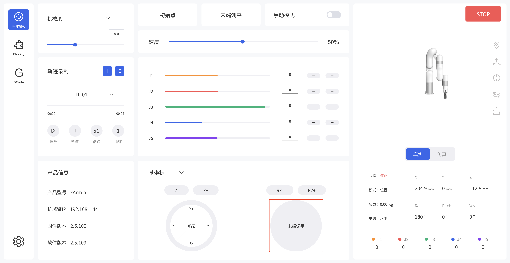

# 如何调平xArm5末端？

## 1. UFACTORY Studio
进入实时控制页面，点击末端调平。
'Live Control - Aligning the Hand'.

## 2. Python SDK
通过SDK发送指令： J4 = - (J2+J3)。

~~~python
// align the end flange of xArm 5 Lite
code, angles = arm.get_servo_angle()
if code == 0:
    angles[3] = -(angles[1] + angles[2])
    arm.set_servo_angle(angle=angles, wait=True)
~~~