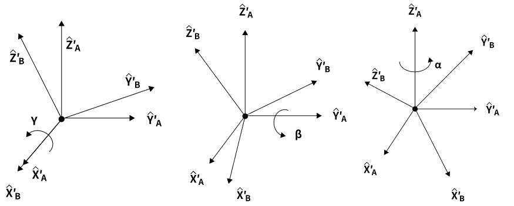
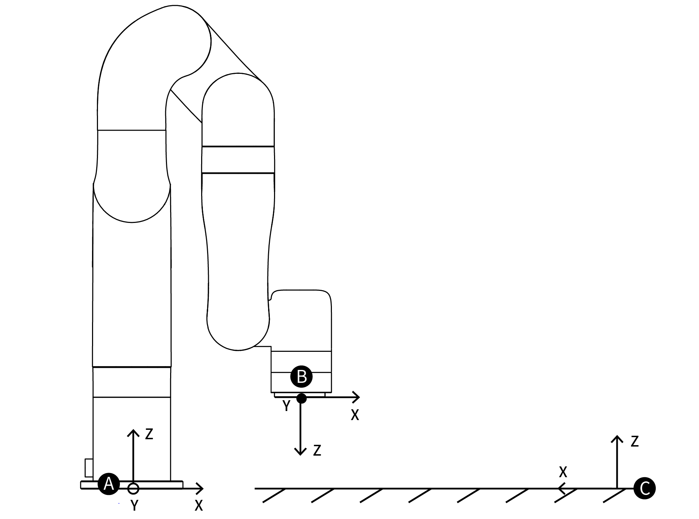

# 11. 术语定义

***
**控制器：** 机械臂的核心部分，它是机械臂控制系统的集成。 

***
**末端执行器：** 末端执行器安装在机械臂手腕（末端）的前端，用来安装夹持器和专用工具（如机械爪、真空吸头等），可以直接执行工作任务。  
***
**使能机械臂：** 给机械臂上电，且开启机械臂电机，机械臂使能后，可正常开始运动。  
***
**TCP：** 工具中心点（默认为法兰盘中心）。  
***
**TCP运动：** 目标位置为笛卡尔空间坐标点的运动，末端在运动中遵循指定的轨迹（圆弧，直线等）。  
***
**TCP负载（末端负载）：** 负载重量是指实际的（末端执行器+托运外物）的重量，单位是kg。X/Y/Z轴表示TCP的重心相对于默认工具坐标系（位于法兰中心）的位置，单位是mm。  
***
**TCP偏移（末端执行器偏移）：** 设置TCP（末端执行器）坐标系与定义在法兰中心的工具坐标系之间的相对偏移量，单位是mm。 
***
**Roll/Pitch/Yaw（RPY）：** Roll /Pitch/Yaw按顺序依次绕选定坐标系（基坐标系）的X/Y/Z旋转。  
下面举例描述坐标系{B}姿态的一种方法：
例如首先将坐标系{B}和一个已知参考坐标系{A}重合。先将{B}绕**X轴**旋转γ，再绕**Y轴**旋转β，最后绕**Z轴**旋转α。
每个旋转都是绕着固定的参考坐标系{A}的轴，这种方法叫XYZ固定角坐标系，有时把他们定义为回转角（roll）、俯仰角（pitch）和偏转角（yaw）。  
上面描述的就是XYZ欧拉角，旋转过程如下图所示：
  
  
  等价旋转矩阵为：  
$$ 
{{}^B_A \mathbf{R}_{XYZ}(\gamma, \beta, \alpha) = \mathbf{R}_Z(\alpha)\mathbf{R}_Y(\beta)\mathbf{R}_X(\gamma)}
$$
注：γ对应roll；β对应pitch；α对应yaw。  
***

**轴角：** Rx/Ry/Rz与 Roll/Pitch/Yaw 一样， 使用 3 个值表示姿态，但不是三个旋转角度，而是一个三维旋转向量[x,y,z]和一个旋转角度 phi（标量）的乘积。
轴角表示的性质：  
假设旋转轴为[x,y,z]， 旋转角度为 phi。则轴角表示即为[Rx, Ry, Rz] = [x*phi, y*phi, z*phi]，其中[x,y,z]为单位向量，phi 为非负值，因而[Rx, Ry, Rz]的向量长度(模)即可推算旋转角度，向量方向即为旋转方向。
如果想表示逆向旋转，则将旋转轴向量[x,y,z]取反， phi 值不变。
使用 phi 和[x,y,z]同样可以推导出单位四元数的姿态表示 q = [cos(phi/2), sin(phi/2)*x, sin(phi/2)*y, sin(phi/2)*z]。  

例如：
当前 TCP 坐标系的姿态是基坐标系围绕某个空间向量旋转某个角度得到的。比如用基坐标系表示的旋转轴的向量为[1, 0, 0]，旋转角度为 180 度 (pi 弧度），则这个姿态的轴角表示即为[π, 0, 0]。如果旋转轴
为 [0.707, 0.707, 0]，旋转角度为 90 度(π/2 弧度），则轴角姿态为[0.707*(pi/2), 0.707*(pi/2), 0]。
***
**基坐标系：** 基坐标系是以机器人安装基座为基准、用来描述机器人本体运动的笛卡尔坐标系。  
任何机器人都离不开基坐标系，也是机器人TCP在三维空间运动所必须的基本坐标系（面对机器人前后：X轴 ，左右：Y轴， 上下：Z轴）

**工具坐标系：** 由工具中心点TCP与坐标方位组成。  
如果没有设置TCP偏移，那么默认工具坐标系位于法兰中心，是以工具中心点作为零点，机器人的轨迹参照工具坐标系。  

**用户坐标系：** 用户坐标系可定义为机器人运动范围内的任意位置，设定任意角度的X、Y、Z 轴，坐标系的方向根据客户需要任意定义。

&nbsp;&nbsp;&nbsp;&nbsp;A：基坐标系&nbsp;&nbsp;&nbsp;B：TCP坐标系&nbsp;&nbsp;&nbsp;C：用户坐标系 
***
**手动模式：** 即示教模式或力矩模式，在该模式下，操作人员可直接手动控制机械臂。
***
**示教灵敏度：** 示教灵敏度范围1~5个等级。设定的值越大，示教灵敏度等级越高，开启示教模式拖拽关节所需的力越小。
***
**碰撞灵敏度：** 碰撞灵敏度范围0~5个等级,设置为0时表示不开启碰撞检测。设定的值越大，碰撞灵敏度等级越高，机械臂碰撞检测后所需的力越小。
***
**GPIO：** 通用型输入输出。
对于输入，可以通过读取某个寄存器来确定引脚电位的高低；
对于输出，可以通过写入某个寄存器来让这个引脚输出高电位或者低电位；
***
**安全边界：** 该模式被激活后，可以限制机械臂笛卡尔空间的边界范围，如果工具法兰中心（TCP偏移点）超出设置的安全边界，机械臂将停止运动。
***
**缩减模式：** 该模式被激活后，机械臂的笛卡尔运动的最大运动线速度、关节运动的最大关节速度和关节范围将受到限制。
***