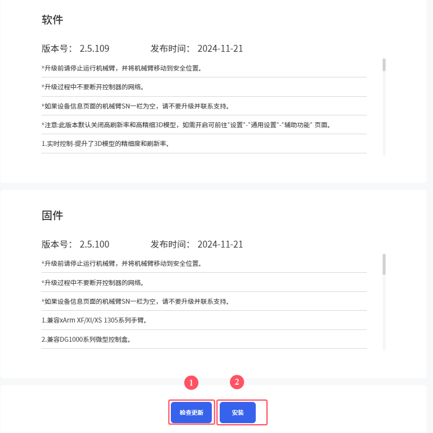
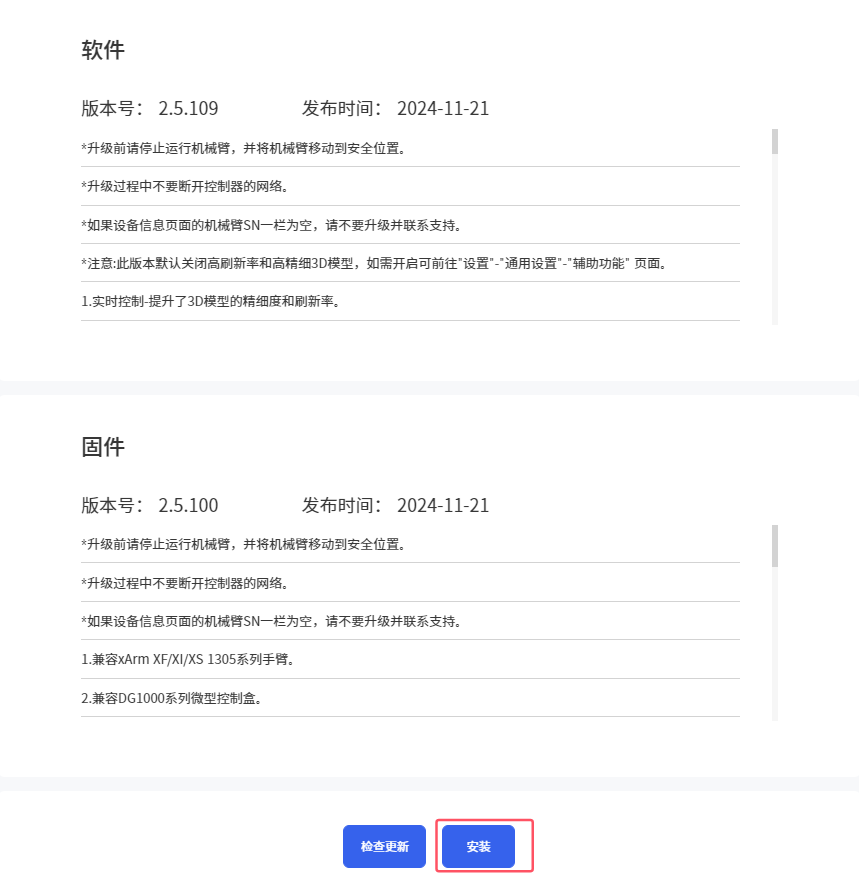
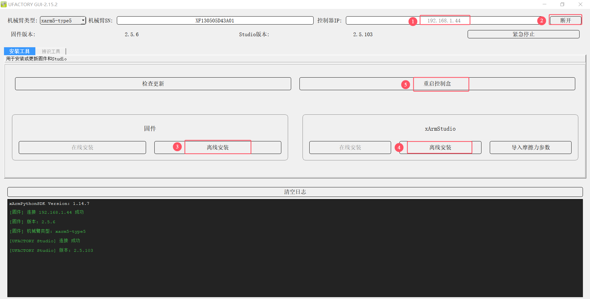

# 13. 软件固件升级方式

## 13.1 在线升级  
当PC端有网络连接时，可进行在线升级。  

**方法一：** 使用UFactory studio进行在线升级。  
进入我的设备-检查更新，点击“检查更新”，如有新的版本，点击“下载”，下载完成后点击“安装”加载下载好的安装包，等待系统重启。重启耗时约2-3分钟。  
 

## 13.2 离线升级
当PC端没有网络连接时，可使用离线升级。   

**方法一：** 使用UFactory Studio离线升级。   
[GUI工具和软件/固件离线包](http://update.ufactory.cc/xArmTool-x86.zip) - xArm&UF850下载   
[GUI工具和软件/固件离线包](http://update.ufactory.cc/xArmTool-Lite6.zip) - Lite6下载  

进入我的设备-检查更新，点击“安装”加载提前下载好的离线包，等待安装完成系统重启即可。   
 

**方法二：** 使用xarm-tool-gui进行离线升级。  
[GUI工具和软件/固件离线包](http://update.ufactory.cc/xArmTool-x86.zip) - xArm&UF850下载   
[GUI工具和软件/固件离线包](http://update.ufactory.cc/xArmTool-Lite6.zip) - Lite6下载 
* 1.点击固件-离线安装，选择提前下载好的离线固件包，点击安装，界面弹出提示“安装固件成功”。 
* 2.点击Studio-离线安装，选择提前下载好的离线Studio包，点击安装，界面弹出提示“安装Studio成功”。 
* 3.点击重启控制盒，等待2-3分钟控制器重启完成，重新连接即可。
 

**注意：**
当在线升级不成功时，可以尝试离线升级。离线升级仍然不成功时，请联系技术支持（[support@ufactory.cc](mailto:support@ufactory.cc)）。 软件/固件**降级**请参考xarm-tool-tui的升级方法，选择对应低版本的离线包即可。
