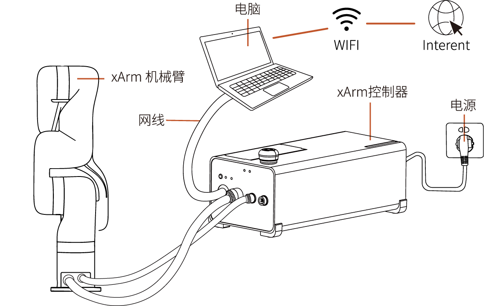
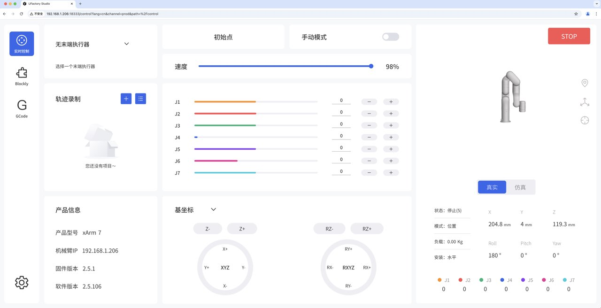

# 2. 连接机械臂

## 2.1 硬件连接
推荐控制器与PC直连，以xArm为例如下图：  

其他连接方式请参考硬件连接。

## 2.2 软件连接

机械臂默认IP为192.168.1.xxx，**请确保电脑IP和机械臂IP处于同一网段，但不能完全一致。** 即PC端的IPV4网段必须在192.168.1.1-192.168.1.255之间。
如何设置电脑IP请参考[快速安装手册-软件连接](https://www.cn.ufactory.cc/_files/ugd/896670_96742aa662884c389854f66dad3c4cbe.pdf)。  

打开浏览器，在搜索栏中输入**控制器IP+:18333**，可快速访问UFACTORY Studio。   

例如：控制器IP为192.168.1.201  
访问链接：<u>192.168.1.201:18333</u>

