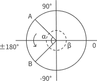
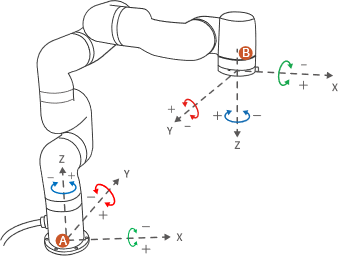
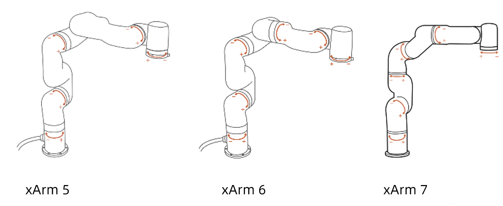

# 3. 实时控制界面
用于实时控制机械臂的位置，调整机械臂的运动姿态，末端工具，轨迹录制等。


## 3.1 末端执行器
软件支持的末端执行器有：机械爪、真空吸头（插接式和触点式）、xArm BIO机械爪、Robotiq-2F-85机械爪、Robotiq-2F-140机械爪。  

默认为无末端执行器。
 

选择对应末端执行器时，若检测到当前机械臂波特率和默认末端执行器波特率不符，弹框提示用户选择设置为默认波特率，点击是即可保存。例如：xArm机械爪默认波特率为2000000，Robotiq机械爪默认波特率为115200。  


支持自定义圆柱体和长方体，如下图：


## 3.2 轨迹录制
用于记录并回放用户拖拽机械臂进行示教的轨迹，最长录制时间为5分钟，可设置轨迹回放倍数，录制好的轨迹可导入Blockly项目中。

1. 播放：播放当前轨迹文件。
2. 暂停：暂停播放当前轨迹文件。
3. 倍数：倍数播放，可选1倍，2倍，4倍。
4. 循环次数：循环播放次数，最大为999次。
5. 新建文件：单击后弹出菜单：输入轨迹名称，点击录制并拖动手臂（**Lite6需要按住末端按钮**），轨迹录制完成，单击保存按钮。
6. 导入/删除文件：导入和删除选中的轨迹文件。  

新建文件过程如图：  

  
轨迹文件列表：


## 3.3 产品基础信息
产品信息界面显示产品基础信息，如型号，机械臂IP，固件及软件版本，机械臂状态，模式，负载，安装方式等。  


IP地址：显示当前机械臂控制器的IP。  

模式：显示机械臂当前模式，默认为位置模式。  

负载：显示手臂当前的负载参数，默认为0kg。  

安装：显示手臂当前的安装方式，默认为水平。 

位置信息：显示机械臂当前TCP坐标[X,Y,Z,R,P,Y]。若选择轴角显示方式，则为[X,Y,Z,Rx,Ry,Rz]。可在辅助功能中切换。     

关节信息：显示机械臂各关节角度，单位为度。


## 3.4 位置和关节控制

初始点：长按为连续运动，机械臂回到默认初始点位。点按为步进运动，可在设置-运动参数-基础参数-初始点位置中设置自定义初始点（关节坐标）。    
默认初始点：    
* xArm/850：``` [0,0,0,0,0,0,0]```  
* Lite6：```[0,9.9,31.8,0,21.9,0]```  

**危险：机械臂安装了末端执行器的情况下，如果要进行回零点操作时，请务必评估回零点路径会不会碰撞障碍物或者安装机械臂的固定面。** 

末端调平：将末端法兰调整为水平。长按为连续运动，点按为步进运动。（xArm7因构型问题暂时不提供此按钮）  

手动模式：可手动拖拽机械部关节到达目标位置点。 
* 1.开启手动模式前，请确保机械臂的安装方式和负载设置与实际符合，否则会有危险。
* 2.机械臂需要正确加载SN才能开启手动模式，可在设置-我的设备中查看软件获取的机械表SN。
* 3.查看并对比机械臂底座电源口贴的SN，与软件中的是否一致。

速度：用于条件实时控制界面机械臂的运动速度，默认为50% = 115mm/s，1% = 2.3mm/s， 100%=230mm/s。（此页面速度最大值不是机械臂真实的最大运动速度，如需让机械臂高速运行，可在Blockly运动程序中添加速度指令）   


直线运动：用户可以基于基坐标系，工具坐标系来控制机械臂的运动状态。笛卡尔空间运动的机械臂使工具在点之间进行线性移动，这意味这每个关节都会执行更为复杂的移动，以使工具保持在直线路径上。目标点确认后，末端路径是唯一的，轨迹过程中对应的姿态是随机的。
* 1. 基坐标系XYZ控制工具的位置，单位是毫米（mm）。TCP坐标系的Roll/Pitch/Yaw控制工具的方向，单位是度（°）。
* 2. 默认为轴角控制（Rx/Ry/Rz），可在设置-辅助功能中切换为RPY控制，如下图：


***
<font color=Orange size=4>TCP坐标系定义：</font>
   
&nbsp;&nbsp;&nbsp;&nbsp;A：基坐标系&nbsp;&nbsp;&nbsp;B：TCP坐标系 

机械臂末端执行器法兰中心点（TCP）来定义的TCP坐标系，是依次绕基坐标系的X/Y/Z轴旋转[180°, 0°,0°]的结果。TCP坐标系的X/Y/Z空间指向会根据旋转角度的改变而改变。
* Roll /Pitch/Yaw分别绕选定坐标系的X/Y/Z旋转，设置数值的±表示在旋转角度范围内圆的数值，其旋转方向会根据两点之间较小的角度方向旋转，这一点尤其要注意，严格控制两点之间的偏转角度大小来控制旋转方向，必要时在两点之间插入第三个点。如下图所示，如果要从位置点A偏转到位置点B，机械臂走的是α夹角方向，如果需要走β夹角方向，需要在β夹角之间插入新的位置点，而且要保证插入的位置点与A形成的夹角小于α。

* Roll/Pitch/Yaw三者的±180°在空间上的点是重合的，取值范围都为±180°，所以机械臂上报位置时，±180°都有可能。
* RPY [rad] 滚动角、俯仰角和偏航角 (RPY)。RPY 旋转矩阵（X、Y、Z 旋转）由以下公式确定：
$$
Rrpy ( r, p,y) = R Z (y ) · R Y (p ) · R X ( r )
$$ 
    
&nbsp;&nbsp;&nbsp;&nbsp;A：基坐标系&nbsp;&nbsp;&nbsp;B：TCP坐标系 

**危险：机械臂在记录笛卡尔位置点前必须检查TCP偏移量。**
***

关节运动：机械臂通过协调每一个关节的旋转角度来控制末端执行器的位置，末端轨迹不是直线，速度单位是°/s。目标点确定之后，末端路径和轨迹过程中对应的姿态都是唯一的，目标点有多个关节联动时，完成这条指令每个关节用时一样。  
长按为连续运动，点按为步进运动。  
进度条：显示当前关节可移动范围。

**确定关节旋转方向，可参考下图：**


## 3.5 使能和STOP按钮

使能：使能机械臂各关节，使能成功后，该按钮消失。  

STOP：机械臂立刻停止运动并清除所有缓存指令，不会断机械臂的使能状态。**软急停。**

## 3.6 仿真与真实机械臂
两种模式均需要连接真实机械臂。当切换为仿真机械臂时，真实机械臂不运动。但在仿真模式下设置的参数，应用于真实机械臂。  
例如，在仿真模式下设置TCP负载为0.6kg，切换回真实机械臂时负载也为0.6kg。
![[simrobot_cn.png]](assets/simrobot_cn.png)

1. 重置视角：将3D视图视角设置为默认状态。
2. 基坐标：：显示当前基坐标系。
3. 工具坐标：显示当前工具坐标系。
4. 绘制轨迹：绘制机械臂运行轨迹。
5. 清除轨迹：清除已绘制的轨迹。  
  
  如下图，显示基坐标与工具坐标，绘制轨迹。


