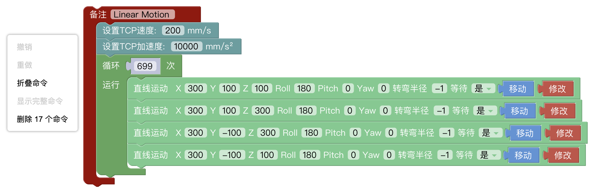
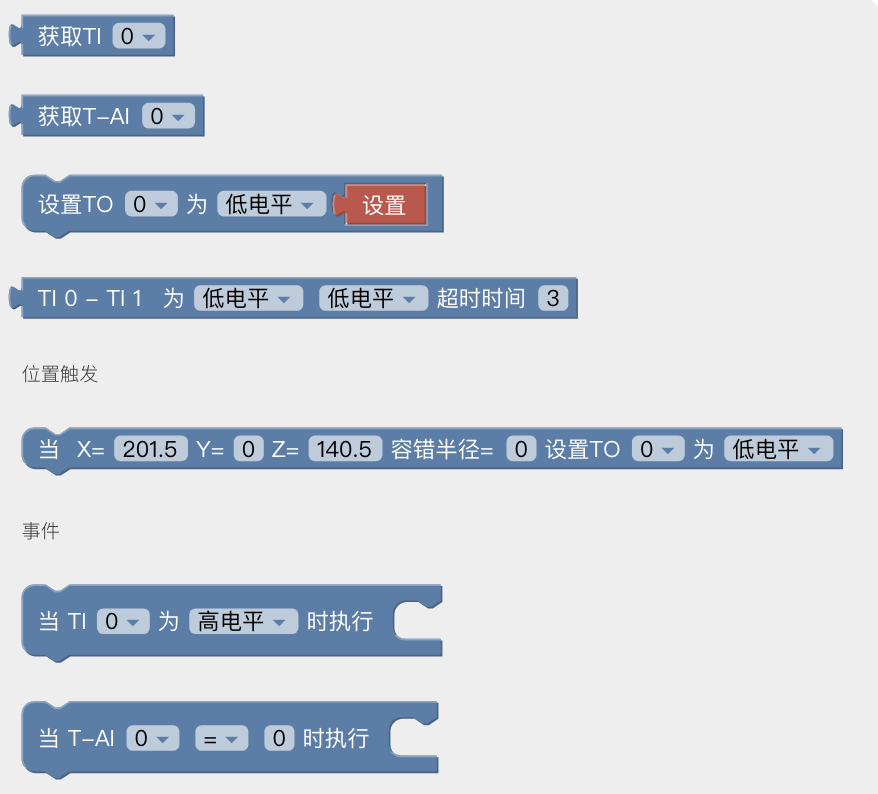

# 4. Blockly界面
Blockly是一个图形化编程工具，可以通过拖拽代码块的方式编程来控制机械臂，无需手动编写代码。
## 4.1 页面简介

1. 运行：运行当前Blockly项目。
2. 暂停：暂停正在运行的Blockly项目。
3. 转Python：跳转到Python IDE模块。
4. 保存：保存对Blockly项目的更改。
5. 缩放日志区：隐藏/显示日志区域。
6. 缩放3D区：隐藏/显示3D模型区域。
7. 文件操作：新建、导入、下载、复制、重命名、删除。

## 4.2 Blockly工作区
将代码块拖入到操作面板，**代码块执行的顺序是自上而下，从左至右**，可同时拖拽改代码块后面连着的代码。拖拽代码块到左边非工作区删除，或者可以选择代码块后按键盘Enter/Delete键。
 
1. 重置：页面回到默认大小和代码块居中位置。
2. 放大：放大代码块。
3. 缩小：缩小代码块。

**工作区右键功能**  
在非代码块的空白工作区右键，功能主要针对所有的代码块：

* **撤销：** 撤销上一次的操作。
* **重做：** 还原上一次撤销的操作。
* **折叠命令：** 折叠所有代码块。
* **显示完整命令：** 显示所有折叠的代码块。
* **删除命令：** 删除代码块。

**移动/修改代码块**

点击修改，弹出实时控制界面，可重新编辑当前指令的运动坐标。  
长按移动按钮，使机械臂移动到当前指令的位置点。点击保存，保存更改。

**注意：**
* 在一段指令里面，有顺序A/B/C/D...等多个点，如果点击移动让机械臂从A点位置跳过B点直接到C点或者C点以后的位置，为避免损害周边设施，必须要进行安全评估。
* 因为笛卡尔指令的复杂性，笛卡尔空间轨迹规划，需要做逆运动学求解。因而可能存在无解、多解、逼近解的情况。从A点到B点走笛卡尔指令时的解不理想时，必要时在两点之间插入第三个关节指令。

## 4.3 Blockly编程
### 4.3.1 设置

设置TCP速度: 设置直线运动的速度，单位是mm/s。
参数范围：xArm/UF850:0-1000, Lite6:500    
设置TCP加速度: 设置直线运动的加速度，单位是mm/s²。参数范围：1-50000  
设置关节速度: 设置关节运动的速度，单位是°/s。参数范围：0-180  
设置关节加速度：设置关节运动的加速度，单位是°/s²。参数范围1-1146  
设置TCP负载：设置当前项目的负载，下拉列表引用TCP负载。  
设置TCP偏移：设置当前项目的末端偏移，下拉列表引用TCP偏移。  
设置坐标系偏移:设置当前项目的基坐标偏移，下拉列表引用坐标系偏移数据。  
设置碰撞灵敏度：默认为3，参数范围：0、1、2、3、4、5  
重置计数器：该指令将控制器内的计数器重置为0。  
计数器自增：每次执行到该指令时会使控制器的计数器自增1。  
获取计数器：获取计数器的值。  
当计数器(>)(0)执行：when执行事件，满足条件时执行。

### 4.3.2 运动

运动（恢复）：设置机械臂的状态。可选参数：恢复、暂停、停止。停止将退出程序。  
紧急停止：机械臂立即停止运动，退出Blockly程序并清空所有缓存指令。  
零点：机械臂回所有关节值都为0的姿态。  
末端调平：将末端调整为水平。  
关节运动：设置关节运动的各个关节值，单位是°。在真实机械臂模式下，从侧边拖出的关节运动指令数据是真实机械臂当前姿态数据。  
直线运动（XYZRPY）：直线运动，姿态控制方式为RPY。  
直线运动[轴角]（XYZRxRyRz）：直线运动，姿态控制方式为轴角。    
向前：机械臂基于当前位置做相对运动，单位是mm。可选参数：前、后、左、右、上、下 。 
工具运动（XYZRPY）：机械臂相对于工具坐标系做相对运动。  
圆弧运动：表示位置1到位置2走圆弧运动，但该命令前面还需再加入一个位置点，三点确定一个圆，单位是mm。圆心角：该圆弧的度数，设置360°时可以走完一整个圆弧。（注意：要想实现平滑的轨迹运动，需要设置等待=假）  
支持输入变量的运动：  
与上面的运动代码块功能相似，可输入的值支持变量，方便客户编程。  
例如下图，将X设置为变量。

### 4.3.3 IO
#### 4.3.3.1 控制器IO
xArm/UF850有16个数字输入、16个数字输出、2个模拟输入、2个模拟输出。  
Lite6有8个数字输入、8个数字输出、2个模拟输入、2个模拟输出。  
控制器数字输入IO为低电平触发。
![[blockly_cgpio_cn.png]](assets/blockly_cgpio_cn.png)
**获取CI(0)：** 获取CI0-CI7的值。返回：0或1

**获取DI(0)：** 获取DI0-DI7的值。返回：0或1

**设置CO(0)为(低电平)：** 设置(CO0-CO7)为(低电平/高电平)，点击设置可单独执行该指令。

**设置DO(0)为(低电平)：** 设置(DO0-DO7)为(低电平/高电平)，点击设置可单独执行该指令。

**获取AI(0)**：获取AI0、AI1的值。返回：0-3V

**CI0-CI7为(高/低)电平,超时时间(3):** 判断CI0-CI7的值，满足条件时执行事件。当超过超时时间(3)s仍不满足条件时，执行下一条代码块。

**DI0-DI7为(高/低)电平,超时时间(3):** 判断DI0-DI7的值，满足条件时执行事件。当超过超时时间(3)s仍不满足条件时，执行下一条代码块。  

**位置触发：**   

* 当机械臂到达指定位置时，以触发位置点（X,Y,Z）为中心指定的球面体区域（球面体半径为容错半径）触发IO。该指令可用于在特定位置触发IO的场景。
* X,Y,Z 代表机械臂要到达的指定位置的坐标值，单位毫米。
* 容错半径是指，TCP位置触发的数字IO操作中，以触发位置点为中心指定一个球面体区域，只要系统检测TCP位置进入这个附近区域时即触发IO。如果不设置容错半径，则机械臂以非0的速度通过指定点时可能因无法准确检测到而导致漏触发。

**事件：**  

* 当(CI0-CI7)为(高电平/低电平)时执行：当条件满足时执行该代码块包含的指令。
* 当(DI0-DI7)为(高电平/低电平)时执行：当条件满足时执行该代码块包含的指令。
* 当(AI0/AI1)(=)(0)时执行：当监听的模拟IO数值满足条件时执行代码块包含的指令，条件有 =，≠，>，≥，<，≤ 。
* UFactory studio的IO触发逻辑：  
**当（when，跳变触发）：** 每100ms获取一次IO状态，将第一次获取到的状态作为初始值。从第二次获取到的IO状态与上一次获取的IO状态比较，**有变化时**触发满足条件的回调。  
**如果（if，水平触发）：** 第一次检测到IO状态满足条件时，触发满足条件的回调。
#### 4.3.3.2 工具IO
  
可参考控制器IO的代码块，功能相似
### 4.3.4 末端工具
**机械爪**  
软件自动检测手臂类型，并显示对应代码块。  
* xArm/UF850：设置机械爪位置、设置机械爪位置(变量)、物体已被夹住。 位置：-10~850，速度：1000~5000
* Lite6：设置机械爪张开、物体已被夹住。 可选参数：张开、闭合、停止  

  
    

**BIO机械爪**  
初始化机械爪，设置BIO机械爪打开、检测BIO机械爪已经夹住物体。
机械爪使用时必须先进行初始化。 速度：200-2400

**Robotiq机械爪**  
初始化Robotiq机械爪、设置Robotiq机械爪位置/速度/力度。
位置：0-255，速度：0-255，力度：0-255

**真空吸头**   
获取真空吸头状态：返回0或1。 0：吸住  1：  
检测到物体已经(吸住)：吸住或释放，超过超时时间不满足条件则执行下一个代码块。  
设置真空吸头(开)是否拾取检测(否)：打开或关闭吸头。

### 4.3.5 外接设备
#### **直线滑轨**   
当手臂检测到连接了滑轨时显示此代码块，否则不可使用。 设置直线滑轨：位置、速度。

#### **Modbus RTU**   
设置/获取RS-485端口Modbus RTU指令： 机械臂/控制盒。  
仅支持**标准ModbusRTU**，会在输入的指令后自动加CRC。

例如：控制xArm机械臂开到位置600，并获取当前位置。

#### **力矩传感器**  
设置力矩传感器力控制：
坐标系：基坐标、工具坐标。 力方向：Fx,Fy,Fz,Tx,Ty,Tz。
力大小：Fx(-105,105)  Fy(-105,105)  Fz(-140,140)   TxTyTz(-2.8,2.8)

#### **Modbus TCP**  
Modbus TCP寄存器定义请参考：[Modbus TCP寄存器](https://docs.ufactory.cc/modbustcp_cn)
当保持寄存器地址()为()时执行：需要检测到该寄存器地址的值有跳变，则触发事件。
  
例如下图，将寄存器01 A0的值设置为12 34，触发手臂运动。

### 4.3.6 导入  
可支持导入轨迹文件、Blockly工程、Gcode代码。可选择运行次数。  
点击运行可单独执行对应的文件项目。

### 4.3.7 逻辑
  
**等待：** 等待()秒后发送后面的指令。
如果(条件1) 运行（指令1）：如果条件1成立，则会运行指令1，否则就跳过。
如果/否则语句的设置：
* 点击运行命令块上的设置按钮，然后命令块会弹出一个选择框，如下图：  

* 将上图中否则代码块拖到右边如果代码块下方，使两个代码块结合，如下图：  

* 此时点击设置按钮，1. 选择框收回，如果/否则语句设置完成，如下图：  

  
### 4.3.8 循环
  
一直循环 ：里面包含的指令无限循环。
循环() 运行：循环（）次里面包含的指令。
重复运行，当：当条件不成立时，跳出循环。
跳出循环：终止循环。

### 4.3.9 运算
  
可使用上面的代码块做加减乘除，指数运算等一些复杂的运算。

### 4.3.10 进阶
#### **文字**

备注：备注该代码块，起指示作用，可改变颜色。  
消息提示：类型（信息/成功/警告/错误），持续时间表示消息显示的时间，单位是秒（s）；message表示提示的消息内容。    
字符串打印：可在下方打印输入的字符串，并设置字体颜色。  
变量打印：可打印添加的变量，并设置字体颜色。  
日期：可输出运行该指令时的日期。  
Python代码块：可以自定义编写python代码,使其变成Blockly中的一个块，并在程序中使用  
Python表达式：可以自定义Python表达式。

#### **变量**
  
用户可以新建变量。变量操作：设置变量值、通过加减操作改变变量值。  
可重命名变量、删除变量。

#### **函数**
  
定义函数（函数名）：可定义新函数，不带返回值。  
定义函数（函数名）输出[]：可定义新函数，带返回值。  
如果()输出()：条件判断句，只能放在内置函数中。    

**注意：定义的函数要放在主程序的前面。**

## 4.4 Python IDE模块  
点击Blockly页面的图标进入到Python IDE页面。 Python IDE是Python开发集成环境，可直接使用xArm-Python-SDK API和查看Blockly项目自动转换的Python代码。
  
点击选项，或右键项目，可新建文件夹、新建文件、导入文件、下载文件、重命名文件、删除文件，图标功能与Blockly相似。

