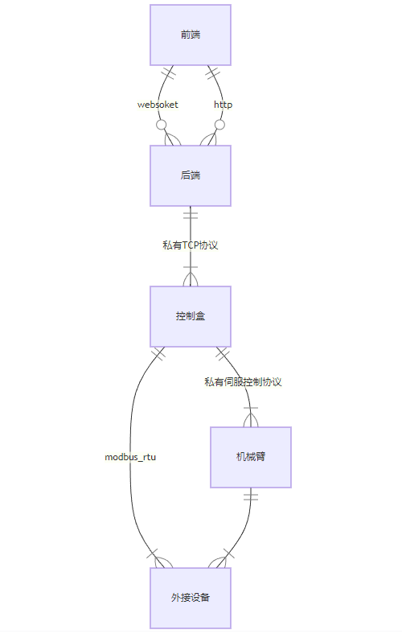

# websocket API
## Studio接口概述： 

### 1. Studio通信协议：

* _websoket：ws://{ip}:18333/ws_
* _http/1.1：http://{ip}:18333_

### 2. 通信流程图：

* front\_end：前端（用户操作界面）
* Background：后端（封装xArm-Python-SDK）
* Controller：控制器
* Robot：机械臂
* uxbus：UFACTORY自定义协议（控制器与电机通信）
* u\_modbus\_tcp：UFACTORY自定义协议（PC与控制器通信）
* Externals：外接设备，例如BIO机械爪、xArm真空吸头、xArm机械爪等

  



### 3. 上报数据说明：

* 建立websocket连接后，后端会持续上报机械臂实时状态，以下是上报参数解析

```
{
    "type": "report",
    "cmd": "devices_status_keys_report",
    "data": [
        0. "xarm_connected",                 # 机械臂连接状态
        1. "xarm_version",                   # 机械臂类型和固件版本
        2. "xarm_port_name",                 # 控制器IP
        3. "xarm_printed",                   # studio是否停止输出数据(内部使用)
        4. "xarm_state",                     # 机械臂状态
        5. "xarm_version_number",            # 固件版本
        6. "xarm_mode",                      # 机械臂模式
        7. "xarm_collision_sensitivity",     # 碰撞灵敏度
        8. "xarm_teach_sensitivity",         # 示教灵敏度
        9. "xarm_tcp_load",                  # 负载
        10. "xarm_tcp_offset",                # 偏移
        11. "xarm_world_offset",              # 坐标系参数
        12. "xarm_gravity_direction",         # 重力方向
        13. "xarm_paused",                    # xarm是否是暂停状态
        14. "xarm_type",                      # 机械臂类型
        15. "xarm_error_code",                # 错误码
        16. "xarm_warn_code",                 # 警告码
        17. "xarm_tcp_pose",                  # TCP坐标
        18. "xarm_joint_pose",                # 关节角度
        19. "xarm_axis_angle",                # 机械臂轴角角度
        20. "xarm_limit_acc",                 # TCP加速度限制
        21. "xarm_limit_velo",                # TCP速度限制
        22. "xarm_current_velo",              # 当前TCP速度
        23. "xarm_current_acc",               # 当前TCP加速度
        24. "xarm_limit_angle_acc",           # 关节加速度限制
        25. "xarm_limit_angle_velo",          # 关节速度限制
        26. "xarm_current_angle_velo",        # 当前TCP速度
        27. "xarm_current_angle_acc",         # 当前关节加速度
        28. "xarm_tcp_jerk",                  # TCP加加速度
        29. "xarm_joint_jerk",                # 关节加加速度
        30. "xarm_mtbrake",                   # 机械臂关节抱闸状态
        31. "xarm_warn",                      # 警告信息
        32. "xarm_error",                     # 错误信息
        33. "xarm_servo_error",               # 伺服错误
        34. "xarm_is_ready",                  # 机械臂是否运动就绪状态
        35. "xarm_is_verified",               # studio密钥是否验证通过
        36. "xarm_axis",                      # 关节轴数
        37. "config",                         # 安全边界和缩减模式
        38. "xarm_python",                    # pythonIDE运行状态和连接状态
        39. "xarm_speed_percent",             # 实时控制界面速度百分比
        40. "xarm_acc_percent",               # 实时控制界面加速度百分比
        41. "xarm_initial_point",             # 初始点位置
        42. "xarm_position_step",             # 位置步长
        43. "xarm_attitude_step",             # 姿态步长
        44. "xarm_joint_step",                # 关节步长
        45. "xarm_end_tool_type",             # 机械臂末端类型
        46. "xarm_gripper_is_enable",         # bio机械爪是否已使能
        47. "gripper_error_code",             # xArm机械爪错误码
        48. "bio_gripper_error_code",         # bio机械爪错误码
        49. "robotiq_error_code",             # robotiq错误码
        50. "xarm_device_type",               # 机械臂固件类型
        51. "xarm_mount_degrees",             # 机械臂安装方向参数(倾斜角度和旋转角度)
        52. "current_clients_count",          # 当前连接的客户端
        53. "xarm_is_connecting",             # studio是否有连接机械臂(内部使用)
        54. "core_updated",                   # studio是否有更新
        55. "firmware_updated",               # 固件是否有更新
        56. "channel",                        # 是测试环境还是正式环境
        57. "xarm_counter_val",               # 计数器值
        58. "xarm_quick_access_switch",       # 快速访问开关
        59. "xarm_quick_access",              # 快速访问的选项
        60. "xarm_gpio_reset_config",         # gpio状态
        61. "xarm_default_tcp_acc",           # 默认TCP加速度
        62. "xarm_default_joint_acc",         # 默认关节加速度
        63. "xarm_cgpio_states",              # 控制器输入、输出和模拟量参数
        64. "xarm_voltages",                  # 机械臂电压信息
        65. "xarm_currents",                  # 机械臂电流信息
        66. "xarm_self_collision_params",     # 自碰撞模式已经参数
        67. "xarm_quick_copy_switch",         # 是否打开快速复制
        68. "xarm_run_package_blockly_switch",# 是否打包运行
        69. "xarm_is_simulation_robot",       # 是否是仿真机械臂模式
        70. "bio_gripper_is_enabled",         # bio机械爪是否已使能
        71. "robotiq_is_activated",           # robotiq机械爪是否已使能
        72. "xarm_is_velocity",               # 速度模式标志，根据此变量来设置速度模式(已不再使用)
        73. "xarm_is_axis_angle",             # 姿态控制方式(轴角/RPY)
        74. "xarm_is_robot_arm",              # 选择机械臂or控制盒
        75. "line_track_error_code",          # 直线滑轨错误码
        76. "xarm_other_tool_type",           # 末端工具类型(滑轨之类）
        77. "ft_sensor",                      # 六维力矩传感器参数和状态
        78. "lite6_record_mode",              # lite6手动模式是否打开
        79. "lite6_ti2_status",               # lite6末端示教按钮状态
        80. "reduced_states",                 # 缩减模式状态
        81. "safe_border_states",             # 安全边界状态
        82. "xarm_end_otherCuboid_param",     # 末端工具长方体参数
        83. "xarm_end_otherCylinder_param",   # 末端工具圆柱体参数
        84. "joint_exceed_axis",              # 关节超限时的轴数
        85. "xarm_is_show_axis_angle"        # 3D界面展示是否使用轴角模式
    ]
}
```
