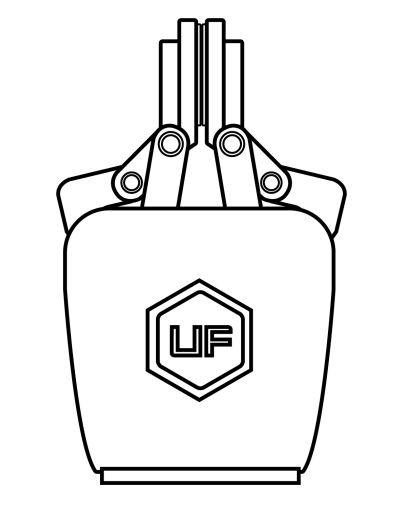

# 1.机械爪总体介绍

## 1.1 机械爪简要介绍

机械爪是机器人末端工具，能够动态抓取物体。

机械爪的位置数值范围是：-10到850，数值越大，机械爪张开程度就越大，反之，数值越小，机械爪张开程度就越小。如果出现夹合不紧的情况，可以发送负值。

## 1.2设置与控制
xArm机械爪通过一条电缆直接供电和控制，该电缆用于24V直流供电和基于RS-485的Modbus RTU通信。
## 1.3.安全
**警告**
操作员在使用xArm机械爪之前必须已阅读并理解手册中的所有说明。
**注意**
术语“操作员”是指负责在xArm机械爪上进行以下任何操作的任何人：
* 安装
* 控制
* 维护
* 检查
* 标定
* 编程
* 退役

本文档说明了xArm机械爪从安装到运行再到使用的整个生命周期的一般操作。
本文档中的图形和照片是代表性的示例，它们与交付的产品之间可能存在差异。
### 1.3.1.警告
**注意**
不遵守警告而使用抓取工具，可能导致操作人员受伤或设备损坏。
**警告**
* 在操作机器人之前，必须正确固定好夹具。
* 请勿安装或操作已损坏或缺少零件的机械爪。
* 切勿为机械爪通交流电。
* 确保所有接线端子稳定连接在机械臂和机械爪两端。
* 请始终使用建议的电气连接。
* 在初始化机械臂程序之前，请确保没有人在机械臂和机械爪路径中。
* 始终不要超过机械爪的有效载荷。
* 根据您的应用情况，相应设置机械爪的速度。
* 接通电源时，手指和衣服应远离机械爪。
* 请勿在人或动物身上使用机械爪。

### 1.3.2.风险评估和最终应用 

xArm机械爪用于工业机器人，最终应用中使用的机器人、抓取器和任何其他设备必须进行风险评估。机器人集成商的责任是确保遵守所有本地安全措施和规定。根据不同的应用，可能存在需要采取额外保护/安全措施的风险，例如，机械爪操作的工件可能对操作员具有固有的危险。

### 1.3.3.用途
xArm机械爪用于抓取并临时固定或保持物体。

**警告**

机械爪不适用于对物体或表面施加力。

该产品旨在安装在机器人或其他自动化设备上。

**信息**

* 始终遵守有关自动化安全和通用机器安全的本地和国家法律，法规和指令。
* 本设备只能在其技术数据范围内使用。产品的任何其他使用均被视为不当和意外使用。
* 对于因任何不当使用或不当使用引起的任何损坏，UFACTORY将不承担任何责任。
