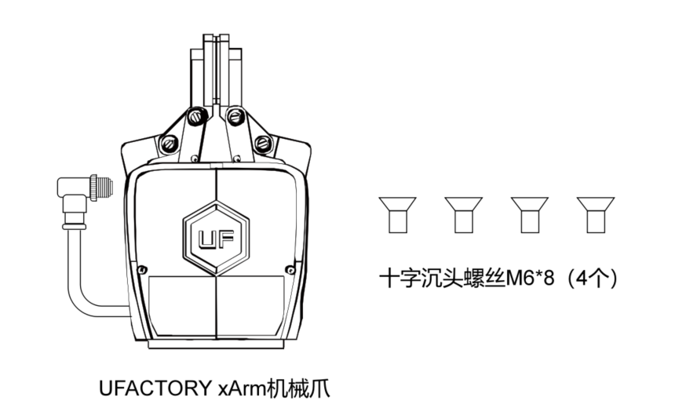
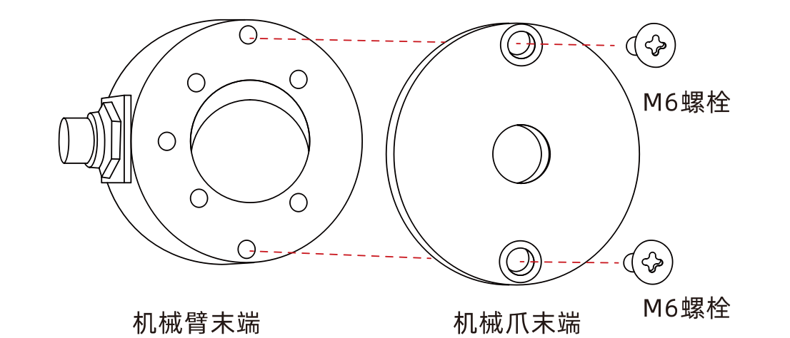
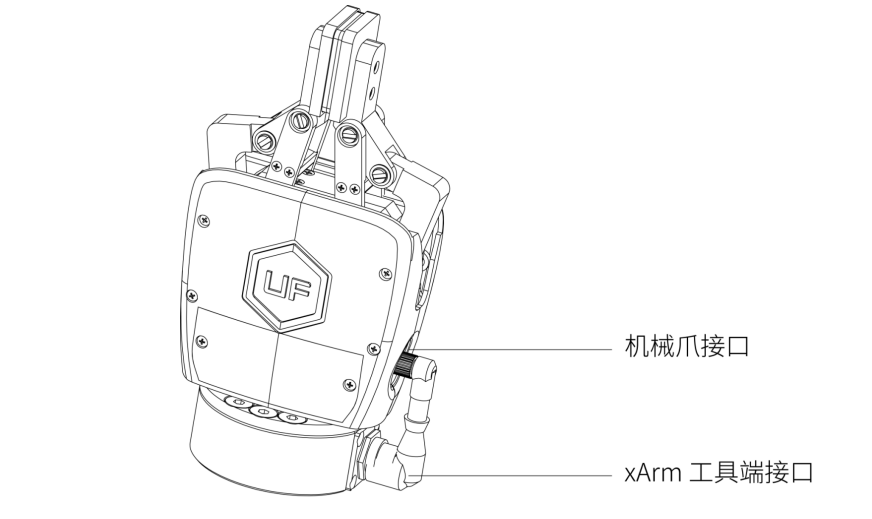
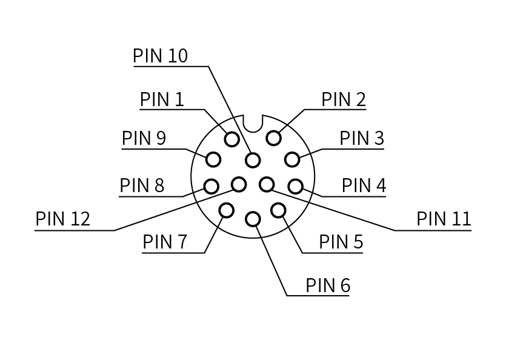
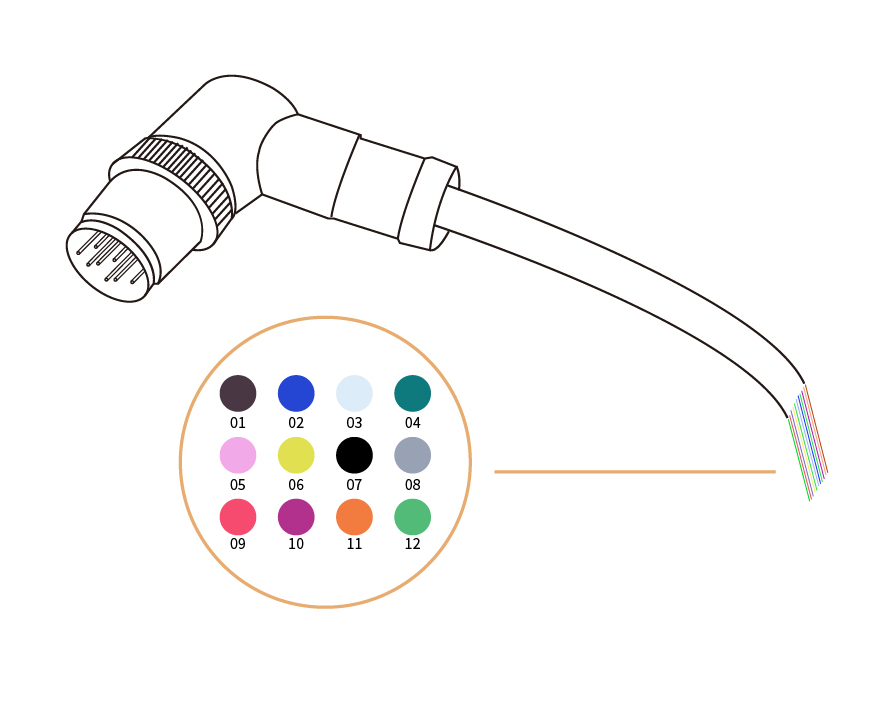

# 2.安装

以下小节将指导您完成xArm机械爪的安装和常规设置。

* 1-发货清单
* 2-机械安装部分
* 3-电气设置部分

**警告**

* 安装之前：

阅读并理解与xArm机械爪有关的安全说明。

根据发货清单和订单验证包裹。

备有需求中列出的所需零件。

* 安装时：

满足环境条件。

在牢固地固定住机械爪并清除危险区域之前，请勿操作机械爪或打开电源。
机械爪的手指可能会移动并造成伤害或损坏。

## 2.1. 发货清单
### 2.1.1.通用套件

xArm机械爪套件通常包括以下物品（如下图所示）：

xArm机械爪

十字沉头螺丝M6*8(4个)

## 2.2.机械安装

安装机械爪流程：

1.使机械臂运动到安全位置（避免碰到机械臂安装表面或者其他设备）；

2.机械臂断电（按下控制器急停按钮）；

3.用2颗M6螺丝把机械爪固定在机械臂末端；

4.用机械爪连接线连接机械臂和机械爪。

**注意：**
1. 接通机械爪连接线时一定要使机械臂断电，急停开关处于按下状态，机械臂电源指示灯熄灭，避免热插拔引起机械臂故障；
2. 因机械爪连接线长度限制，机械爪接口与机械臂工具端接口需在相同的方向；
3. 机械爪连接线接通机械爪和机械臂时注意务必对齐两端接口的定位孔，机械爪连接线的公针较为纤细，避免在拆装时使公针弯曲。
## 2.3.电气设置
xArm机械爪通过单根设备电缆与xArm机械臂建立电源和通信。设备电缆为机械爪提供24V电源，并实现了与机械臂控制器的串行RS485通信。

**警告：**

请断开机械臂电源后，再用机械爪连接线将机械爪和机械臂连接在一起。

### 2.3.1.引脚接口
机械爪连接接口如下图所示。

电缆内部的12条线有不同颜色，不同颜色代表不同功能，请参见下表

| 线序 | 颜色   | 信号               |
|------|--------|--------------------|
| 1    | 棕     | +24V（电源）       |
| 2    | 蓝     | +24V（电源）       |
| 3    | 白     | 0V （GND）         |
| 4    | 绿     | 0V （GND）         |
| 5    | 粉     | 用户485-A          |
| 6    | 黄     | 用户485-B          |
| 7    | 黑     | 工具输出 0 （TO0）  |
| 8    | 灰     | 工具输出 1 （TO1）  |
| 9    | 红     | 工具输入 0 （TI0）  |
| 10   | 紫     | 工具输入 1 （TI1）  |
| 11   | 橙     | 模拟输入 0 （AI0）  |
| 12   | 浅绿   | 模拟输入 1 （AI1）  |
